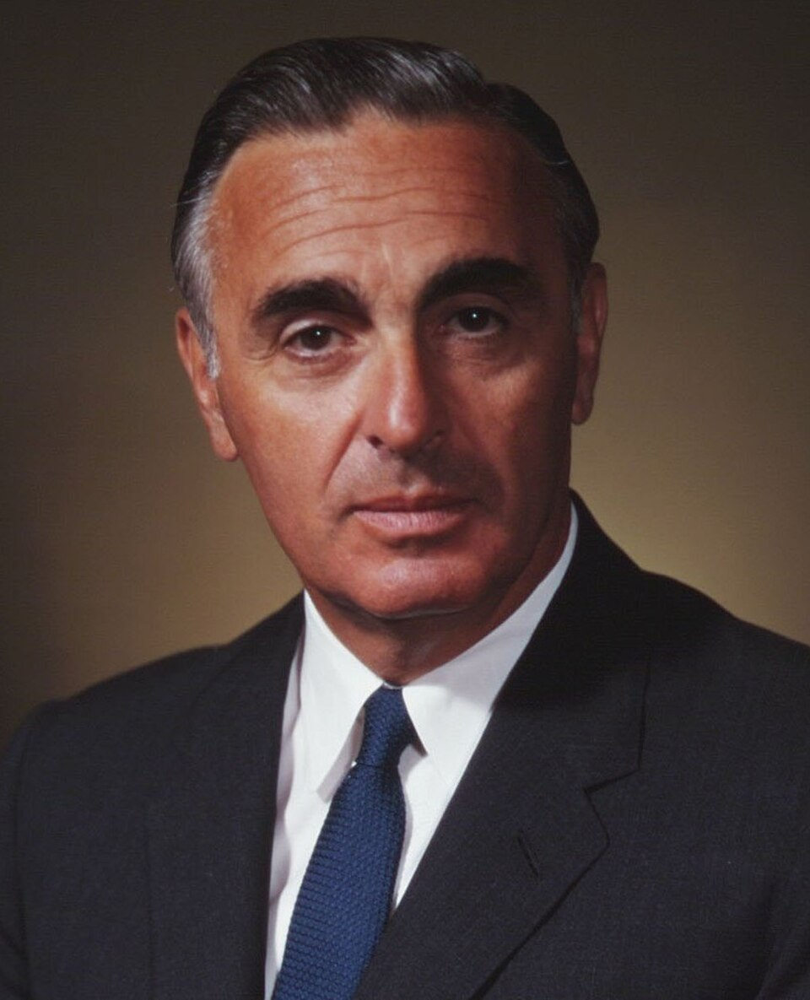
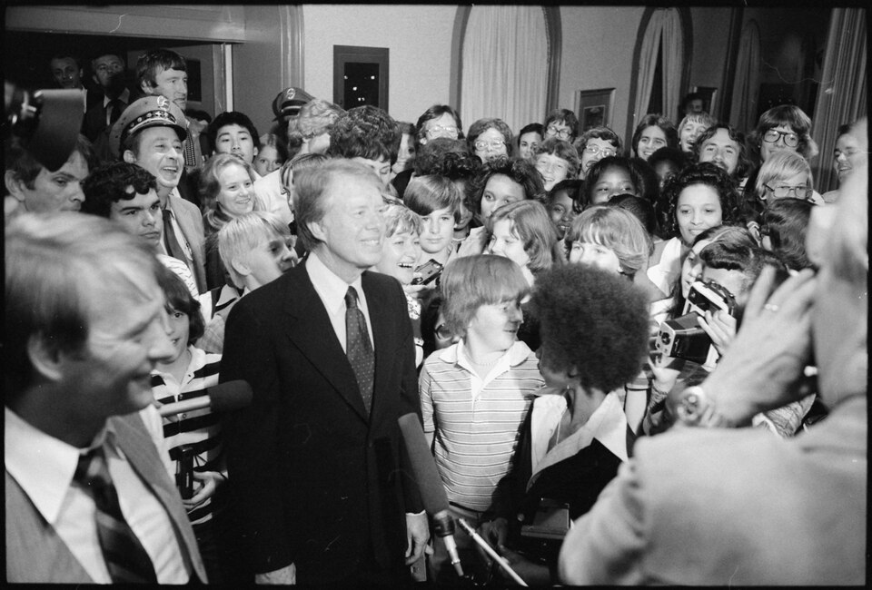
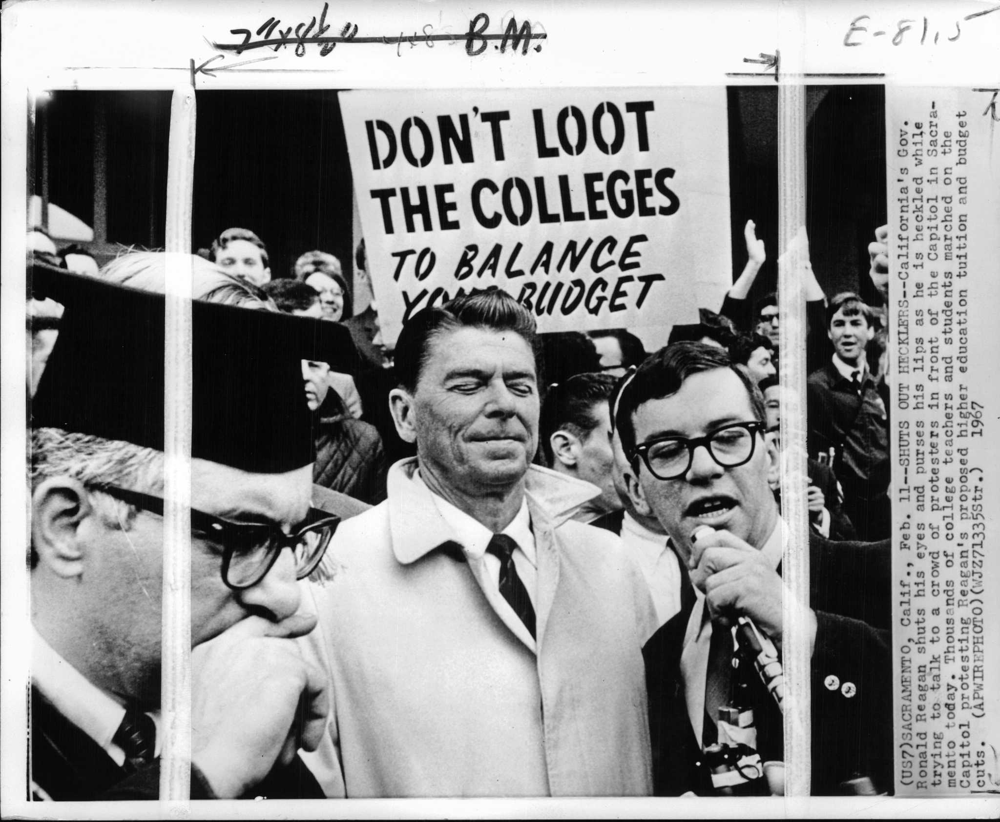
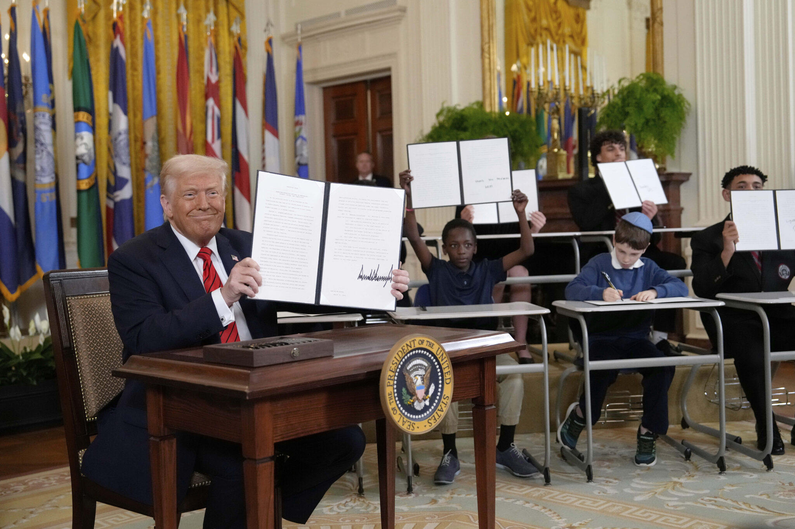

There's a bill package sitting in front of Congress right now that would gut most of what the Department of Education, usually abbreviated ED, actually does. Education policy is something I actually know a fair amount about (though I am still a neophyte), so I wanted to write up how we got here before it potentially gets dismantled.

I want to cover two things:

a)  The history of the department, since I think understanding its history is important for understanding its role in American political discourse today. You'll notice a lot of the same arguments repeating.

b)  What ED actually does today, and what these bills would specifically hinder.

This is a crash-crash course since the more I've learned about this stuff (like many things) the more I realize it is more complex. But I think I can highlight some key findings and understandings.

## Pre-Civil War

Under the 10th Amendment, education was never granted to the federal government as an area of governance. Schools and education were supposed to be left up to the states.

-   **1857 and 1858**: A small contingency of people wanted federal land grants so states could open colleges to teach agriculture and mechanical skills. This failed to pass both times it was tried.
-   **1861**: In the wake of industrialization and population growth across the country, Lincoln's administration saw it necessary to start collecting information on the number of schools present and being built. This also led to the public state college land grants.

Schools had already become another vector of state versus federal jurisdiction that added to pre-Civil War tensions, though probably not a major contributor on its own.

## Post-Civil War

.jpeg)

-   **1867**: The Department of Education was created under Andrew Johnson's presidential cabinet.
-   **1869**: By law, ED was demoted to a lower "Office of Education" after states' rights advocates pushed back. The office was placed under the Department of the Interior.
    -   Its stated purpose was to collect information and statistics about schools and provide advice to schools, essentially operating the same way the Department of Agriculture collects information and provides help to farmers.
    -   The office flip-flopped between names during this period, including the "Bureau of Education and Statistics," before eventually landing back on its original name. It existed in this form for decades, until 1939.

## Mid-20th Century to Carter

There were too many of acts and bills for education funding passed during this century to go over, so I am just going to focus on some key issues.

-   **1939**: A law repealed and dismantled the Office of Education. Afterward, education was delegated to the Federal Security Agency.
-   **1953**: Responsibility for education moved to the Department of Health, which was later renamed the Department of Health, Education, and Welfare. This stayed the case until Carter.

### 1965 (signed by LBJ): the Elementary and Secondary Education Act (ESEA)

This was the first significant federal K-12 funding, and I've seen education policy analysts argue this is the real milestone of federal involvement in education, far more important in terms of actual impact than the creation of the Department of Education itself. These pieces of legislation are still relevant 80 years alter.

-   **Title I**: funding for schools serving low-income students, still the largest K-12 funding stream today.
-   **Title II**: originally funding for refugee and low-income-housing children, reworked several times since.
-   **Title III**: originally funding for supplementary educational centers and services, including adult education. Today's Title III of ESEA funds English-learner and language-instruction programs instead.
-   **Title VI**: funding for special education and disabilities-related programming.
-   **Title VII**: funding for vocational schools.

### 1965 (signed by LBJ): the Higher Education Act (HEA)

Designed to strengthen the educational resources of colleges and provide financial assistance for students in higher education.

-   **Title I**: sets the overarching definitions and rules for grant programs.
-   **Title II**: funds programs to improve teacher preparation and recruitment.
-   **Title III**: creates grants that go to institutions rather than students, specifically aimed at colleges with low-income or large numbers of minority students.
-   **Title IV**: funds student financial assistance, probably the most well-known title. Establishes federal student loan programs, work-study, and a regulatory framework. Pell Grants were later amended onto this title after the Education Amendments of 1972.
-   **Title V**: initially created to fund the "National Teacher Corps" to send teachers into low-income areas, but later repurposed into grants aimed at strengthening colleges serving underfunded student populations that don't fall under Title III, like Hispanic-Serving or Tribal colleges.
-   **Title VI**: funds foreign language institutions and international business education programs.
-   **Title VII**: covers graduate-level support programs and fellowships.
-   **Title VIII**: covers other funds that don't fit elsewhere.

### 1972 (signed by Nixon): the Education Amendments

This essentially expanded HEA, growing federal funding while bolting on major civil rights protections at the same time, in the wake of the civil rights era. There were a lot of titles in this bill, so here are the important ones:

-   **Title I**: created Pell Grants and stapled the program onto Title IV of HEA.
-   **Title II**: expanded federal support for vocational training programs.
-   **Title III**: established the National Institute of Education, a federal research agency to coordinate and fund education research.
-   **Title VII**: provided federal money to cover the costs of desegregation, acting as a financial incentive to desegregate.
-   **Title VIII**: limited anti-busing segregation practices for school buses. Interestingly, Nixon thought this didn't go far enough on desegregation.
-   **Title IX**: added a new title barring sex discrimination in any federally funded education program. This has had far too many consequences over the decades to list here, but it's just one of the civil rights mechanisms ED can use, discussed more below.

### 1979 to 1980: the Department of Education Organization Act (signed by Jimmy Carter)

In 1979, Senator Abraham Ribicoff introduced the Department of Education Organization Act, which was later signed by Jimmy Carter the same year. Senator Ribicoff, who was the Secretary of Health, Education, and Welfare under JFK, was originally concerned for Education and was disappointed that education took the back burner compared to Health. So he started a campaign to create a specific Department of Education in order to give education a dedicated executive office (actually, he has a really interesting political history fighting for school integration and police brutality against student Vietnam protesters). Though, the creation of a Department of Education was a general goal the Carter administration had wanted and helped organize to push.

.jpg)

Jimmy Carter signed the Department of Education Organization Act, which officially created the Department of Education we have today. Carter called it "a significant milestone in my effort to make the federal government more efficient," since the role of education management had been scattered across many agencies and offices up to that point.

Detractors called it a waste and a bloated bureaucracy, a common criticism of the Carter administration generally. There were also states' rights-based complaints arguing it violated the 10th Amendment, the same argument used in the 1860s.

In reality, Carter created ED for two reasons: it was something he'd campaigned on and wanted to show a win on, and he was struggling ahead of the 1980 election and wanted the teachers' union's backing, which he became the first president to ever receive. Obviously, these efforts proved fruitless as he lost to Reagan.

At this point, the department's stated goals were:

-   Strengthen the federal commitment to equal educational opportunity for every individual.
-   Supplement, not replace, the efforts of states, local school systems, private institutions, researchers, and parents to improve education quality.
-   Encourage public, parent, and student involvement in federal education programs.
-   Improve education through federally supported research, evaluation, and information sharing.
-   Increase accountability of federal education programs to the President, Congress, and the public.

This mission mattered because there was a growing US populace, and there was still fallout in the wake of desegregation.

## Reagan and Modern Arguments About Education

-   **1980 to 1981**: Immediately after Reagan was elected, his administration threatened a 30 percent federal funding cut to education agencies, though it only managed to pass a 10 percent cut. Reagan called for the elimination of Carter's new ED and supported tax credits for private school tuition. This is when conservative arguments in favor of tax credits really start to cement in political discourse.
-   [The New Right](https://en.wikipedia.org/wiki/New_Right) argued public schools threatened American life and culture, notably only ever talking about public education.
-   Notable figures like Milton Friedman were widely quoted calling public schools "islands of socialism in a free-market sea."
-   Public education became a huge point of attack for arguments about government bloat and anti-capitalism. The Christian Crusade (the major religious-right movement of the time and a precursor to the Heritage Foundation) claimed that ED and the National Education Association had created a school system where children were being indoctrinated for a new collectivist world government.

Essentially, this is the same argument still used today, and it hasn't changed much since Reagan. At the time, ED's actual role hadn't changed much from being a data collection agency and manager of federal funds, but the department became a focal point of anti-government-bloat discourse, partly because it was brand new.

## The Department of Education Today, and Its Core Functions

Strip away the politics and ED has four core functions:

1.  **Administers federal financial aid for education.** It sets policy on financial aid, distributes it, and monitors its use. The Trump administration is currently pushing this function toward the Treasury Department.
2.  **Collects data on the nation's schools and funds education research.** This was the original purpose of the federal education office as far as Lincoln-era Republicans saw it. A lot of this capacity was gutted by DOGE cuts in 2025, including the cancellation of roughly \$900 million in contracts at the Institute of Education Sciences. Next to USAID, this was probably one of the worst things DOGE did, though some of it has since been reinstated.
3.  **Focuses national attention on education issues and proposes reforms.** This is largely discretionary and depends on who's Secretary. Under Secretary Linda McMahon, the administration's stated approach is to push this responsibility down to the states rather than set national policy.
4.  **Enforces civil rights and equal-access laws in education**, through the Office for Civil Rights, a Carter-era creation that ensures schools receiving federal money comply with federal civil rights law, including Title IX, Title VI, and IDEA-related protections. ED uses federal funding as the carrot to get schools to comply.

Importantly, ED's job is mostly implementation, not invention. At the end of the day, its purpose is to enforce whatever Congress has told it to do. In practice that mostly means:

-   **Distributing money**: Title I funding for schools serving low-income students, IDEA funding for students with disabilities, Pell Grants, and the federal student loan system.
-   **Writing regulations** on how that money can be used, which is where ED's actual influence outstrips its small direct financial footprint. States and school districts don't have to take ED's money, but if they want it, they have to follow the conditions attached. That's the entire mechanism of federal "control" over a system that's otherwise radically decentralized, with roughly 14,000 separate, locally elected or appointed school boards in the U.S.

So the rhetoric around the Department of Education's power is pretty overblown. Less than 10 percent of funding for public schools comes from the federal government and ED. The vast majority comes from state and local governments. If you dry up federal funds, ED basically becomes powerless and has no way of enforcing federal law. It ends up serving as a ceremonial "this is what education should look like" cheerleader more than anything with real teeth.

## Federal Overreach

The two biggest cases of federal overreach into education that get brought up constantly by detracters are No Child Left Behind and Every Student Succeeds Act.

-   **No Child Left Behind (2001)**: introduced mandatory standardized testing and school accountability tied to federal funding, a huge expansion of what a state had to do to keep receiving Title I money.
-   **Every Student Succeeds Act (2015)**: reauthorized and loosened No Child Left Behind, giving states more flexibility in designing accountability systems while keeping the federal testing and reporting requirement structure.

Worth noting here: the federal government has absolutely no say over curriculum. How curriculum actually gets set is a genuinely interesting subject on its own. The only strings ED attaches are based on civil rights law and test scores, not curriculum content.

I could go a lot more into No Child Left Behind, as there are many repercussions of this both good and bad, but that's way beyond the scope of this blog.no-child

## Trump's Push to Gut the ED

You cannot close ED without Congress repealing the 1979 Department of Education Organization Act. Trump is just the most recent champion in a line of attacks on ED going back to states' rights sympathizers after the Civil War, though it was really Reagan who made public education a boogeyman for the MAGAts.

**Project 2025** (Heritage Foundation) proposed phasing out Title I funding over 10 years and shifting responsibility to the states. Recall that less than 10 percent of public school funding comes from the federal government in the first place. The logic is that repealing ED outright would be hard, but gutting its ability to enforce policy would effectively neuter it just the same.

**Trump's meddling**: On March 20, 2025, Trump signed an executive order directing Secretary McMahon to take all necessary steps to facilitate the closure of the Department of Education and return authority over education to the states and local communities. Since then, the administration has been leveraging "interagency agreements" to informally shift ED responsibilities to other agencies and departments. A good example is student loan management getting pushed to the Department of Treasury, which, in the administration's defense, was technically the agency responsible for that role about a century ago.

There's a lot more meddling I could talk about, like meddling with school curriculum's, anti Critical Race Theory fear-mongering, don't say gay laws, etc. But I will just focus on the ED for now.

**"Less Bureaucracy, Better Education"**: On July 15, 2026, the House Committee on Education and the Workforce advanced a 10-bill package, pretty much on party lines. This would not abolish ED outright, since the Senate would likely never pass that, but these bills would permanently codify the interagency transfers mentioned above. It's pretty much straight out of Project 2025, and it would strip the Secretary of Education of statutory authority over the affected programs, killing ED's role in having any real oversight into most matters of education.

A quick list of the bills:

-   **H.R. 9609**, Less Bureaucracy, Better Student Aid Act (Walberg): transfers Federal Student Aid functions, staff, and records to the Treasury Department.
-   **H.R. 9607**, Less Bureaucracy, Better Workforce Development Act (Walberg): transfers Career, Technical, and Adult Education to the Department of Labor.
-   **H.R. 9611**, Less Bureaucracy, Better Higher Education Act (Harris, R-NC): transfers TRIO, GEAR UP, GAANN, and Title III institutional aid to Labor.
-   **H.R. 9610**, Less Bureaucracy, Better K-12 Education Act (Harris, R-NC): this one is a bit vaguer on exactly what it would do.
-   **H.R. 9606**, Less Bureaucracy, Better Child Care for Student Parents Act (Onder, R-MO): moves CCAMPIS, the child care and after-school help program, to the Department of Health and Human Services.
-   **H.R. 9605**, Less Bureaucracy, Better Foreign Medical Accreditation Act (Grothman, R-WI): moves foreign medical school accreditation oversight to Health and Human Services.
-   **H.R. 9604**, Less Bureaucracy, Better Tribal Education Act (Owens, R-UT): moves Native education programs to the Department of the Interior.
-   **H.R. 9608**, Less Bureaucracy, Better Family Engagement Act (Miller, R-IL): moves K-12 family engagement programs to Health and Human Services.
-   A collection of bills from Rep. Joe Wilson (R-SC) and Rep. Michael Baumgartner (R-WA) moving international education programs and foreign-gift reporting to the Department of State.

Passing these bills would effectively end ED in practice. There are also bills that would straight-up abolish it outright, like **H.R. 899** (Massie, R-KY) and **S. 1148**, which would terminate ED by December 31, 2026. These have been sitting around for a while and would probably never get past a Senate filibuster.

## Conclusion

Hopefully it's evident by now that there's been a running attack on American education and the Department of Education specifically, along with fearmongering about the role of federal oversight that's usually pretty exaggerated.

It's been a states-versus-federal-government issue since before the Civil War, though during the Cold War it started adopting a free-market-versus-socialism framing on top of that. Public schools became a culture-war flashpoint starting with Reagan, later adopted wholesale by the Christian right.

Most of what gets claimed about ED today is exaggerated:

-   ED funding represents, at most, 10 percent of public school funding.
-   ED has no say over curriculum.
-   ED's purpose, across all its different forms, has largely always been about data collection and financial-aid administration.

Because getting rid of ED outright would require getting past a Senate filibuster, it's much easier to pursue a bunch of individual bills that would heavily limit its ability to function instead. From what I've read, education policy analysts generally don't attribute much of the actual improvement in American education over time to the department itself. It's clearly useful for enforcing civil rights protections, but student outcomes over time track more with legislation and school-level changes at every level of government than with the department's existence.

All that said, it seems pretty clear the current push against ED is mostly about fulfilling a culture-war argument that's been running for decades, more than it is about any serious policy analysis of what the department actually does.

## Sources

Yes, I wiki-warrior'd some of the history on this one.

**Bill text and records (Congress.gov)**

-   [H.R. 899 - A Bill to Terminate the Department of Education](https://www.congress.gov/bill/119th-congress/house-bill/899)
-   [S. 1148 - A Bill to Terminate the Department of Education](https://www.congress.gov/bill/119th-congress/senate-bill/1148)
-   [H.R. 369 - States' Education Reclamation Act of 2025 (bill text)](https://www.govinfo.gov/content/pkg/BILLS-119hr369ih/pdf/BILLS-119hr369ih.pdf)
-   [H.R. 2691 - To Abolish the Department of Education and Provide Funding Directly to States](https://www.congress.gov/bill/119th-congress/house-bill/2691)
-   [H.R. 2456 - Orderly Liquidation of the Department of Education Act](https://www.congress.gov/bill/119th-congress/house-bill/2456)
-   [Sen. Mike Rounds - Returning Education to Our States Act (bill text)](https://www.rounds.senate.gov/imo/media/doc/returning_education_to_our_states_act.pdf)
-   [Congress.gov - House Education and Workforce Committee Markup of the "Less Bureaucracy, Better Education" Package](https://www.congress.gov/event/119th-congress/house-event/119464)
-   [H.R. 9610 - Less Bureaucracy, Better K-12 Education Act](https://www.congress.gov/bill/119th-congress/house-bill/9610)

**House Committee on Education and the Workforce**

-   [Chair Walberg Delivers Remarks at Markup of 10 Bills](https://edworkforce.house.gov/news/documentsingle.aspx?DocumentID=413598)
-   [Committee News List](https://edworkforce.house.gov/news/documentquery.aspx?DocumentTypeID=1823)

**Background and history**

-   [Harvard Graduate School of Education (EdCast) - "Unpacking the U.S. Department of Education: What Does It Actually Do?"](https://www.gse.harvard.edu/ideas/edcast/25/02/unpacking-us-department-education-what-does-it-actually-do)
-   [The Chronicle of Higher Education - "The Higher Education Act Just Turned 50. Has It Done What It Was Supposed To?"](https://www.chronicle.com/article/the-higher-education-act-just-turned-50-has-it-done-what-it-was-supposed-to/)
-   [HISTORY.com - "The Rise and Rapid Fall of the First US Department of Education"](https://www.history.com/articles/department-education-andrew-johnson-reconstruction)
-   [EBSCO Research Starters - "U.S. Department of Education Is Created"](https://www.ebsco.com/research-starters/history/us-department-education-created)
-   [Wootton Common Sense - "This Day in History: Department of Education Created"](https://woottoncommonsense.com/6925/news/this-day-in-history-department-of-education-created/)
-   [Cornell University Library (RMC) - "Senator Justin S. Morrill, the Land-Grant College Act and Cornell"](https://rmc.library.cornell.edu/morrill/MorrillLincoln.html)
-   [APLU - "Land-Grant University FAQ"](https://www.aplu.org/about-us/history-of-aplu/what-is-a-land-grant-university/)
-   [Wikipedia - "Henry Barnard"](https://en.wikipedia.org/wiki/Henry_Barnard)
-   [Wikipedia - "Zalmon Richards"](https://en.wikipedia.org/wiki/Zalmon_Richards)
-   [Wikipedia - "United States Office of Education"](https://en.wikipedia.org/wiki/U.S._Office_of_Education)

**Current dismantling coverage**

-   [The Conversation - "Trump's Executive Order to Dismantle the Education Department Was Inspired by the Heritage Foundation's Decades-Long Disapproval of the Agency"](https://theconversation.com/trumps-executive-order-to-dismantle-the-education-department-was-inspired-by-the-heritage-foundations-decades-long-disapproval-of-the-agency-250605)
-   [EdSource - "Trump Signs Executive Order to Dismantle Department of Education"](https://edsource.org/2025/trump-signs-executive-order-to-dismantle-department-of-education/728843)
-   [U.S. News & World Report - "Trump Signs Executive Order to Dismantle the Education Department: What to Know"](https://www.usnews.com/news/national-news/articles/2025-03-21/trump-signs-executive-order-to-dismantle-the-education-department-what-to-know)
-   [CNBC - "Trump Signs Executive Order to Dismantle the Department of Education"](https://www.cnbc.com/2025/03/20/trump-signs-executive-order-to-dismantle-department-of-education.html)
-   [NPR - "Trump to Order Dismantling of Education Department"](https://www.npr.org/2025/03/05/nx-s1-5316227/trump-order-dismantling-education-department)
-   [NASFAA - "House Republicans Introduce Package of Bills to Transfer ED Responsibilities, Appropriations to Other Agencies"](https://www.nasfaa.org/news-item/39371/House_Republicans_Introduce_Package_of_Bills_to_Transfer_ED_Responsibilities_Appropriations_to_Other_Agencies)
-   [Community College Daily - "House Bills Would Codify ED Program Transfers"](https://www.ccdaily.com/2026/07/house-bills-would-codify-ed-program-transfers/)
-   [University Business - "New Legislative Package Would Dramatically Downsize Education Department"](https://universitybusiness.com/new-legislative-package-would-dramatically-downsize-education-department/)
-   [News From The States - "US House Republicans Take 'First Step' Toward Dismantling Department of Education"](https://www.newsfromthestates.com/article/us-house-republicans-take-first-step-toward-dismantling-department-education-trump-linda-mcmahon-executive-order-tim-walberg-bobby-scott)
-   [U.S. Department of Education - McMahon's Statement on the Legislative Package](https://www.ed.gov/about/news/press-release/us-secretary-of-education-linda-mcmahon-issues-statement-house-education-and-workforce-committees-less-bureaucracy-better-education-legislative)
