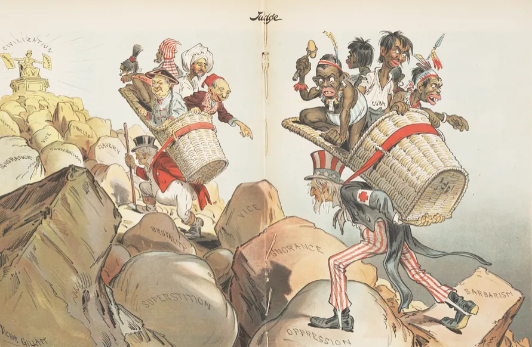
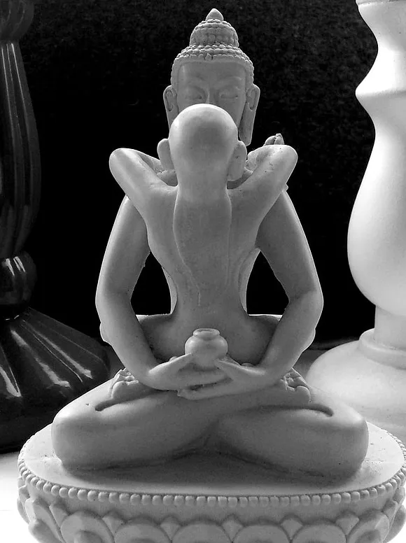
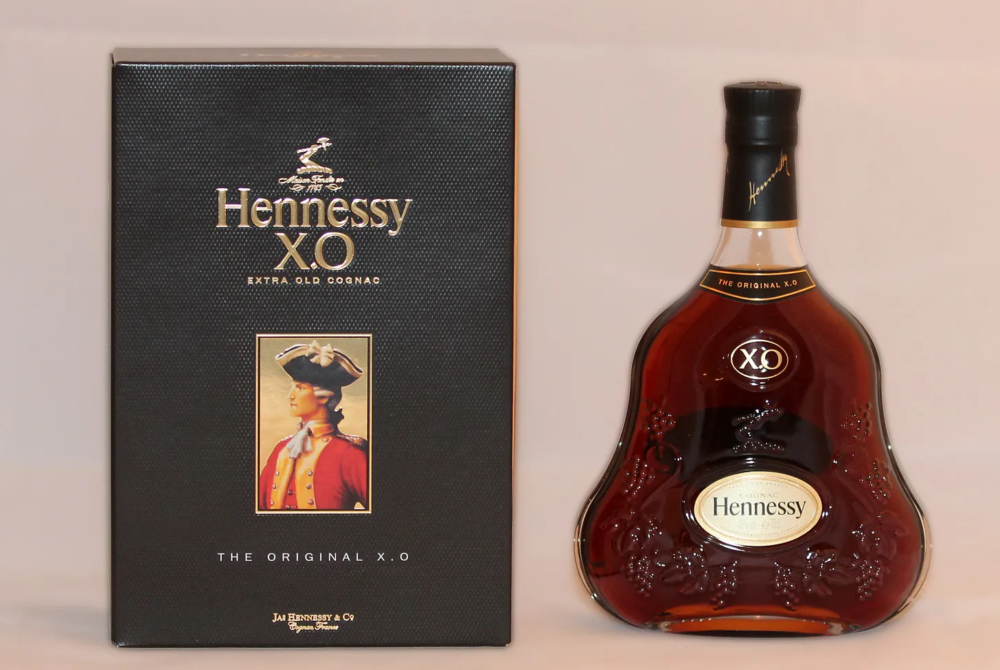
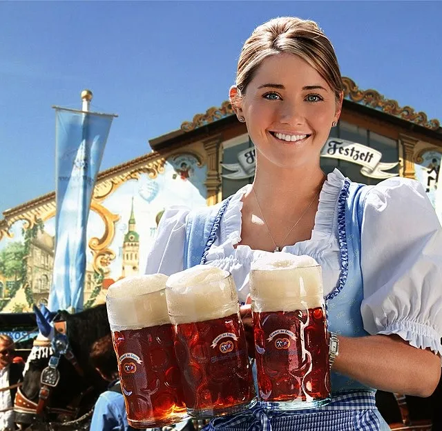
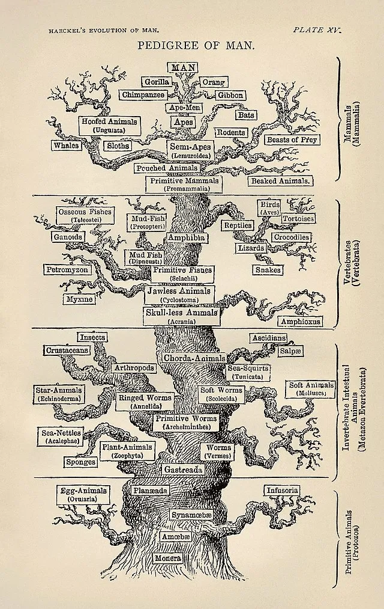

**DISCLAIMER: This is an old post. I think its always nice to catalog your old writing. It's good to look back on to see how much has changed. In this case, however, not much has changed other than I feel like I was funnier back in the day.**

I've finally clawed my way back to writing callused and all. Rage and anger from recent events — plus the endless cesspool of insanity online — have been my relentless, albeit admittingly unhealthy, driving forces. Also, I'm throwing writing in right after the hundred backlashes in my daily ritual of flagellation, because apparently, I haven't been committed enough to my demonstrations of humility. Based on how this essay turned out, I need to put more effort into the penance.

As someone who has always been interested in and invested in evolutionary biology, I have naturally been exposed to the controversial field of [evolutionary psychology](https://plato.stanford.edu/entries/evolutionary-psychology/) (EP). This field intrigued me, and I dug into it about five years ago, but I kind of fell out of it when I got more into methodology in general.

EP is more pervasive than some people might realize. I find lurkings of this line of thinking whenever discussions dwell on the "nature" of man or society, and it is inevitably going to come up whenever serious discussions of humane evolution occur. Some of my favorite philosophical essays on the nature of existence often have a veneer of EP, appealing to the natural state of man or our mind. (See my [essay on Zapffe](/posts/zapffe) like a year ago \[getting back into it 😤\]). EP as a field didn't begin until the later 20th century, but it has unofficially existed as far back as Darwin, who wrote certain books like [*The Expression of the Emotions in Man and Animals*](https://darwin-online.org.uk/converted/pdf/1897_Expression_F1152.pdf).

> In the distant future I see open fields for far more important researches. Psychology will be based on a new foundation, that of the necessary acquirement of each mental power and capacity by gradation.
>
> — Darwin, Charles (1859). *The Origin of Species*. p. 488

Most famously, notions of evolution in humans were abused by the Social Darwinists to justify their own nefarious worldviews, such as the supposed inferiority of people with mental disabilities or the sub-intellect of Africans, which [gave birth to eugenics as well as race-based intelligence differences](https://www.genome.gov/about-genomics/educational-resources/timelines/eugenics).

Social Darwinism was a poison to science and society, and it has become much maligned for good reasons. So, I understand the reactionary skepticism that EP faces today. It's better to be overly cautious of these motivated lines of thinking, given the harm they have caused in the past.

## The Grifters

The sheer amount of grift surrounding EP certainly doesn't help its reputation. There's a whole crowd of people who adamantly subscribe to "biologically and scientifically verified" views that align with their lives and ideals. I refer to these as Neo-Social Darwinists, since they often seek to weaponize science for their pernicious aims. But I am also comfortable calling them fucking ingrates cause I find it funnier. EP has weirdly become a fixation of many right-wing, "[red pill" communities](https://www.tandfonline.com/doi/full/10.1080/09589236.2023.2260318#abstract) that spout the values of "traditional" masculinity, femininity, and relationships, among other stupid ideas, for which they weaponized natural selection. I listened to a debate against a [tantric sex](https://www.webmd.com/sex/what-is-tantric-sex) guru from Santa Monica who started invoking concepts of EP to justify the feminine submissive energies of her spiritual-sexual guidance, and it was so mind-rotting that it almost turned me off the concept of sex at all (almost).

I find these kinds of folks hilarious because they are, themselves, the best counterargument against the evolution they love so much — clearly, they've disproven evolution by proudly displaying the fact that they are direct descendants of chimpanzees.

Not all of us are fortunate enough to have 1.2% more chimpanzee DNA than the average person. So, the intuitive grasp of their ideals will forever escape me. Ironically, the same individuals who decry fields like gender psychology and the social sciences at large will adopt and adapt social sciences when it suits them. It's almost like science is just a tool to them, and they don't actually give a fuck about it. Maybe I was wrong about them being chimps. It might be more likely that they are degenerate mollusks of human beings instead.

As a consequence, EP has gotten such a bad reputation in the mainstream that I feel kind of bad for the earnest researchers in the field. EP programs should start including public relations in their core curriculum because anyone entering the field will inevitably be tied to the baboons who drag their knuckles through it.

## The Gripers

I certainly don't like the group I described above (shocking), but I wanted to bring attention to the other kind of people who annoy me — those who feel emboldened to attack an entire field of science based on surface-level knowledge. Almost always these truth sayers' understanding is just as shallow. I don't claim to be an expert on the subject of EP. I've read some papers here and there, and I've read a bit of [*The Handbook of Evolutionary Psychology: Volume 1: Foundation (2015)*](https://www.amazon.com/Handbook-Evolutionary-Psychology-Foundation/dp/111875588X/) when I was more into it, but I don't feel qualified to fully critique the field. However, there are plenty of critiques within Psychology itself ([Botto & Gottzén, 2022](https://academic.oup.com/book/35226/chapter-abstract/299749084?redirectedFrom=fulltext); [Confer et al., 2010](https://psycnet.apa.org/record/2010-02208-001)).

What I want to emphasize is that the backlash against EP has primarily been a reaction to individuals who seek to weaponize it. The controversies in the popular realm are very different from the debates happening within academia. Even some geneticists and biologists I've read seem to base their understanding of the field on the exaggerated claims often reported in pop science media. It's an unfortunate reality of psychology (and many other fields) that the more outlandish or extraordinary claims are the ones that gain traction among the masses.

I have a rule of thumb when it comes to science and any academic discipline in general: if you, as someone with little understanding of the material, have found a potential objection or criticism, chances are the people who have dedicated their lives and careers to the subject have already thought of it. Simple yet desperately lacking among the slugs slugging around.

## Analysis Objections

Frankly speaking, people don't know shit about statistics. I have seen so many criticisms of EP that would apply to the whole field of Psychology. One common objection I see is low sample size of this or that study, "B-but, these studies had low sample size!!1!" Well ok white knight, if you don't like low sample size, get ready to throw away a *lot* of research.

The fact of the matter is, yes larger sample size is almost always preferable, but this simply isn't feasible most of the time. There *are* remedies for low sample sizes. These vary from different types of models, different estimation techniques, different statistical tests, and so forth depending on the context. And sometimes, methods are simply robust to this issue, meaning it doesn't affect the analysis substantively.

I worked on a project involving some race-language groups of only 8 people or so out of a total sample of about 60. People be hard to measure. This is just the reality of doing psychological research.

## Experimental Design Objections

The other issue on this matter is the obvious retort that always gets levied at EP: "what about cultural differences." The critique goes something along the lines of, "You can't prove this is evolution because culture and learned behavior exist!" Now, in fairness, this *is* an actual concern, but appealing back to my rule of thumb, it's a very obvious one that would be thought about and carefully controlled for.

This criticism annoys me a lot whenever it gets brought up because the critics are always smug about it like they just crumbled the foundations of the whole field with a single utterance of "environmental conditioned behavior." It's so self-evident that culture is a confounding effect, it is not worth bringing up in the majority of cases.

## Conclusion and Last Rants

This isn't a substantive defense or attack on the whole field of EP. I only wanted to touch on the things that derail any conversation of EP from anything productive or interesting.

EP is just yet another method among many to explain human behavior. But, ultimately, it cannot be the only correct perspective. The nature of the soft sciences is that there are no strict mechanics that can be used as the justification for macro theories of human thoughts or behavior. A phenomenological interpretation will always present itself, and nothing purely material can replace it.

EP better fuck off from imposing a [teleology](https://en.wikipedia.org/wiki/Teleology_in_biology) onto everything. Evolution only acts to describe the mechanism as to how things are — a long stochastic process of changes in frequencies of genotypes and phenotypes over generations of populations of organisms. Evolution has no purpose, aim, or goal. Natural selection is a stochastic process that just has predictable trends that can explain the phenomenon we observe. It does not ascribe purposes to them, and our traits aren't "designed."

Here are the takeaways. Don't hate women or minorities, don't assume you know more than people who do these things for a living, don't mention teleology, and stay humble :\^)

------------------------------------------------------------------------

The [Common Loon's](https://en.wikipedia.org/wiki/Common_loon) call has become synonymous with the echoes of solitude — a pleasure of nature only those at the early morning misted lake have the pleasure of hearing.

------------------------------------------------------------------------


