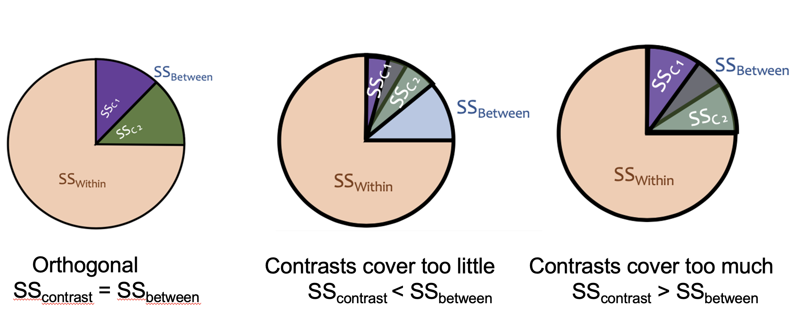
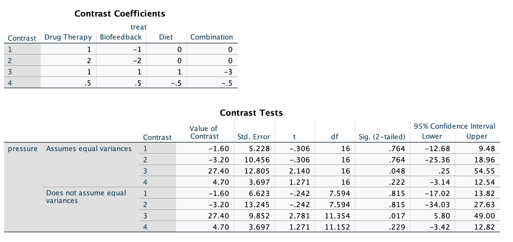
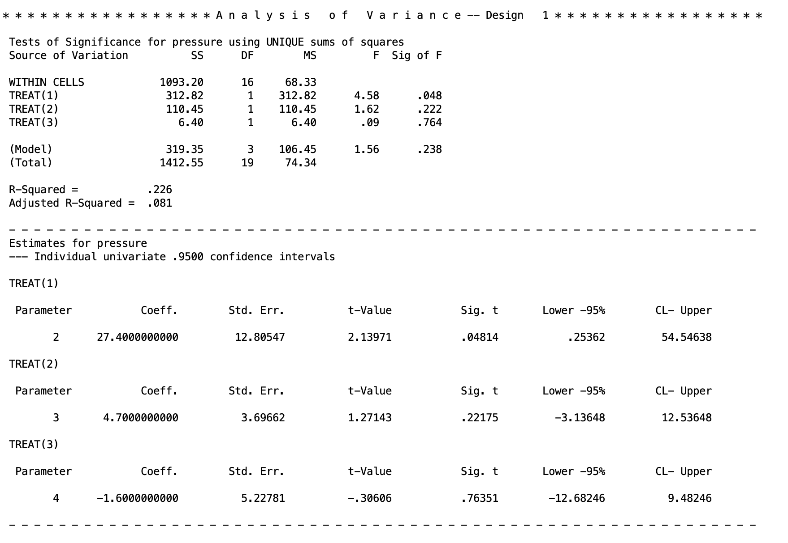

## Introduction

In this lesson, we will introduce you to contrasts and how to formulate them for hypothesis testing.

We will test group differences among three groups using three SPSS procedures: one-way ANOVA, univariate ANOVA, and multivariate ANOVA (MANOVA). Note, SPSS can't be ran natively in Quarto (how I am generating this page), so all results I am copy/pasting from SPSS output.

Contrasts are used to do followup comparison tests after a significant ANOVA. The null hypthesis of an ANOVA is that all the groups are the same.

I.e. $$\mu_1 = \mu_2 = \mu_3$$

The alternative is that *at least one* of the means is different. The issue is that this could come from many pattern. Here are some potential sources of a significant ANOVA where you would reject the null hypothesis

$$\mu_1 = \mu_2, ~~\mu_2 = \mu_3,~~ \mu_1 \neq \mu_3$$

$$\mu_1 \neq \mu_2 \neq \mu_3$$

$$\mu_1 = \mu_2,~~ \mu_1 = \mu_3,~~ \mu_2 \neq \mu_3 $$

And so on. A *linear contrast* helps us figure out which of the potential alternative hypotheses is the correct one and is what is giving us a significant omnibus ANOVA test.

If you do *not* have a significant omnibus ANOVA, then you should ignore the contrasts since you've already determined that there is no mean difference (failed to reject the ANOVA null). Thus, any potentially significant contrasts you get would be considered false positives (Type I error).

From my experience leading the lab lectures of this course, this lesson tends to be the most unintuitive lesson, at least at first. Contrasts will become more clear when we start doing more specific comparisons.

### The Dataset

We will be using the Contrasts.sav dataset for this lesson. The motivating example is a context where a researcher is interested in treatments to reduce hypertension of the blood stream. Consider a hypothetical study with four independent groups of subjects, each of whom is assigned randomly to one of the following treatments: drug therapy, biofeedback, dietary modification, or a treatment combining all aspects of the other treatments. For simplicity, suppose the dependent variable is a single blood pressure reading taken 2 weeks after the termination of treatment.

The data would consist of four groups.

| drug therapy | biofeedback | dietary modification | combined |
|--------------|-------------|----------------------|----------|
| 84           | 84          | 98                   | 94       |
| 95           | 92          | 95                   | 78       |
| 93           | 101         | 86                   | 85       |
| 104          | 80          | 87                   | 80       |
| 81           | 108         | 94                   | 81       |
| mean 91.40   | mean 93     | mean 92              | mean 83  |

------------------------------------------------------------------------

## 1. Contrasts

In order to deduce how the omnibus ANOVA is significant, we have to create a list of possible alternative hypotheses in equations called "contrasts". These contrasts are formulated as equating two or more means to each other. For example, lets say we believe that the ANOVA is significant because the mean of drug therapy differs from biofeedback. The null hypothesis (assuming that there the groups are equal) would look like

$$ \mu_{drug~therapy} = \mu_{biofeedback} $$

If these two means are equal, in other words, we are saying that the difference between them is 0.

$$ 0 = \mu_{drug~therapy} - \mu_{biofeedback}$$

Much like a t test, we want to see if these two means are significantly different than 0 or not. Keep in mind that this is for the population, we have to deduce if we reject this null or not from our data. So we can formulate this contrast with our observed data to calculate a mean difference that will be tested.

$$ \Psi_1 = \bar{X}_{drug~therapy} - \bar{X}_{biofeedback}$$

The $\Psi$ represents the value of the mean differences from our sample. That is, when we plug in our group means to calculate the value of $\Psi$.

$$ \Psi_1 = 91.4 - 93 = -1.6 $$

So the testing value for this contrast is $\Psi = -1.6$ (note, which order you subtract the means does not matter for the significance test, the only difference it will make will be the signs of the ends of the confidence intervals).

I'll spare you the formulas, but in the end, this value will give us an F statistic and a p value, so we can see if this mean difference is significant or not. If it *is* significant, this could be *a* source of the significant omnibus ANOVA test, however there could be contrasts that are significant. The F statistic for the test follows the form

$$CV = F_{\alpha;~ 1, ~df_{error}}.$$ where $\alpha$ is your alpha level and $df_{error}$ is your degrees-of-freedom of the error variance.

Unlike with t tests, you can test multiple means at once in any method so long as you can formulate them into a simple equality ($MEAN 1 = MEAN 2$). How this works is that you can test whether the *average* of multiple means differs from other means.

For example, let's say I want to see if the combined treatment group differs from the average of all the other treatments. We can formulate the null hypothesis as:

$$ \mu_{combined} = \frac{\mu_{drug~therapy}+\mu_{biofeedback}+\mu_{diet}}{3} $$ If we do some algebra, we can get this as a difference that equals 0:

$$ 0 =\mu_{combined} - \frac{\mu_{drug~therapy}+\mu_{biofeedback}+\mu_{diet}}{3} $$ Then, to make things simpler, we should distribute the $-1/3$:

$$ 0= \mu_{combined} + \frac{-1}{3}\mu_{drug~therapy}+\frac{-1}{3}\mu_{biofeedback}+\frac{-1}{3}\mu_{diet} $$ This is the null hypothesis for the contrast we are testing. Whenever you want to test multiple means at once, if the means are grouped together, they *have* to be given a coefficient that is a fraction, where the denominator is the number of groups you are putting together (e.g., we are finding the average of three groups, so each get a coefficient of 1/3). We can then put this into a sample estimated contrast.

$$ \Psi_2 = \bar{X}_{combined} + \frac{-1}{3}\bar{X}_{drug~therapy}+\frac{-1}{3}\bar{X}_{biofeedback}+\frac{-1}{3}\bar{X}_{diet} $$ Plugging in the group means we get

$$ \Psi_2 = 83 + \frac{-1}{3}(91.4)+\frac{-1}{3}(93)+\frac{-1}{3}(92)\approx -9.133$$ So we will test whether or not -9.133 is significantly different than 0 or not. If it is significant, then we can say that we reject the null hypothesis that the average of the drug therapy, biofeedback, and dietary modification group means differs from the mean of the combination treatment group.

Now lets take a step back to the comparison between drug therapy and biofeedback. When I gave the $\Psi$ equation, I only wrote two variables in the model $\bar{X}_{drug~therapy}$ and $\bar{X}_{biofeedback}$. In truth, you can add *all* the group means to the model. The two means that are present just get the coefficient of 1 and -1, and the means that are not present get a coefficient of 0. $$ \Psi = 1(\bar{X}_{drug~therapy}) + (-1)\bar{X}_{biofeedback} + 0(\bar{X}_{diet}) + 0(\bar{X}_{combined})$$ This framing is important because, in order to calculate the contrasts in whatever software you use, you need to use the specific coefficients.

There are many combinations of contrasts you might be able to think of when comparing your groups. For example, you can compare the average of drug therapy and biofeedback treatment against the average of dietary modification and combination treatments. In this case, you will just have to remember you are calculating the *average* of the groups you are putting together, so each one will get a fraction coefficient. If you are confused about what coefficient you should use, work backwards from the initial ($MEAN 1 = MEAN 2$) type equality and work back fro there.

$$ \Psi_3 = \frac{1}{2}\bar{X}_{drug~therapy}+\frac{1}{2}\bar{X}_{biofeedback}+\frac{-1}{2}\bar{X}_{diet} + \frac{-1}{2}\bar{X}_{combined}$$ Recall that the order of subtraction doesn't matter when getting significance tests.

If you looked at my Linear Regression tutorial material, and went over the Multicategorical Predictor lesson, you will recall I talked about contrasts there too. Well, it turns out that a multicategorical regression is doing the same thing as contrasts in ANOVA!

Contrasts like above are the fundamental utility of ANOVA. It's not really that helpful to find if there is *any* difference in the group means. As a researcher you want to know what groups are significantly different and *where* that difference occurs. This will be especially the case when we get into more complicated ANOVAs. The utility of ANOVA as a researcher stems from its ease in assessing complex group memberships and their differences. It is much easier to do contrasts for a split plot, 3 x 2 mixed subjects MANOVA, for example then it is to run a ton of complex interactions in a regression and try to interpret them.

ANOVA is just a different language to interpret the data.

Not all can be well, and unfortuntately, there are stipulations about the type of contrasts that you can run. We will go over what "orthogonality" is next.

------------------------------------------------------------------------

## 2. Orthogonality

In the many cases, linear contrasts must be **orthogonal**. Orthogonality means that the contrasts are statistically independent of each other. This means that each contrast is testing a completely unique piece of the between-groups variability, with no overlap. Think of it like slicing a pie: orthogonal contrasts carve $SS_{between}$ into non-overlapping slices that add up exactly to the whole pie.

{fig-align="center" width="489"}

If your contrasts are not orthogonal, the slices either overlap (testing the same variance twice) or leave gaps (missing some variance entirely), which produces incorrect results. If the contrasts covers too little, the variance you need to test in the orthogonal will spill out of the pie, making you mistake your variance as smaller than it is. If the contrast covers too much, your pie is overflowing, and the contrasts will start mixing, over inflating your variance in the tests. If you recall from the Introduction to SPSS and ANOVA lesson, the F tests are checking the variation in the data. You need this variation to be accurate. Only orthogonal contrasts can guarantee this.

Orthogonality applies to a set of contrasts, and there are three requirements for a set of contrasts to be orthogonal.

**1. Each contrast's coefficients must sum to zero:** I.e., you need to take the coefficient of each contrast, and see that, if you add them, they equal zero. Or in other words. $$\sum_j c_j = 0$$ To take an example from an earilier contrast

$$ \Psi_2 = (1)\bar{X}_{combined} + \frac{-1}{3}\bar{X}_{drug~therapy}+\frac{-1}{3}\bar{X}_{biofeedback}+\frac{-1}{3}\bar{X}_{diet} $$

The sum of the coefficients are

$$ 1+\frac{-1}{3}+\frac{-1}{3}+\frac{-1}{3} =0$$

This ensures that the contrast is a genuine comparison of group means rather than just a weighted average of them. So long as you keep in mind that a contrast is testing a null hypothesis that the sum equals 0 and you work back from there (see above), then you will guarantee this.

**2. The positive coefficients should sum to 1 and the negative coefficients should sum to -1.**

This rule prevents a group mean from appearing on both sides of the comparison at once. Aka, since you are taking an average of multiple means (when you bunch up multple groups), then the coefficients that result will, by necessity, sum to 1 or -1.

For example,

$$ \Psi = (1)\bar{X}_{combined} + \frac{-1}{3}\bar{X}_{drug~therapy}+\frac{-1}{3}\bar{X}_{biofeedback}+\frac{-1}{3}\bar{X}_{diet} $$ The positive coefficient: $1$

The negative coefficients: $\frac{-1}{3}+\frac{-1}{3}+\frac{-1}{3}=-1$

If you did Rule 1, this rule will be fufilled automatically, since they will sum to zero.

Technically the coefficients just need to be in the correct proportions rather than exactly 1 and -1, so you can multiply through by a whole number to avoid repeating decimals (e.g.,$1+\frac{-1}{3} + \frac{-1}{3} + \frac{-1}{3}$ becomes $3+-1 + -1 + -1$). This won't affect your significance test result, however it will give you the wrong confidence intervals. The confidence intervals, as a result, will be scaled to the same degree that you scaled the contrast coefficients.

E.g., I scaled $3+-1 + -1 + -1$ by 3, so the confidence interval will be 3 times as long. All I need to do is divide the ends of the confidence interval by 3 to get the correct interval.

As you will see, in SPSS it will occasionally be necessary to scale the coefficients up and scale the confidence intervals down in this manner.

**3. The dot product of any two contrasts must equal zero:**

This is the formal test of independence between two contrasts. The "dot product" is a matrix algebra term, but it essentially means that the, for any two contrast, if you multiple the coefficients of the respective means. Formally, it is represented by $\sum_j c_{1j} \cdot c_{2j} = 0$.

To do this manually, take $\frac{-1}{3}$ from $\frac{-1}{3}\bar{X}_{drug~therapy}$ from the $\Psi_2$ contrast and take $\frac{1}{2}\bar{X}_{drug~therapy}$ from the $\Psi_3$ contrast. Then multiply them together: $\frac{-1}{3}*\frac{1}{2}=\frac{-1}{6}$.

Do this for *every* group mean for the contrasts. Then, after, sum each of these together.

For example between $\Psi_2$ and $\Psi_3$.

$$ \Psi_2 =  \frac{-1}{3}\bar{X}_{drug~therapy}+\frac{-1}{3}\bar{X}_{biofeedback}+\frac{-1}{3}\bar{X}_{diet} + (1)\bar{X}_{combined} $$

$$ \Psi_3 = \frac{1}{2}\bar{X}_{drug~therapy}+\frac{1}{2}\bar{X}_{biofeedback}+\frac{-1}{2}\bar{X}_{diet} + \frac{-1}{2}\bar{X}_{combined}$$ Multiply the coefficients of the respective groups:

$$\text{Drug Therapy}: \frac{-1}{3} * \frac{1}{2}= \frac{-1}{6}$$ $$\text{Biofeedback}: \frac{-1}{3} * \frac{1}{2}= \frac{-1}{6}$$ $$\text{Diet Modification}: \frac{-1}{3} * \frac{-1}{2}= \frac{1}{6}$$

$$\text{Combination}: 1 * \frac{-1}{2}= \frac{-1}{2}$$ Sum these together

$$\frac{-1}{6} + \frac{-1}{6} + \frac{1}{6} + \frac{-1}{2}=\frac{-2}{3}$$ So, since this does *not* equal 0, these two contrasts are *not* orthogonal. If you want to know if the set of contrasts you are interested in are orthogonal, you need to do this between every possible combination ($\psi_1$ vs $\psi_2$, $\psi_1$ vs $\psi_3$, and $\psi_2$ vs $\psi_3$).

If at least one of them is not orthogonal with one another, then the full set is not orthogonal. If all of them orthogonal, then the set is good to go.

Here's an example of orthogonal contrast

$$ \Psi_1 =  (1)\bar{X}_{drug~therapy}+(-1)bar{X}_{biofeedback}+(0)\bar{X}_{diet} + (0)\bar{X}_{combined} $$

$$ \Psi_2 =  \frac{-1}{3}\bar{X}_{drug~therapy}+\frac{-1}{3}\bar{X}_{biofeedback}+\frac{-1}{3}\bar{X}_{diet} + (1)\bar{X}_{combined} $$ I told you visualizing the coefficients of 0 would be helpful! I'll skip some lines and see if these are orthogonal

$$(1)(\frac{-1}{3}) + (-1)\frac{-1}{3} + (0)\frac{-1}{3} + (0)1=\frac{-1}{3} + \frac{1}{3}=0$$ So the contrasts $Psi_1$ and $\Psi_2$ are orthogonal!

This probably seems incredibly tedious, and it is. However, if two things are true, your contrasts are guaranteed to be orthogonal, full stop.

**1. You are doing a between subject design (one person can only be member of one group)**

**2. You have a balanced design (each group has equal sample size)**

If these two things are true, then *any* contrasts you construct will automatically be orthogonal.

Why is this true? In short, shared variance between contrasts comes from two sources: people appearing in more than one group, and groups having unequal influence due to different sample sizes. A between-subjects design eliminates the first source since each person belongs to exactly one group, and a balanced design eliminates the second since equal group sizes make the dot product condition automatically satisfied for any coefficients that each sum to zero. So as long as each contrast sums to zero, the design structure handles the rest.

------------------------------------------------------------------------

## 3. Contrasts with SPSS

There's a few ways to do contrast testing with simple one-way ANOVAs. As we will get to more complicated ANOVAs, we will have to use the MANOVA function, but for now, we can go over the rest. Regardless of what software you use, you will have to come up with contrasts to test on your own, and if you are doing anything with a within-subjects components or have unequal group sample size, you will have to check that your groups of contrast are orthogonal.

First I want to talk about the caveat with long and repeating decimals. SPSS cannot do fractions as it cannot do division mid function. Instead, you must do everything in discrete decimals.

E.g.: $\frac{1}{2} \rightarrow .5$

The issue is that for certain fractions, like $\frac{1}{3}$, there is no decimal you can input as this number is infinitely repeating (e.g., $\frac{1}{3} = .3333....$). You cannot just cut decimals early or round their numbers, since this will be an incorrectly specified contrast (it will break the rule that the coefficients all sum to 0 and that the positives/negatives coefficients sum to 1/-1). So instead, you *must* rescale these coefficients to turn them into whole numbers.

E.g.: $\frac{1}{3}*3 \rightarrow 1$

To do this, all coefficients must be rescaled in the same way. For example,

$$ \Psi_2 = \frac{-1}{3}\bar{X}_{drug~therapy}+\frac{-1}{3}\bar{X}_{biofeedback}+\frac{-1}{3}\bar{X}_{diet} + (1)\bar{X}_{combined} $$

$$ \Psi_2=-1\bar{X}_{drug~therapy}+-1\bar{X}_{biofeedback}+-1\bar{X}_{diet} +(3)\bar{X}_{combined} $$

If you recall, this will not change your significance test or your F statistic. All that will change is your confidence interval. So in SPSS, if you have to do this, you *need to remember* to rescale the confidence interval after by dividing it by the number you scaled the coefficients by (in this case, take the confidence interval and divide both sides by 3).

### Using the ONEWAY Function

The `ONEWAY` procedure allows you to specify contrasts directly using `/contrast=` lines. Each `/contrast=` line specifies the coefficients for one contrast.

``` text
ONEWAY pressure BY treat
/statistics descriptives
/contrast= 1 -1 0 0
/contrast= 2 -2 0 0
/contrast= 1 1 1 -3
/contrast= .5 .5 -.5 -.5.
```

Note that the contrast `2 -2 0 0` gives the same test as `1 -1 0 0`. They differ only in scaling, thus, their confidence interval will be different. Also notice that the third contrast line I rescaled the coefficients like I stated above since I couldn't put in proper decimals. But for the last contrast, I could put in proper decimals so I left them be.

The output is.

This syntax works well for one-way between-subjects designs but fails for other designs (within-subjects, multiple factors, multiple dependent variables, etc.). Because of this, you don't need to make the contrasts you input orthogonal, and you can input any number of contrasts you wish (so long as the contrast is stated correctly. The MANOVA procedure is much more flexible, so we will use it for the majority of analyses this semester. In fact, ONEWAY can do some fundamental types of analyses that cannot be done easily in either SAS or R, which is one reason this class focuses on SPSS.



The new and important part of the output are at the bottom and labeled as contrasts. The "Contrast Coefficients" block just print the contrasts you put in the syntax. The "Contrast Tests" table gives the t tests for the contrasts. The "Assumes/Does not assume equal variances" blocks just give you two different results depending on your homoskedasticity assumption (covered in a future lesson), but this assumption essentially means you assume the variances of the scores within each group are the same. We are interested in the top half of the table. The contrasts are labeled in the order you inputted them.

-   **Value of Contrast** - the $\Psi$ contrast value
-   **Std. Error** - the standard error of the $\Psi$
-   **t** - the $t$ test statistic. NOTE, taking the square of this is equivalent to the F test. So $t^2 = F$. In the case of Contrast 1 $F = (-.306)^2=.094$.
-   **df** - the degrees of freedom for the $t$ test. Note, the df numerator for the $F$ test is just 1.
-   **Sig. (2-tailed)** - the $p$ value for the contrast test. As we can see, none are significant besides the third contrast.
-   **95% Confidence Interval** - the Lower and Upper ends of the confidence intervals for the contrast $\Psi$. Note, that we rescaled Contrast 2 by x2 and Contrast 3 by x3. So to ge the proper confidence interval for Contrast 2, do $[-25.36/2, ~~18.96/2]$ (which is equivalent to the interval for the unscaled Contrast 1), and the interval for Contrast 3 is $[.25/3, ~~ 54.55/3]=[.083,~~18.183]$.

### Contrasts within MANOVA

Contrasts with the MANOVA functiona re much more flexible in the types of ANOVA you can apply them to. So going forward, we will be focusing on the MANOVA function.

To run contrasts in MANOVA, we add a **special matrix** that identifies what contrasts we want to test.

``` text
MANOVA pressure BY treat (1 4)
/print=cellinfo(means)
/error=within
/contrast(treat) = special(1 1 1 1
                             1 1 1 -3
                             0.5 0.5 -0.5 -0.5
                             1 -1 0 0)
/design = treat(1) treat(2) treat(3).
```

Here is what each line does:

**Line 1** specifies your dependent variable (`pressure`) and your independent grouping variable (`treat`). The numbers in the parentheses represent the range of groups in the IV (group 1 through 4).

**Line 2** tells SPSS to print out the means of each group. This line is not necessary, but omitting it means you will not have the group means conveniently provided to you.

**Line 3** specifies the type of SS error we are using for the ANOVA. We will use the within-error option. This line is redundant since it is the default, but include it for transparency.

**Line 4, the special matrix**, identifies the contrasts we are interested in testing. Within `/contrast()` you put your grouping variable. Then after, in the `= special()` argument, you need to state your contrasts. However, there are guidelines to how this "special matrix" work.

Guidelines for the special matrix:

1.  **The first row consists of all ones.** This adds the grand mean to our model (equivalently, the intercept in the regression framework). Without it, SPSS would not know what baseline to use for your contrasts. I usually put this directly after `special(` on that same line for clarity, that way each contrast is on an individual row.

2.  **The special matrix must always be a square matrix**. This means the rows and columns need to be equal in size (including the ros of all 1's). The number of columns and rows must be equal to $a$, which is the number of groups for your group variable. Within the MANOVA function, you can test $a - 1$ contrasts per special matrix. This means with our data of 4 groups, we can only test 3 contrasts at a time, and we *must* test three contrasts at a time. You have no choice in this for this method. If you were interested in more than $a-1$ contrasts (e.g., if I wanted to test 4 contrasts), then you have to run multiple MANOVA procedures just with different contrasts in the special matrix.

Sometimes this limitation means that some of your contrasts will be redundant. For example, if I wanted to only test 2 contrasts, I still have to fit 3 in the matrix. In this case, that third contrast I fit is just fluff. I don't care about the output, so I can ignore it. In fact, you *should* ignore it because it is bad science to take significant results after you've already decided that you don't care about it. This is called "p hacking".

Here's an example where I am interested in 4 contrasts. The first MANOVA block has the first three contrasts (stated in a square matrix, including the first row of ones). The second MANOVA block contains the the fourth contrast I am interested in (.5, .5, 0, -1), and the other two contrasts are redundant and just necessary.

``` text
MANOVA pressure BY treat (1 4)
/print=cellinfo(means)
/error=within
/contrast(treat) = special (1  1    1    1
                             1  1    1   -3
                             0.5 0.5 -0.5 -0.5
                             1  -1    0    0)
/design = treat(1) treat(2) treat(3).

MANOVA pressure BY treat (1 4)
/print=cellinfo(means)
/error=within
/contrast(treat) = special (1    1    1    1
                             0.5  0.5  0   -1
                             0    1   -1    0
                             1    1   -1   -1)
/design = treat(1) treat(2) treat(3).
```

3.  **Any other rule of orthogonality must apply if needed.** If you are running a between-subjects ANOVA with equal group sample size (like what we are doing here), then you can ignore making the special matrix orthogonal. However, if you are doing anything else, then the $a-1$ contrasts you are adding *must* be orthogonal (don't inlcude the intial line of all 1's when determining orthogonality). All rules for orthogonality from above apply. Make sure you determine orthogonality *before* you have to rescale for SPSS. Aka, if some of your coefficients are $\frac{1}{3}$, you must check orthogonality using the $\frac{1}{3}$ and then rescale to 1 by multuplying by 3 after you determined they were orthogonal.

**Line 5, the /design line in the syntax**, specifies the tests we are performing. `treat(1)` means: test the DV with the grouping variable `treat` using the first contrast (after the line of 1's). It's generally importnat to include all contrasts in the design line even if you are only interested in one. If you are doing a between-subjects ANOVA with balanced group sample size, then you can just put `/design = treat` and leave it at that. However, if you are doing anything else, you must put each contrast specified via `/design=groupvariable(1) groupvariable(2) ...`. If you don't do this, SPSS will give you incorrect results. SPSS gives incorrect results if you do not.

Now lets go over the output for the initial MANOVA syntax.

 There are two new things to look for. The between-subjects line of the ANOVA table has been broken up between the three contrasts `TREAT(1)`, `TREAT(2)`, `TREAT(3)`. This gives the F tests for each of the contrasts, along with the sum of squares, degrees of freed, and p values. The regular between-subjects output of the anova can be found in the `(Model)` line.

The new block of texts is then under a new table at the bottom. These are the contrasts given again. The left hand column labels the contrast (e.g., `TREAT(1)` is the first contrast).

The output is

-   **Coeff** - the $\Psi$ contrast value

-   **Std. Err.** - the standard error of $\Psi$

-   **t-value** - the $t$ statistic for the $t$ test of $\Psi$. Note, this $t$ squared is equal to the $F$ value given in the ANOVA table at the top. E.g. For the first contrast: $t^2=(2.13971)^2=4.578$, which matches what is above.

-   **lower -95%** and **CL - Upper** - these are the lower and upper limits of the 95% confidence intervals. You need to rescale these if you rescaled the contrast coefficients (see the output for the ONEWAY code for examples).

This is the method we will use mostly going forward, so I would recommend learning this, as it has the most general use cases for different ANOVAs.

------------------------------------------------------------------------

## 4. Discussion Questions

These are if you want to practice your concepts of contrast testing.

**Q1:** Why do you think we need to specify $a - 1$ contrasts even if we only want to test a single contrast?

**Q2:** What is the `/design` line doing? What might happen if you do not specify all contrasts?

**Q3:** Do you notice anything interesting about the coefficients in the second row of the contrast statement (`1 1 1 -3`)? What problem might we have because of this? What can we do about it?

**Q4:** Comparing the two contrasts `.5 .5 -.5 -.5` and `1 1 -1 -1` in the first and second MANOVA blocks, what do you find?

*Note:* Unfortunately, the MANOVA procedure *cannot* accommodate data that do not meet the homogeneity of variance assumption, though the ONEWAY procedure can. MANOVA never uses a separate error term. The same is true of PROC GLM in SAS.

**Q5.** Within MANOVA, test the following contrasts on your own. You can do so with any special matrix. Remember to avoid non-terminating decimals (e.g., .33, .66) - use whole number equivalents instead (e.g., `1 1 1 -3` instead of `.33 .33 .33 -1`).

The groups are: **Drug**, **Bio**, **Diet**, and **Combo**.

1.  Drug & Bio **vs.** Diet
2.  Drug & Bio & Combo **vs.** Diet
3.  Drug **vs.** Diet
4.  Drug & Bio **vs.** Combo
5.  Bio **vs.** Diet
6.  Bio & Diet **vs.** Combo
7.  Drug & Bio & Diet **vs.** Combo
8.  Drug & Bio **vs.** Diet & Combo
9.  Drug **vs.** Bio

------------------------------------------------------------------------

## Well Done!

You have completed Lab 1. Here is a summary of what was covered:

-   How ANOVA partitions total variability into between-groups and within-groups components
-   Running one-way ANOVAs using three SPSS procedures: `ONEWAY`, `UNIANOVA`, and `MANOVA`
-   How to specify contrasts in `ONEWAY` using `/contrast=` lines
-   How to specify contrasts in `MANOVA` using the special matrix
-   Rules for orthogonality and the special matrix structure
-   How to test more than $a - 1$ contrasts using multiple MANOVA calls
