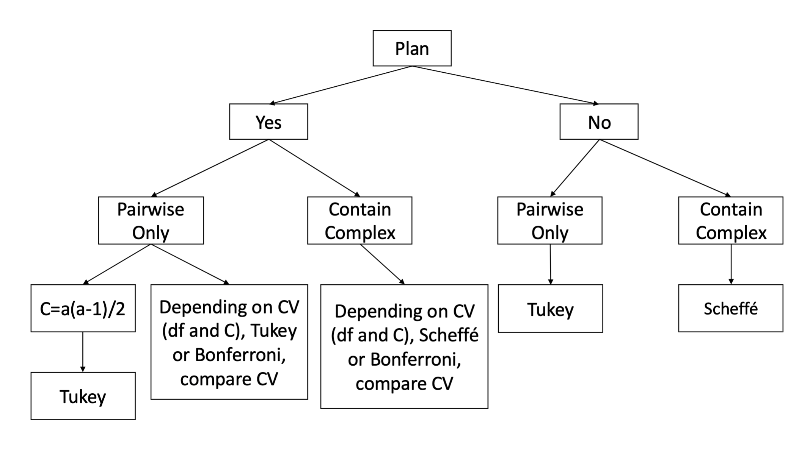
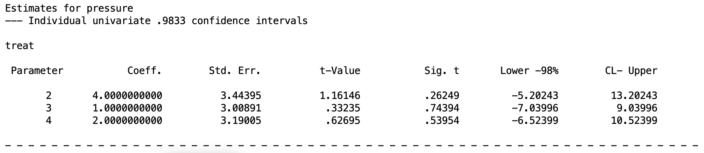
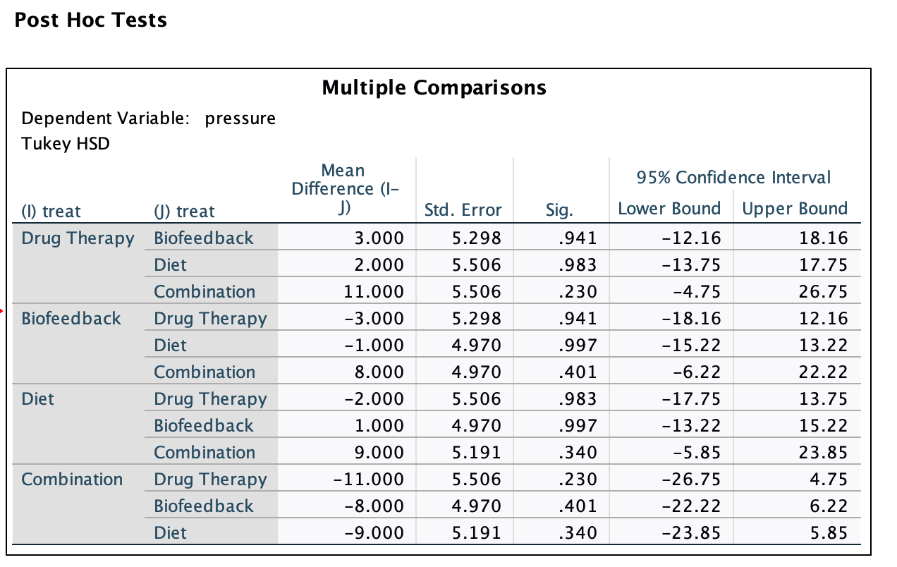

## Introduction

In the previous lesson, we covered how to formulate and test contrasts after a significant omnibus ANOVA. But we left something important unaddressed: what happens when you run many of those tests? Initially, this might not be seen as a concern, however this is a *very* important aspect of psychological research. Each test you run has a chance of producing a false positive, and the more tests you run, the more that risk compounds. If you carelessly start running a bunch of tests, you will eventually get a Type I error. This fact is inevitable and enescapable.

Think about it this way, imagine standing in front of a mirror and inspecting yourself for flaws. Even if you are a perfectly healthy and beautiful human being, the longer and more carefully you look, the more likely you are to notice something like a blemish, an asymmetry, or a hair out of place. None of these might mean anything, but the sheer act of repeated searching guarantees you will eventually land on something that looks wrong, and this will cause your self esteem to plummet, even if the "flaw" was never a big deal! The more you are looking for personal flaws, the more you are going to find one regardless of how insignificant they are.

Type I error inflation works the same way. Each additional significance test is another pass in the mirror, and the more passes you take, the more likely you are to flag something as a "real" finding purely by chance.

This lesson is about how to keep that risk of finding false results under control.

We will continue with the hypertension dataset from the previous lesson: four treatment groups (drug therapy, biofeedback, dietary modification, and a combination treatment), with blood pressure as the dependent variable. The combination treatment group had the lowest mean ($\bar{X} = 83$), while the other three groups had means of 91.4, 93, and 92 respectively.

------------------------------------------------------------------------

## 1. The Multiple Comparisons Problem

### Why Running Many Tests Is Dangerous

When you reject the null hypothesis at the level $\alpha = .05$, you are accepting a 5% chance that you are wrong and that the effect you found is a false positive. This is called a **Type I error**. That 5% is arbitrary, but it is generally the recommended manageable risk for a single test for psychology. In clinical settings, you might use $\alpha = .01$ instead, but we will use .05 going forward.

We distinguish two kinds of error rates:

-   **Per-comparison error rate** ($\alpha_{PC}$): the false positive rate for a single test, the one you set directly (e.g., .05).
-   **Experimentwise error rate** ($\alpha_{EW}$): the probability of making *at least one* Type I error across the entire set of tests you are running.

The former is what you set directly by choosing your significance threshold before running a test. The latter is what researchers need to worry about as they publish their studies: it is the real probability that your study produced at least one false positive result.

A practical way to think about it is that $\alpha_{PC}$ is the concern of a researcher evaluating a single isolated test, while $\alpha_{EW}$ is the concern of a psychologist writing up a results section and asking whether their pattern of significant findings can be trusted. If you ran one contrast and it was significant, $\alpha_{PC}$ is what matters. If you ran six contrasts and three of them were significant, $\alpha_{EW}$ is what should haunt you.

For a set of contrasts, the experimentwise error rate is:

$$\alpha_{EW} = 1 - (1 - \alpha_{PC})^C$$

where $C$ is the number of comparisons being made. With just 3 comparisons at $\alpha = .05$:

$$\alpha_{EW} = 1 - (1 - .05)^3 = 1 - (.95)^3 \approx .143$$

So, if you did 3 tests, your real Type I error rate is actually 14%, not 5%. With 10 comparisons it climbs to about 40%. You are no longer doing science at $\alpha = .05$. You are just conducting a lottery and hoping you get lucky.

Luckily, there are ways to help mitigate this issue that researchers need to be aware of. Unfortunately, most people don't do this, since they either A) don't know about these things or B) don't want to lose their "significant" results (i.e., they don't want to admit they might have had false findings).

It's a bit disheartening the ammount of researchers who don't even consider experimentwise error rates, but you, reader, can be the change we need!

### Planned vs. Post Hoc Comparisons

An important distinction for choosing how to control Type I error is whether your mean comparisons were **planned** or **post hoc**.

A **planned contrast** is one you decided to test *before* looking at the data, based on your theoretical hypotheses. You committed to it in advance.

A **post hoc contrast** is one you decided to test *after* examining the data. For example, after noticing that two particular group means look far apart.

This distinction matters more than it might seem. Suppose you run a four-group study and after seeing the results you decide to test the largest-looking mean difference. It feels like you are only running one test. But in reality, you implicitly scanned all possible pairwise differences before choosing that one. The comparison that "caught your eye" is almost by definition the most extreme one in the data, which means it is also the one most likely to be a false positive. You did not really run one test. You ran all of them mentally and selected the winner.

This is called data-driven science and is generally frowned upon within psychology. This type of behavior has heavily contributed to replication issues, since researchers are just looking for *any* significance rather than actually doing hypothesis testing from theoretical decisions.

To account for these issues of post hoc testing, the number of comparisons you must account for is not just the ones you formally tested, but the entire family of comparisons that your selection process implicitly considered.

------------------------------------------------------------------------

## 2. How to Correct for Experimentwise Error?

The solution to Type I error inflation is to apply a multiple comparison procedure, which is a method that adjusts how you evaluate significance when running more than one test. These procedures make sure your experimentwise error rate stays at .05 rather than ballooning beyond it. The general idea behind all of these methods is the same: make each individual test harder to pass, so that the cumulative probability of any false positive across all tests stays controlled.

For instance, instead of requiring p \< .05 to declare a contrast significant, you might require p \< .017 if you are running three tests. Each individual hurdle is higher, but the payoff is that your overall false positive risk across all three tests stays at .05.

There is no single universal correction, and each one differs in the situations they are designed for. The right choice depends on two things:

1)  Whether your comparisons were planned before data collection or chosen post hoc after examining the results.

2)  Whether your comparisons are pairwise only (one group compared to another group), or include complex comparisons that involve averages of multiple groups.

The three most common procedures are **Bonferroni**, **Tukey**, and **Scheffé**. We will cover each in turn, using the hypertension dataset to illustrate.

Before we go into detail, a handy decision tree below summarizes the recommendations depending on your scenario (Note, "CV" stands for critical value, which we will get into).

{fig-align="center" width="600"}

------------------------------------------------------------------------

## 3. Bonferroni Correction

### The Logic

Bonferroni is the simplest approach. If you are running $C$ tests and want your overall experimentwise error rate to be $\alpha_{EW} = .05$, you just divide your significance threshold by $C$:

$$\alpha_{Bonferroni} = \frac{\alpha_{EW}}{C} = \frac{.05}{C}$$

Each individual comparison must then have $p < \alpha_{Bonferroni}$ to be declared significant. Think of your total allowable false positive risk as a budget. You only have five cents to spend across all your tests. Bonferroni simply splits that budget evenly, giving each test an equal share. The more tests you run, the smaller each share gets, and the harder each individual test becomes to pass.

For example, if you plan 3 comparisons:

$$\alpha_{Bonferroni} = \frac{.05}{3} = .0167$$

In this case, the budget for individual tests was $\alpha_{Bonferroni}=.0167$ each for your allowance of $\alpha_{EW}=.05$.

This value of .0167 is conservative, meaning it is harder to reject individual tests.

> Terminology note on testing: "Conservative" means tests are harder to reject. "Liberal" means tests are easier to reject. One is not better than the other inherently. It depends the context. With concern to Type I error, however, the more conservative your test, the least likely you are to make a false positive. However, this comes with a trade off in statistical power. So the more conservative your test is, the harder it is to reject. That means it is harder to make a false positive, but as a result, it also is harder to make a *correct* positive. Often times, when choosing your methods and anlyese, you will have to decide where on this trade off you want to be. But more on this later.

Bonferroni is a blunt instrument for correction, but it always works, as long as you can specify $C$ in advance. Because of this, it is the most universally applied correction as it can be applied in any scenario. It just depends on what you set $C$ as.

### Setting C

Deciding what $C$ should be is where researchers sometimes go wrong. The rule is: $C$ must reflect the number of comparisons that were *realistically considered*, not just the ones you formally ran.

-   If you planned a specific set of $C$ comparisons before data collection, $C$ is that number.
-   If you want to test all pairwise comparisons (or if your original plan was all pairwise but you ended up testing fewer), $C$ must be set to $\frac{a(a-1)}{2}$, where $a$ is the number of groups.
-   If you intended to test a subset of pairwise comparisons but then tested additional ones after seeing the data, again $C = \frac{a(a-1)}{2}$.

The key principle: if you let the data influence which comparisons you run, your $C$ needs to expand to cover all comparisons that could have been selected. This controls for the "eyeballing it" scenario.

For an example, let's say after running an ANOVA for a variable with 5 groups, you want to test a pairwise comparison. This means you would have seen the results and the sizes of the means, so it is appropriate to control for all possible pairwise comparisons. That means you set $C$ as

$$C =\frac{5(5-1)}{2}=\frac{20}{2}=10$$

Therefore, your Bonferroni corrected alpha level is $\alpha_{Bonferroni}=.05/10=.005$. This means for any of the pairwise comparisons you make as a contrast for this ANOVA, the p values must be less than .005 to be considered significant.

### The Test Statistic and Critical Value

The F statistic and confidence interval formulas for Bonferroni contrasts are identical to those from the Contrasts lesson, nothing changes there. You can look those up if you want to. What does change is the **critical value** of your significance test. Under the Bonferroni correction with equal variances:

$$CV = F_{\alpha/C;\; 1,\; df_{error}}$$

This is more or less the same as what you would use for any contrast, except instead of just using $\alpha = .05$, you use whatever $\alpha/C$ comes out to be.

This new critical values redefines the confidence intervals as well. So as a result, the confidence intervals for Bonferroni corrected tests become wider.

### Advantage and Limitation

The main advantage of Bonferroni is its simplicity and flexibility — it works for any set of contrasts, pairwise or complex, planned or post hoc (as long as $C$ is finite and specifiable).

The limitation is power. As $C$ grows, each individual threshold becomes more and more stringent, making it harder to detect real effects. For a small number of planned comparisons, Bonferroni is excellent. For a large number, or for post hoc complex comparisons where $C$ is theoretically infinite, it breaks down.

### SPSS

There is no official way to do Bonferroni in SPSS. ALl you need to do is look at your p value in the output, and compare that to what your $\alpha_{Bonefrroni} = \alpha/C$ level. However, if you want corrected confidence intervals, you **need** to manually set your confidence level

There's different ways to do this in SPSS, however, I highly recommend using MANOVA because it gives you full control and scope over everything it is doing.

``` text
MANOVA pressure BY treat (1 4) 
/print=cellinfo(means)
/error=within
/cinterval =individual(.9833) /* add this line to specific confidence levels
/contrast(treat) = special (1    1     1     1
                            1    1     1    -3
                            .5   .5   -.5  -.5
                            1   -1     0     0) 
/design = treat(1) treat(2) treat(3).
```

The `/cinterval` line is where you specify the new Bonferroni confidence level. This level is simple equal to $1-(\alpha/c)$, so in our example with 3 contrast comparisons, it is $1−(.05/3)=1-.0166=.9833$. It is important to remember to put this in your syntax before you estimate the model or else you will get the wrong confidence intervals, and thus might be giving the wrong results.

The output for this would look like


{fig-align="center" width="600"}
This piece of the output contains each of the contrasts I specified for treatment above. This isn't the best example, but we can see that the p values are greater than $\alpha/c = .0166$, thus none are significant after controlling for experimentwise error rate. The confidence intervals are also adjusted appropriately, as you can see in the top ".9833 confidence intervals". 

This goes to show how simple and easy Bonferroni corrections are to use, and why more people should be using them. However, Bonferroni corrections are not always the most optimal corrections to use. Depending on the scenario, other techniques will be much better at controlling for experimentwise error rates. And while Bonferroni acts as a good "this is better than nothing" method, if you really care about getting your error rates as optimal, we will cover two over methods.

------------------------------------------------------------------------

## 4. Tukey's HSD

### The Logic

Tukey's Honestly Significant Difference (HSD) procedure is designed specifically for **pairwise comparisons**. Rather than dividing alpha by $C$, Tukey uses a different statistical distribution called the **studentized range distribution**. This method sets a single critical value that simultaneously controls the familywise error rate across *all* $\frac{a(a-1)}{2}$ pairwise comparisons.

The core intuition is this: if you are going to run all pairwise comparisons, the most dangerous one (i.e. the one most likely to be a false positive) is the comparison between the largest and smallest group means. Tukey asks: how large can the range between the maximum and minimum group means get just by chance, assuming all population means are actually equal? It uses the sampling distribution of this "worst-case scenario" difference to set a threshold, then applies that same threshold to all pairwise comparisons.

  Rather than using a $F$ or $t$ statistic, Tukey computes a "$q$ statistic" for a pairwise comparison between the lowest mean group $g$ and highest mean group $h$. I'll skip the function, but the bottom line is that this $q$ statistic operates similarly to a $t$ statistic in that it compares two means, but it accounts for the fact that you are selecting the most extreme pair from a family of comparisons, and it uses $MS_{within}$ as its error term. This makes the test more conservative than a plain $t$ test, and thus better at controlling for experimentwise error rates.

From the studentized range distribution of the $q$ statistic, you can ge tthe critical $q_{CV}$ value, which can be converted to a critical $F$ value:

$$F_{1,df_{error}} = \frac{q_{CV}^2}{2}.$$
This fact will become important in the next subsection, but this F statistic is also used to compute a confidence interval for the mean-to-mean contrast comparisons.

The takeaway is that this method gives you a more efficient method of testing mean-to-mean comparisons with the least amount of risk of committing a Type I error. What I mean by "efficient" is that it is able to find the optimal balance between being too conservative (low Type I error, low power) and too liberal (high Type I error, high power). When in doubt, you can always take the path with least amount of risk and do the most conservative test, but for researchers who want to increase the chances of finding an effect to the utmost degree, Tukey can be beneficial.

### Tukey vs. Bonferroni for Pairwise Comparisons

When you plan to test *all* pairwise comparisons, both Tukey and Bonferroni control the familywise error rate at .05. 

However, Tukey is more powerful in this situation, because its critical value is optimized for the structure of pairwise comparisons while Bonferroni is a general-purpose correction. You can see this by looking at the relative increases of their critical values as the nuber of groups and maximum pairwise comparisons increase:

| Groups | Comparisons | Tukey CV | Bonferroni CV |
|--------|-------------|----------|---------------|
| 2      | 1           | 4.75     | 4.75          |
| 3      | 3           | 7.12     | 7.73          |
| 4      | 6           | 8.81     | 9.92          |
| 5      | 10          | 10.16    | 11.76         |
| 6      | 15          | 11.28    | 13.32         |

As the table shows, Tukey's critical value stays lower than Bonferroni's as more groups are added, meaning it is easier to reject the null with Tukey. Thus, you are able to control for inflated Type I error rates *while* keeping your tests as powerful as possible.

However, when the number of pairwise comparisons is small (e.g., just 2 groups), they are equivalent. Therefore, the **rule of thumb** is that when all pairwise comparisons are of interest, Tukey is preferred over Bonferroni.

### SPSS

Tukey cannot be run through MANOVA in SPSS. It must be done through the `ONEWAY` procedure. This means that for more complex designs (within-subjects, split-plot, etc. that we will do in the future), Tukey is generally not available unless you are willing to compute it by hand.

To get this, you should run code like this 

``` text
ONEWAY pressure BY treat
/statistics descriptives
/posthoc=tukey.
```

In the `/posthoc=` line, just put `tukey`. The output should give you a Tukey test for every single pariwise comaprison 

{fig-align="center" width="600"}
This output gives all possible pairwise mean comparisons in the treatment groups and does a Tukey QSD test for each. You can see in the left most column one group that is compared to a group in the second column. For example, the first row is the Drug Therapy group compared to the Biofeedback group. In this set up, there are some redundancies as each pairwise comparison will show up twice (the Drug Therapy vs Biofeedback comparison shows up again in fourth row for example). The significance column gives the p value based on the Tukey test, which you compare to .05, and the confidence intervals are already adjusted for the Tukey test.

Again, this isn't the best example data set, but as we can see none of the pairwise comparisons are significant after controlling for experimentwise error rates using the Tukey test. 

------------------------------------------------------------------------

## 5. Scheffé's Method

### The Logic

Scheffé is designed for **post hoc complex comparisons** — the situation where you decide which contrasts to test only after examining the data, and your contrasts may include complex (non-pairwise) comparisons.

In this situation, Bonferroni does not apply because $C$ is not defined — you did not select a pre-specified set of contrasts. And Tukey does not apply because Tukey only handles pairwise differences. Scheffé handles the general case.

The key insight behind Scheffé is that, in a post hoc setting, you are implicitly searching across *all possible contrasts* — not just pairwise ones, but any weighted combination of group means. Among all possible contrasts, one of them will necessarily have the largest $SS_\psi$ — the largest contrast sum of squares. Scheffé identifies what the maximum $F$ statistic could be under this worst-case selection and uses that as the critical value.

It turns out that the worst-case contrast can capture at most all of the between-groups sum of squares, $SS_B$. Since the omnibus F statistic is $F_{omnibus} = SS_B / [(a-1) \cdot MS_W]$, the maximum possible contrast F is:

$$F_{max} = (a - 1) \cdot F_{omnibus}$$

This leads directly to Scheffé's critical value:

$$CV_{Scheffé} = (a - 1) \cdot F_{.05;\; a-1,\; N-a}$$

This is a fixed value that depends only on the number of groups and the error degrees of freedom — it does not change regardless of how many contrasts you test. That is what makes Scheffé appropriate for post hoc work: you do not need to pre-specify $C$.

### Test Equations

Assuming equal variances, the F statistic is identical to the standard contrast F:

$$F_\psi = \frac{(\hat{\psi})^2}{\left[MS_W \sum_{j=1}^{a} \left(\frac{c_j^2}{n_j}\right)\right]}$$

The confidence interval is:

$$\hat{\psi} \pm \sqrt{(a-1) F_{.05;\; a-1,\; N-a}} \cdot \sqrt{MS_W \sum_{j=1}^{a} \left(\frac{c_j^2}{n_j}\right)}$$

You compare the calculated $F_\psi$ to $(a-1) F_{.05;\; a-1,\; N-a}$. If $F_\psi$ exceeds the critical value, the contrast is significant.

**Important:** Scheffé requires equal variances. If heterogeneity of variance is present, Scheffé is not appropriate.

### The Omnibus Connection

There is a useful and elegant link between Scheffé and the omnibus ANOVA: **if and only if the omnibus F test is significant, at least one contrast will be significant by Scheffé's method**. Conversely, if the omnibus test is non-significant, Scheffé cannot produce any significant contrasts. This means that if your omnibus ANOVA is non-significant, you can skip Scheffé entirely — you already know the answer.

### Scheffé vs. Bonferroni: When to Use Which

Both Scheffé and Bonferroni can be used for planned complex comparisons. The question is which one gives you more power (i.e., lower critical value) for your specific situation. The answer depends on how many comparisons you are making:

| C (# Comparisons) | Bonferroni CV | Scheffé CV |
|-------------------|---------------|------------|
| 1                 | 4.17          | 8.76       |
| 2                 | 5.57          | 8.76       |
| 3                 | 6.45          | 8.76       |
| 4                 | 7.08          | 8.76       |
| ...               | ...           | 8.76       |
| 9                 | 8.94          | 8.76       |
| 10                | 9.18          | 8.76       |

(For $a = 4$ groups, $df_{error} = 30$.)

Bonferroni's critical value increases with $C$, while Scheffé's stays fixed. They cross over at around 8 comparisons. So:

-   For a **small number of planned comparisons**, Bonferroni has more power and should be preferred.
-   For a **large number of comparisons or post hoc complex contrasts**, Scheffé is preferred (and may be the only valid option).
-   **Scheffé should not be used unless at least one comparison is complex.** For pairwise-only post hoc comparisons, use Tukey.

------------------------------------------------------------------------

## 6. Implementing MCPs in SPSS

### Pairwise Comparisons with ONEWAY

The easiest way to run all three procedures for all pairwise comparisons is via the `ONEWAY` command. Just add a `/posthoc=` line:

``` text
ONEWAY pressure BY treat
/statistics descriptives
/posthoc=tukey scheffe bonferroni.
```

This produces a "Multiple Comparisons" table in the output that lists every pairwise mean difference for each correction method, along with its standard error, adjusted $p$ value, and 95% confidence interval. The output is easy to read and directly interpretable.


In the output, each row shows a pair of groups (I) and (J), the mean difference (I–J), the standard error, the adjusted significance value, and the 95% CI. For Tukey and Bonferroni, you can use the $p$ values directly — they are adjusted. For Scheffé in pairwise mode, the $p$ values are also valid here since ONEWAY computes them correctly.

This syntax works well when your goal is all pairwise comparisons. However, **if you want to test specific planned contrasts or complex comparisons, you need to use MANOVA** with the `/cinterval` line instead.

**Note:** ONEWAY cannot do within-subjects or factorial designs. For those, you will always need MANOVA.

### Bonferroni with MANOVA

To apply a Bonferroni correction to specific planned contrasts in MANOVA, you use the `/cinterval=individual(#)` line. The `#` is the confidence level for each *individual* interval, calculated as:

$$\# = 1 - \frac{\alpha}{C} = 1 - \frac{.05}{C}$$

For our hypertension example, suppose you planned the following 3 contrasts before data collection:

1.  Drug therapy & biofeedback & diet vs. combination ($\psi_1$)
2.  Drug therapy & biofeedback vs. diet & combination ($\psi_2$)
3.  Drug therapy vs. biofeedback ($\psi_3$)

With $C = 3$:

$$\# = 1 - \frac{.05}{3} = 1 - .0167 = .9833$$

The SPSS syntax is:

``` text
MANOVA pressure BY treat (1 4)
/print=cellinfo(means)
/error=within
/cinterval =individual(.9833)
/contrast(treat) = special (1    1    1    1
                             1    1    1   -3
                             .5   .5  -.5  -.5
                             1   -1    0    0)
/design = treat(1) treat(2) treat(3).
```

The number `.9833` tells SPSS to construct a 98.33% confidence interval for each individual contrast. This is what makes the family-wise error rate .05 across 3 contrasts: each comparison gets a stricter interval than the usual 95%.

To assess significance, compare each $p$ value in the output to your corrected $\alpha = .05/C = .0167$. If $p < .0167$, the contrast is significant under Bonferroni.


The output shows the `Coeff.` (your $\hat{\psi}$), `Std. Err.`, `t-Value`, `Sig. t` (the $p$ value), and the lower and upper bounds of the confidence interval. Compare each $p$ value to $\alpha/C$. Note that the confidence intervals printed reflect the Bonferroni-corrected width.

**To get the F statistic from this output:** square the $t$-Value. So $t^2 = F$.

**If you plan to test 4 comparisons** (across one or two MANOVA calls), the corrected confidence level would be $1 - (.05/4) = .9875$, regardless of how many contrasts appear in each individual MANOVA call.

### Scheffé with MANOVA

To apply a Scheffé correction in MANOVA, change the `/cinterval` line to use the joint and univariate Scheffé specification:

``` text
MANOVA pressure BY treat (1 4)
/print=cellinfo(means)
/error=within
/cinterval = joint(.95) univariate(scheffe)
/contrast(treat) = special (1    1    1    1
                             1    1    1   -3
                             .5   .5  -.5  -.5
                             1   -1    0    0)
/design = treat.
```

Two things have changed from the Bonferroni syntax:

**The `/cinterval` line** now uses `joint(.95) univariate(scheffe)`. `joint(.95)` keeps the *family-wise* error rate at .05 across all contrasts tested together. `univariate(scheffe)` specifies the Scheffé method for each individual contrast interval.

**The `/design` line** has changed from `treat(1) treat(2) treat(3)` to simply `treat`. This is critical. MANOVA uses the `/design` line not only to specify what goes in the model, but also to define what constitutes a *family* of tests. If you leave it as `treat(1) treat(2) treat(3)`, MANOVA treats each contrast as its own separate family, which sets $\alpha_{PC} = .05$ for each one individually — defeating the purpose of the correction. Writing `/design = treat.` tells MANOVA to treat all contrasts together as a single family, so the correction applies across all of them jointly.


**Critical warning about the Scheffé output:** The $p$ values in the Scheffé MANOVA output are **not corrected**. Do not use them for significance testing. SPSS provides the Scheffé-corrected confidence intervals and the $t$ statistics (which you square to get $F$), but the printed $p$ values are the ordinary uncorrected ones. To assess significance with Scheffé, you must either:

1.  Compare the calculated $F_\psi = t^2$ to the Scheffé critical value $(a-1) F_{.05;\; a-1,\; N-a}$, or
2.  Check whether the Scheffé confidence interval excludes zero.

For our hypertension example with $a = 4$ groups and $df_{error} = 16$ (since $n = 5$ per group, $N = 20$), the Scheffé critical value is:

$$CV_{Scheffé} = (4-1) \times F_{.05;\; 3,\; 16} = 3 \times 3.24 = 9.72$$

Any contrast F statistic must exceed 9.72 to be declared significant.

------------------------------------------------------------------------

## 7. Summary: Choosing Your MCP

The choice of correction method comes down to your research context:

| Situation | Recommended Procedure |
|--------------------------|----------------------------------------------|
| Small set of planned contrasts (pairwise or complex) | Bonferroni |
| All pairwise comparisons planned or post hoc | Tukey |
| Post hoc complex comparisons | Scheffé |
| Planned contrasts with many comparisons | Compare Bonferroni and Scheffé CVs; use the lower one |

A few additional reminders:

-   Tukey and Scheffé **require equal variances**. If the homogeneity of variance assumption is violated, use Bonferroni (which can accommodate heterogeneous variances via the unequal variance formulas).
-   Tukey **cannot be implemented via MANOVA** in SPSS; use `ONEWAY` for Tukey.
-   For Scheffé in MANOVA, always use `/design = treat.` (not the individual contrast design) to ensure the correction applies family-wide.
-   For Scheffé, **never use the output** $p$ values — only use the $F$ statistic vs. the critical value or the confidence intervals.
-   If the omnibus ANOVA is non-significant, Scheffé will never find a significant contrast. You can skip it.

------------------------------------------------------------------------

## Discussion Questions

**Q1.** Using the hypertension data, a researcher runs all 6 pairwise comparisons after looking at the data and seeing that groups 1 and 4 look particularly different. What should $C$ be set to, and why? Which method would you recommend?

**Q2.** A researcher plans 3 contrasts before data collection: one complex and two pairwise. Which correction method(s) are appropriate? What would you need to compare to decide between them?

**Q3.** Explain in your own words why the $p$ values in the MANOVA Scheffé output cannot be used for significance testing. What can you use instead?

**Q4.** Without using $p$ values, how can you assess whether a contrast is significant? Use a worked example from the ONEWAY output above to illustrate.

**Q5.** Using the decision tree, classify each of the following scenarios and identify the appropriate MCP:

a.  4 groups; all 6 pairwise comparisons; planned in advance.
b.  4 groups; 3 planned complex contrasts.
c.  4 groups; 2 pairwise and 1 complex; decided after looking at the data.
d.  4 groups; all pairwise; decided after looking at the data.

**Q6.** Suppose you have 4 groups and $df_{error} = 30$. You are planning 4 complex comparisons. Looking at the Bonferroni vs. Scheffé critical value table, which method should you choose? At what number of comparisons does your answer change?

------------------------------------------------------------------------

## Well Done!

You have completed the Multiple Comparisons lesson. Here is a summary of what was covered:

-   How running multiple tests inflates the experimentwise Type I error rate
-   The distinction between per-comparison and experimentwise error rates, and the formula $\alpha_{EW} = 1 - (1 - \alpha)^C$
-   The difference between planned and post hoc comparisons, and why post hoc selection inflates $C$
-   The three main correction procedures: Bonferroni (flexible, best for small planned sets), Tukey (best for all pairwise), and Scheffé (best for post hoc complex comparisons)
-   How to implement each in SPSS using `ONEWAY` (for Tukey and simple pairwise) and `MANOVA` (for Bonferroni with `/cinterval=individual(#)` and Scheffé with `/cinterval=joint(.95) univariate(scheffe)`)
-   The critical gotcha for Scheffé: never use the output $p$ values; use the $F$ statistic vs. the critical value or the confidence intervals
-   The link between Scheffé and the omnibus F test
