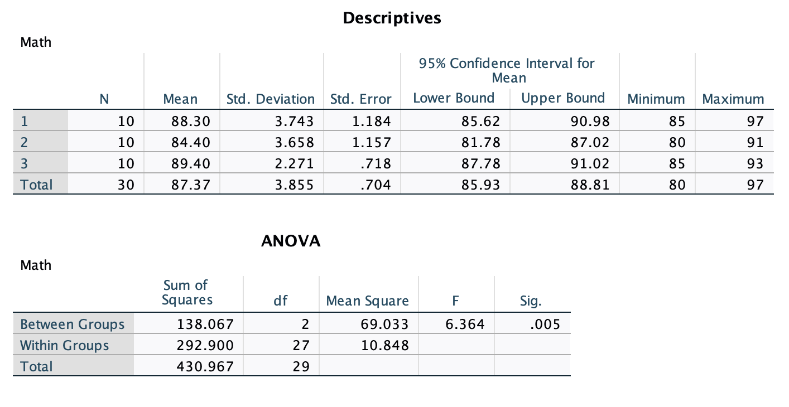
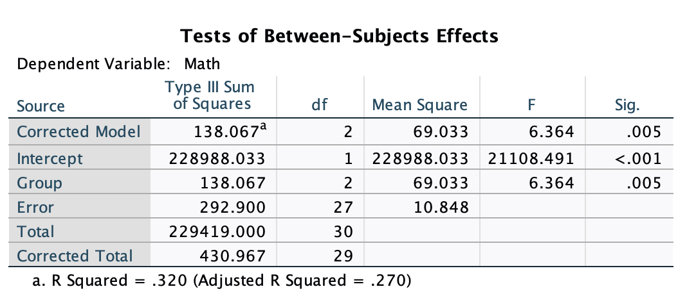
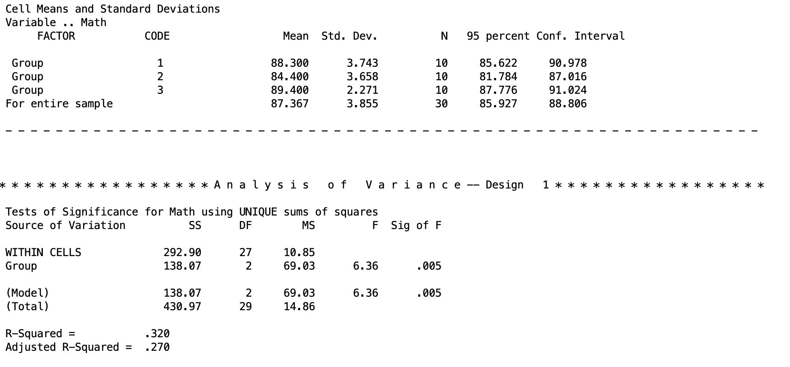

## Introduction

In this lesson, there are three primary objectives: (1) to introduce you to running ANOVAs in SPSS using syntax, (2) to look at the similarities between the different procedures one can use in SPSS for conducting ANOVA, and (3) introduce you to contrasts and how to formulate them for hypothesis testing.

We will test group differences among three groups using three SPSS procedures: one-way ANOVA, univariate ANOVA, and multivariate ANOVA (MANOVA). Note, SPSS can't be ran natively in Quarto (how I am generating this page), so all results I am copy/pasting from SPSS output.

### The Dataset

The data we are using is labeled as OneWay.sav. This data comes from a study that tested a phenomenon known as **stereotype threat**. Aronson et al. (1998) describe this phenomenon as when "members of the stereotyped group often feel pressure in situations where their behavior can confirm the negative reputation that their group lacks a valued ability." One such stereotype is that females are worse at math than males. Females in our study were assigned to take a math test in one of three conditions:

1.  A control group.
2.  A condition in which they were "reminded" prior to testing of the belief that males perform better.
3.  A condition in which they were told to read a report that refutes the stereotype prior to testing.

Stereotype threat would be evidenced if females performed worse when told that males outperform them. Here are the scores from the three groups:

| Group 1 | Group 2 | Group 3 |
|---------|---------|---------|
| 89      | 87      | 90      |
| 86      | 81      | 91      |
| 97      | 89      | 90      |
| 85      | 82      | 89      |
| 90      | 83      | 88      |
| 91      | 83      | 91      |
| 87      | 86      | 87      |
| 88      | 80      | 85      |
| 85      | 82      | 93      |
| 85      | 91      | 90      |

------------------------------------------------------------------------

## 1. General SPSS Notes

Before running any analyses, a few things to know about SPSS syntax.

**Procedures** - SPSS is broken into explicit *procedures*, which can comprise multiple lines of code. Each procedure begins differently, but they all end with a period. That is, a period tells SPSS that you are done describing a procedure and that SPSS should use your input to run it. Think of it like a sentence. Do not forget to end each procedure with a period, or SPSS will wait for more input. Many statistical analysis software are like this, so you may be familiar with the concept.

**Comments** - Comments in SPSS are plain-language parts of your syntax that are totally ignored by the computer. While comments in software like R or Python begin with `#`, in SPSS everything after `/*` is a comment. Anything denoted as a comment will not be read as syntax code. If you want to do a *procedure* as a comment, you start a line with `*` and end it with a period before moving onto actionable syntax.

**Case** - Syntax in SPSS does not have to be all caps. It can be lowercase too. However, much of what we will do is in all caps, since it makes it easier to distinguish between parts of the code.

**General structure** - In general, every procedure will follow this pattern:

```         
STATE WHAT PROCEDURE YOU ARE USING
STATE YOUR MODEL
/ANY FURTHER OPTIONS WILL FOLLOW THE "/" SYMBOL IN THIS NEXT LINE.
```

SPSS will auto-colorize different blocks of syntax corresponding to what they represent. Do not worry if the coloring looks inconsistent. This does not mean anything important as long as your code is correct. Unfortunately, I cannot get code chunks in this in proper colors since Quarto doesn't have a recognized SPSS theme.

------------------------------------------------------------------------

## 2. ANOVA: Partitioning Variability

ANOVA answers a simple question: do the group means of the stereotype threat groups differ more than we would expect by chance? To answer it, ANOVA **partitions** the total variability in the outcome into two buckets:

-   $SS_{between}$ - variability *between* the groups, meaning how much the group means differ from each other. This is the variability we care about.
-   $SS_{within}$ (also called $SS_{error}$) - variability *within* the groups, meaning how much individual scores differ from their own group mean. This is just noise, which is the random differences between individuals that have nothing to do with which group they were in.

Combined, they make up the sum-of-squares total.

$$SS_{total} = SS_{between} + SS_{within}$$

Think of it like a pie. The whole pie is all the variability in your outcome data (math test scores of the females for each group). ANOVA slices it into a "signal" piece ($SS_{between}$) and a "noise" piece ($SS_{within}$).

{fig-align="center" width="486"}

There are going to be differences between our control group, stereotype threat group, and stereotype refuted group. The question is, are the differences between these group means due to *true* differences, or is it just blind luck that they differ from each other (there is error).

{fig-align="center" width="489"}

You can see from this figure (data not exact to the table) that both panels have the same three group means (86, 83, 90), but the right panel has much more spread within each group. When within-group noise is high, the means of each blur together, and it gets harder to sort out whether the differences we see are *true* or not.

In ANOVA, an \*\*F test\*\* is how we distinguish the mean differences (signal) from the noise of the variability within each group to see if those differences are real or just a figment of our imagination. The F statistic is literally a ratio of signal to noise:

\$\$F = \\frac{MS\_{between}}{MS\_{within}} = \\frac{SS\_{between} / df\_{between}}{SS\_{within} / df\_{within}}\$\$

where \$MS\$ stands for "mean square", which is just the sum of squares divided by its degrees of freedom, which puts the two on the same scale so they can be compared fairly.

Intuitively: a \*\*large F\*\* means the group means differ a lot relative to the within-group noise, like the left panel, where the dots cluster tightly and the three means stand clearly apart. A \*\*small F\*\* means the noise drowns out the signal, like the right panel, where the dots are so scattered that the same group means are hard to distinguish from chance variation. When F is large enough (relative to what we would expect by chance), we reject the null hypothesis that all group means are equal.

This is what ANOVA is doing in a nutshell. It is analyzing these variances to determine if our groups are truly different or not. Hence the namesake of ANOVA, "analysis of variances".

### Full and Reduced Models

ANOVA figures out the size of each slice by comparing two models:

-   The **reduced model** assumes group membership does not matter. Everyone just gets the grand mean as their predicted score. All variability is unexplained, so the error of the reduced model ($E_R$) equals $SS_{total}$. In other words, if you had to guess a female student's math score with no information other than the overall average across all three conditions, your best guess is that their score *is* that over all average and that your prediction error would be based on how far each score deviates from that overall average.

-   The **full model** accounts for group membership. Each person gets their own group mean as their predicted score. If you know a student was in the stereotype threat condition, you use that group's mean as your guess instead of the grand mean. This gives a level of accuracy to your guess that wasn't provided in the reduced model. So just knowing what group a female belongs to has helped us explain some of that randomness. In other words, it diminished some of the error that our prediction would have had if we didn't know her group.The remaining unexplained variability is how far each individual score deviates from their own group mean. This is $SS_{within}$, so the error of the full model ($E_F$) equals $SS_{within}$.

The difference between the two models' errors is exactly $SS_{between}$:

$$E_R - E_F = SS_{between}$$

Intuitively: the full model "explains away" some variability that the reduced model could not. How much it explained away is how important the group factor is. If knowing what experimental group the female student was in gives a big advantage on guessing their math score, then the group membership was very important and thus $SS_{between}$ will be large as the differences between $E_R$ and $E_F$ will be large If knowing the female student's experimental group didn't help in guessing their score at all, then $SS_{between}$ will be small as the differences between $E_R$ and $E_F$ will be small.

### The F Test

The mean square (MS) quantifies the sizes of each partition of variability. The general omnibus F test finds the ratio between the two partitions:

$$F = \frac{(E_R - E_F)/(df_R - df_F)}{E_F/df_F} = \frac{SS_{Between}/df_{Between}}{SS_{Within}/df_{Within}} = \frac{MS_{Between}}{MS_{Within}}$$

Where the degrees of freedom are:

-   $df_{total}$ = $N - 1$
-   $df_{within}$ = $N - a$
-   $df_{between}$ = $a - 1$

What I mean by *omnibus* ANOVA is that we are looking into at everything together. So in this case, we are looking at ALL the data together.

This F statistic is what will be used to get a p value to test if the group differences are significant or not.

Next I will turn to introduce the different functions of SPSS you can use to do basic one-way ANOVAs, and the outputs they will give you for our data.

------------------------------------------------------------------------

## 3. One-Way ANOVA with ONEWAY

The `ONEWAY` procedure in SPSS runs a one-way between-subjects ANOVA. It's the simplest method to implement, but tends to be the least flexible because of this. The general syntax structure is:

``` text
ONEWAY          /* The procedure being used (a one-way ANOVA)
DV BY IV        /* This line describes the model: Y (DV) predicted by X (IV)
/STATISTICS DESCRIPTIVES.    /* Creates a table of descriptive statistics
```

For our stereotype threat data, where `Math` is the outcome and `Group` is the grouping variable:

``` text
ONEWAY              /* The procedure being used
MATH BY GROUP       /* Math (DV) predicted by Group (IV)
/STATISTICS DESCRIPTIVES.    /* Creates a table of descriptive statistics
```

 The first table is the output for the descriptive statistics given by `/STATISTICS DESCRIPTIVES`.

The ANOVA table gives the results of the omnibus ANOVA test. It gives you the sum of squares, degrees of freedom, and mean square for the between-group term, within-group (error) term, and the total. It also gives the F test and p value for the between-group term. Since the p value of .005 \< .05, we reject the null hypothesis of the ANOVA that there are no differences in the mean math score between the three treatments.

------------------------------------------------------------------------

## 4. Univariate ANOVA with UNIANOVA

The `UNIANOVA` procedure runs a General Linear Model using a univariate approach. This is only appropriate for between-subjects designs. The syntax is very similar to `ONEWAY` but uses a `/DESIGN` line to explicitly identify the grouping variable as the independent variable.

``` text
UNIANOVA          /* The procedure being used (univariate ANOVA)
DV BY IV          /* Same as what is done above
/DESIGN = IV.     /* DESIGN identifies the grouping variable as the IV
```

For our data:

``` text
UNIANOVA           /* The procedure being used
MATH BY GROUP      /* Same as for ONEWAY
/DESIGN = GROUP.   /* Identifies the grouping variable
```

 This is the focal output of the UNIANOVA function. On the left, you have rows labeled "Corrected Model", which is equivalent to the "Group" row in this case. And you can ignore the "Intercept" line. What you need to focus is on the bottom three rows. Here you ge the sum of squares (specified as "Type III Sum of Squares" though all of our output will be this type of sum of squares), degrees of freedom, mean squares, and the F test. The results for the F test are significant, so we reject the null that the mean math test scores are the same for every treatment group.

The UNIANOVA output will also give you the $R^2$ and adjusted-$R^2$ effect sizes. These are not always used in ANOVAs, so I would ignore them for now. We will cover different effect sizes in a future lesson.

### Types of Sums of Squares

You may have noticed that the UNIANOVA output labels its results 
"Type III Sum of Squares." This is one of three ways SPSS can 
compute sums of squares, and it is worth knowing the difference 
even if it will not matter much until later in the lessons

In a one-way design  like ours, with only one grouping variable and equal group sizes, 
all three types give exactly the same answer. The distinction between the three methods only 
becomes consequential when there are multiple factors in the design 
and the group sizes are unequal.

When that happens, **Type I** sums of squares test each effect in 
the order you list it, so the results can change depending on which 
factor you put first. **Type II** and **Type III** sums of squares 
remove that order dependency, with Type III being the most commonly 
used because it tests each effect after accounting for everything 
else in the model. 

This is actually one of the reasons this series uses SPSS MANOVA 
rather than other software. SPSS MANOVA defaults to Type III 
sums of squares and applies them consistently across all designs, 
from simple one-way ANOVAs all the way through complex split-plot 
designs, so you can trust that every effect you test is being 
evaluated on its own terms regardless of how the data are structured.

For now, the main  takeaway is simply that when you see "Type III" in SPSS output, 
it means each effect is being evaluated on its own terms, 
independent of the others

------------------------------------------------------------------------

## 5. MANOVA

The `MANOVA` procedure (Multivariate Analysis of Variance) is the most flexible of the three. It can be done for within-subjects, between-subjects, one-way, two-way, split plot, and other designs. We will use MANOVA for the majority of analyses this semester because of its flexibility.

The general syntax is:

``` text
/* Multivariate ANOVA for Y (DV) by X (IV)
/* Replace "min" and "max" with the grouping values (smallest to largest)

MANOVA DV BY IV (min max)
/PRINT CELLINFO(ALL)   /* Print descriptive information for each cell in the design
/DESIGN.               /* Specifies the effects of interest within the specified model
                       /* Default is a full factorial model
```

For our data:

``` text
MANOVA MATH BY GROUP (1 3)       /* DV "by" grouping var; ( ) enclose min and max grouping values
/PRINT CELLINFO(ALL)             /* Print descriptive information for each cell
/DESIGN.                         /* Specifies the effects of interest
```

 This is the important chunk of output for the MANOVA. The top table gives the descriptive statistics for each group. This is because we added the `\PRINT CELLINFO(ALL)` line. The bottom table is the ANOVA output, with the sum of squares, degrees of freedom, mean squares, F test, and p value. The top line `WITHIN CELLS` is the error term. The second term is the between-subjects line that we are testing. At the bottom, the `(Model)` line is the same as the between-subjects line. In the future, when we are doing different things, this will change.

The results for the F test are significant, so we reject the null that the mean math test scores are the same for every treatment group.

The MANOVA output will also give you the $R^2$ and adjusted-$R^2$ effect sizes. These are not always used in ANOVAs, so I would ignore them for now. We will cover different effect sizes in a future lesson.

------------------------------------------------------------------------

### Discussion Questions

Here are some review questions if you want to practice your understanding!

1.  Which analyses provided the same answer?

2.  What can be concluded about the stereotype threat hypothesis? Which claims can you make and which can you not?

3.  How are all three of the procedures related to one another? What similarities are there in terms of output and syntax? What are the notable differences? Why do you think SPSS has so many ways to perform an ANOVA?
