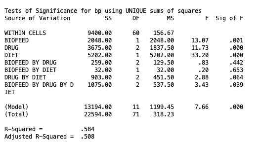
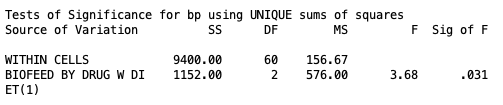
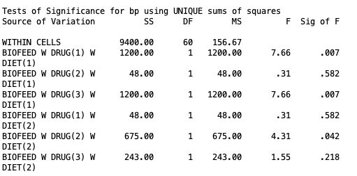
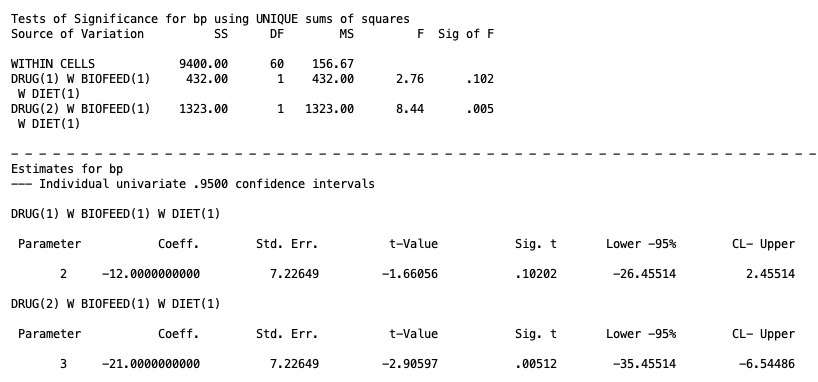
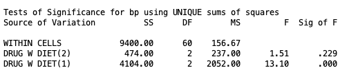
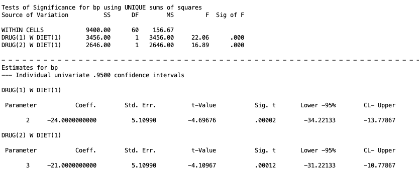
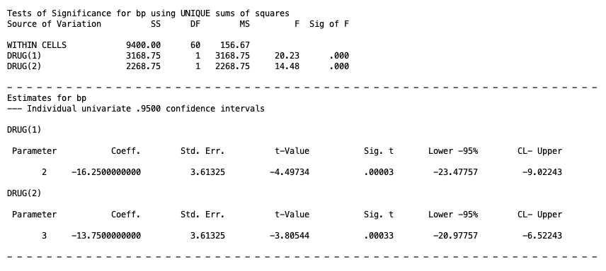

## 1. Intro

So far in this series we have worked with 1 or 2 group factors at a time. Now we will focus on 3 or more factors. Nothing about the core logic changes. We are still comparing a full model against a series of reduced models, and we will still be talking about main effects and interactions. What changes is the number of terms in the model and, more importantly, the number of layers in the follow-up testing process once we find a significant effect. A two-factor design only ever asks us to follow up on a main effect or an interaction. A three-factor design can send us down a much longer chain: three-way interaction, to simple interaction, to simple simple effect, to a comparison of two individual cell means. And it gets even more complicated if you have more than 3 factors, but I will only be covering 3 at the most.

This lesson works through that full chain using one worked example, then explains how the chain changes if the three-way interaction had not been significant in the first place.

### Data Setup

We will be using the `HigherOrder.sav` dataset, which contains 72 cases across four variables:

| Variable | Description | Levels |
|----|----|----|
| `BP` | Blood pressure (the dependent variable) | continuous |
| `DRUG` | Type of drug therapy | 1 = Drug X, 2 = Drug Y, 3 = Drug Z |
| `BIOFEED` | Biofeedback therapy | 1 = Absent, 2 = Present |
| `DIET` | Dietary therapy | 1 = Absent, 2 = Present |

This is a **fully balanced** design with $n = 6$ cases in each of the 12 cells equally, for a total $N = 72$ (side note, if you see a small $n$ that usually means group sample size where a capital $N$ refers to total sample size). Balanced data is not a requirement for a three-way design, but it does make the type of analysis straight forward. Issues of non-balanced data will be the same as discussed int he Two-Way Between-Subjects ANVOA lesson. I will note where the syntax has to change when $n$ is unequal.

### From Two Factors to Three: What the Third Factor Adds

With three factors, A, B, and C, there are now seven effects to consider instead of three:

-   Three main effects: A, B, and C
-   Three two-way interactions: A by B, A by C, and B by C
-   One three-way interaction: A by B by C

The main effects and two-way interactions mean exactly what they meant in the Two-Way ANOVA lesson, except now each one is evaluated averaging over the levels of whichever factor is not involved. The main effect of Drug, for example, compares the marginal means of Drug X, Y, and Z averaged over **both** Biofeedback and Diet. The Drug by Biofeedback interaction asks whether the drug effect depends on biofeedback, **averaged over diet.**

The new piece is the three-way interaction. A significant Drug by Biofeedback by Diet interaction means that the Drug by Biofeedback interaction itself is not the same at every level of Diet. Equivalently, it means the Drug by Diet interaction is not the same at every level of Biofeedback, and the Biofeedback by Diet interaction is not the same at every level of Drug. All three of these are mathematically identical statements about the same effect, so all we need to do is just check one three-way intereaction test.

## 2. The Full and Reduced Models

Again, these are not necessary to know, but they can be helpful to understand what the ANOVA is actually doing.

For a three-way A by B by C design, the full model is

$$Y_{ijkl} = \mu + \alpha_j + \beta_k + \gamma_l + (\alpha\beta)_{jk} + (\alpha\gamma)_{jl} + (\beta\gamma)_{kl} + (\alpha\beta\gamma)_{jkl} + \varepsilon_{ijkl}$$

where

-   $\mu$ is the grand mean
-   $\alpha_j$, $\beta_k$, $\gamma_l$ are the main effects of A, B, and C
-   $(\alpha\beta)_{jk}$, $(\alpha\gamma)_{jl}$, $(\beta\gamma)_{kl}$ are the three two-way interaction terms
-   $(\alpha\beta\gamma)_{jkl}$ is the three-way interaction term
-   $\varepsilon_{ijkl}$ is the residual for individual $i$ in the specific factor levels $jkl$

For our dataset, $a = 3$ (Drug), $b = 2$ (Biofeedback), $c = 2$ (Diet), and $n = 6$, so $df_{Error} = abc(n-1) = 12(5) = 60$.

There are many restricted models depending on what type of effect you are trying to test. The table below shows the restricted model for each of the seven effects. Each restricted model is just the full model with that one term removed, and everything else stays in the model. The one term you remove is the effect you are testing for that specific model.

```{=html}
<div class="concept-diagram">
<div class="header" style="color:#000;">Restricted Models for a Three-Way A &times; B &times; C Design</div>
<div style="display:flex; flex-direction:column; gap:0.75rem;">
<div style="border-bottom:1px solid #ccc; padding-bottom:0.5rem;"><strong style="color:#000;">A</strong><br><span style="font-size:clamp(0.7em, 2vw, 1em); color:#000;">\(Y_{ijkl} = \mu + \beta_k + \gamma_l + (\alpha\beta)_{jk} + (\alpha\gamma)_{jl} + (\beta\gamma)_{kl} + (\alpha\beta\gamma)_{jkl} + \varepsilon_{ijkl}\)</span></div>
<div style="border-bottom:1px solid #ccc; padding-bottom:0.5rem;"><strong style="color:#000;">B</strong><br><span style="font-size:clamp(0.7em, 2vw, 1em); color:#000;">\(Y_{ijkl} = \mu + \alpha_j + \gamma_l + (\alpha\beta)_{jk} + (\alpha\gamma)_{jl} + (\beta\gamma)_{kl} + (\alpha\beta\gamma)_{jkl} + \varepsilon_{ijkl}\)</span></div>
<div style="border-bottom:1px solid #ccc; padding-bottom:0.5rem;"><strong style="color:#000;">C</strong><br><span style="font-size:clamp(0.7em, 2vw, 1em); color:#000;">\(Y_{ijkl} = \mu + \alpha_j + \beta_k + (\alpha\beta)_{jk} + (\alpha\gamma)_{jl} + (\beta\gamma)_{kl} + (\alpha\beta\gamma)_{jkl} + \varepsilon_{ijkl}\)</span></div>
<div style="border-bottom:1px solid #ccc; padding-bottom:0.5rem;"><strong style="color:#000;">A &times; B</strong><br><span style="font-size:clamp(0.7em, 2vw, 1em); color:#000;">\(Y_{ijkl} = \mu + \alpha_j + \beta_k + \gamma_l + (\alpha\gamma)_{jl} + (\beta\gamma)_{kl} + (\alpha\beta\gamma)_{jkl} + \varepsilon_{ijkl}\)</span></div>
<div style="border-bottom:1px solid #ccc; padding-bottom:0.5rem;"><strong style="color:#000;">A &times; C</strong><br><span style="font-size:clamp(0.7em, 2vw, 1em); color:#000;">\(Y_{ijkl} = \mu + \alpha_j + \beta_k + \gamma_l + (\alpha\beta)_{jk} + (\beta\gamma)_{kl} + (\alpha\beta\gamma)_{jkl} + \varepsilon_{ijkl}\)</span></div>
<div style="border-bottom:1px solid #ccc; padding-bottom:0.5rem;"><strong style="color:#000;">B &times; C</strong><br><span style="font-size:clamp(0.7em, 2vw, 1em); color:#000;">\(Y_{ijkl} = \mu + \alpha_j + \beta_k + \gamma_l + (\alpha\beta)_{jk} + (\alpha\gamma)_{jl} + (\alpha\beta\gamma)_{jkl} + \varepsilon_{ijkl}\)</span></div>
<div style="padding-bottom:0.5rem;"><strong style="color:#000;">A &times; B &times; C</strong><br><span style="font-size:clamp(0.7em, 2vw, 1em); color:#000;">\(Y_{ijkl} = \mu + \alpha_j + \beta_k + \gamma_l + (\alpha\beta)_{jk} + (\alpha\gamma)_{jl} + (\beta\gamma)_{kl} + \varepsilon_{ijkl}\)</span></div>
</div>
</div>
```

## 3. Running the Omnibus Tests 

In the context of a three-way ANOVA or any higher order ANOVA, the *omnibus test* means you are testing all interaction effects and all main effects at once. These are all considered one family that you do *not* need to control Type I error for, simply use $\alpha = .05$ (this is a common point of confusion from my experience).

To do this in SPSS for out example, you should use this code

```         
MANOVA
bp BY biofeed(1 2) drug(1 3) diet(1 2)
/OMEANS = tables(biofeed, drug, diet, biofeed by drug,
biofeed by diet, drug by diet, biofeed by drug by diet)
/ERROR = WITHIN
/DESIGN = biofeed, drug, diet, biofeed by drug,
biofeed by diet, drug by diet, biofeed by drug by diet.
```

-   `bp BY biofeed(1 2) drug(1 3) diet(1 2)` declares the dependent variable and the three factors with their group sizes.
-   `/OMEANS = tables(...)` requests the observed marginal means for every main effect and every interaction in the design. This subcommand can be omitted if you are not interested in seeing the marginal means printed.
-   `/ERROR = WITHIN` tells SPSS to use the within-cell error term, the same as in a two-factor design. And again, in different scenarios you can use different error terms, but when you have homogeneous data (eqach group combination has equal variance), then this within error term is optimal. You can research other methods on your own time.
-   `/DESIGN = ...` spells out every term you want tested. Listing each term explicitly, rather than leaving it off, makes it easy to see exactly which seven effects are being compared at a glance. However, you do not need to do this and can simply omit `/DESIGN` entirely, SPSS will default to the full factorial model anyway. However, being explicit is good practice once the model has this many terms.

{fig-alt="SPSS MANOVA output showing the omnibus tests of significance for the three-way Biofeedback by Drug by Diet design, including the significant three-way interaction"}

We can see from this output with $\alpha = .05$ that the three-way interaction is significant (listed with `BIOFEED BY DRUG BY DIET` with $p=.039$), none of the two-way interactions were significant, and each main effect was significant. 

However, as I discussed in the Two-Way ANOVA lesson it is not appropriate to talk about the lower order effects (i.e., main effects and two-way interactions) before analyzing the three-way interaction. Because if the three-way interaction is significant, the lower order effects are not interpretable. In this case, you should ignore the output of anything other than the three-way interaction.

For instance, if your three-way interaction is significant in a real experiment, you should set aside the main effects and the two-way interactions for the most part, since marginalizing over the third factor is inappropriate. The main effect of Drug describes a pattern averaged across both Biofeedback and Diet, but a significant three-way interaction tells us that pattern is not stable across those conditions, so it cannot be trusted as a description of any single condition on its own. The same logic applies to the two-way interactions: even though none of them reached significance here, that result is itself uninterpretable in isolation, because each two-way interaction is only being evaluated as an average across the levels of the third factor. When the three-way interaction is significant, that average can mask interactions that are very much present within specific conditions, which is exactly what we will find once we break the three-way interaction apart into simple interaction effects later in this lesson.

Bottom line, work from the highest level interaction downward. I will provide a flow chart with the paths you need to follow depending on the significance of each term.

### Visualizing the Three-Way Interaction

A significant three-way interaction means the Biofeedback by Drug pattern is not the same when Diet is absent as when Diet is present. Plotting the cell means side by side, one panel per Diet level, makes this concrete.

```{=html}
<div class="concept-diagram">
<div class="header" style="color:#000;">Biofeedback &times; Drug Cell Means, by Diet Condition</div>
<svg viewBox="0 0 760 380" xmlns="http://www.w3.org/2000/svg">
  <text x="215" y="22" class="title" text-anchor="middle">Diet Absent</text>
  <text x="560" y="22" class="title" text-anchor="middle">Diet Present</text>

  <line x1="55" y1="40" x2="55" y2="300" stroke="currentColor" stroke-width="1.5"/>
  <line x1="55" y1="300" x2="375" y2="300" stroke="currentColor" stroke-width="1.5"/>
  <line x1="400" y1="40" x2="400" y2="300" stroke="currentColor" stroke-width="1.5"/>
  <line x1="400" y1="300" x2="720" y2="300" stroke="currentColor" stroke-width="1.5"/>

  <text x="48" y="40" class="axis-label" text-anchor="end">210</text>
  <text x="48" y="103" class="axis-label" text-anchor="end">195</text>
  <text x="48" y="166" class="axis-label" text-anchor="end">180</text>
  <text x="48" y="229" class="axis-label" text-anchor="end">165</text>
  <text x="16" y="170" class="axis-label" text-anchor="middle" style="font-size:11px;" transform="rotate(-90 16 170)">Blood Pressure</text>

  <text x="95" y="318" class="axis-label" text-anchor="middle">X</text>
  <text x="215" y="318" class="axis-label" text-anchor="middle">Y</text>
  <text x="335" y="318" class="axis-label" text-anchor="middle">Z</text>
  <text x="440" y="318" class="axis-label" text-anchor="middle">X</text>
  <text x="560" y="318" class="axis-label" text-anchor="middle">Y</text>
  <text x="680" y="318" class="axis-label" text-anchor="middle">Z</text>
  <text x="215" y="338" class="axis-label" text-anchor="middle">Drug</text>
  <text x="560" y="338" class="axis-label" text-anchor="middle">Drug</text>

  <polyline points="95,168 215,111 335,68" fill="none" stroke="#c0392b" stroke-width="2.5"/>
  <circle cx="95" cy="168" r="4" fill="#c0392b"/>
  <circle cx="215" cy="111" r="4" fill="#c0392b"/>
  <circle cx="335" cy="68" r="4" fill="#c0392b"/>

  <polyline points="95,262 215,92 335,163" fill="none" stroke="#2980b9" stroke-width="2.5"/>
  <circle cx="95" cy="262" r="4" fill="#2980b9"/>
  <circle cx="215" cy="92" r="4" fill="#2980b9"/>
  <circle cx="335" cy="163" r="4" fill="#2980b9"/>

  <polyline points="440,238 560,172 680,238" fill="none" stroke="#c0392b" stroke-width="2.5"/>
  <circle cx="440" cy="238" r="4" fill="#c0392b"/>
  <circle cx="560" cy="172" r="4" fill="#c0392b"/>
  <circle cx="680" cy="238" r="4" fill="#c0392b"/>

  <polyline points="440,258 560,243 680,238" fill="none" stroke="#2980b9" stroke-width="2.5"/>
  <circle cx="440" cy="258" r="4" fill="#2980b9"/>
  <circle cx="560" cy="243" r="4" fill="#2980b9"/>
  <circle cx="680" cy="238" r="4" fill="#2980b9"/>

  <circle cx="430" cy="50" r="5" fill="#c0392b"/>
  <text x="440" y="54" class="row-label">Biofeedback Absent</text>
  <circle cx="430" cy="66" r="5" fill="#2980b9"/>
  <text x="440" y="70" class="row-label">Biofeedback Present</text>

  <text x="215" y="358" class="callout-text" text-anchor="middle">Lines cross sharply (Drug effect depends on Biofeedback)</text>
  <text x="560" y="358" class="callout-text" text-anchor="middle">Lines run closer to parallel</text>
</svg>
</div>
```

When Diet is absent, the Biofeedback Absent and Biofeedback Present lines cross: Drug Z produces the highest blood pressure when biofeedback is absent, but a much smaller, differently shaped pattern when biofeedback is present. When Diet is present, the two lines sit much closer together and follow a more similar shape. That difference in the shape of the interaction across the two panels is exactly what the significant three-way interaction is telling us.

### Choosing Follow-Up Tests: The Decision Tree

Once the three-way interaction is significant, the question becomes which two-way interaction to break apart, and how far down the chain to go. The logic is summarized in the tree below (zoom in if it is hard to see).

```{mermaid}
%%| echo: false
flowchart TD
    A[Three-way interaction] -->|Significant| B[Test simple interaction: two factors crossed, at each level of the third]
    A -->|Not significant| N[Test the two-way interactions: each pair of factors, averaged over the third]

    B -->|Significant at a given level| C[Test simple simple effect: one factor, at each level of a second, within that level of the third]
    B -->|Not significant at a given level| D[Test simple main effect: one factor, averaged over a second, within that level of the third]

    N -->|A two-way interaction is significant| D
    N -->|No two-way interaction is significant| M[Test main effects, each averaged over the other two factors]

    C -->|Significant| E[Compare individual cell means, e.g. level 1 vs level 2 of that factor]
    C -->|Not significant| F[Stop, no differences in that cell combination]

    D -->|Significant| G[Compare individual cell means, e.g. level 1 vs level 2, averaged over the second factor]
    D -->|Not significant| H[Stop, no differences at that level of the third factor]

    M -->|A main effect is significant| I[Compare marginal means, e.g. level 1 vs level 2 of that factor]
    M -->|No main effect is significant| J[Stop, no detectable effects of any factor]
```

Going forward, I will cover each step using our data, even though for our data we be following only a specific path. It is still important to demonstrate how each step for the paths would work. Just as a warning, the SPSS syntax for these tests will get a bit convoluted. I will do my best to walk you through it.

We will have a section on Type I error control at the end of this lesson. For now, we will assume every test is checking $\alpha = .05$.

## 4. Simple Interaction Effects

A significant three-way interaction can be described three equivalent ways: the Drug by Biofeedback interaction differs across Diet levels, the Drug by Diet interaction differs across Biofeedback levels, or the Biofeedback by Diet interaction differs across Drug levels. Which framing to test is a theoretical choice, but hypothetically, the significant three-way interaction could be caused by any one of these. For example, let's say we are interested in whether biofeedback's effect on drug response depends on diet, so we test the Drug by Biofeedback interaction separately within each level of Diet. This is called a **simple interaction effect**. To clarify the terms, "simple" when used this way just means "within specific level of another factor. We are testing the Drug by Biofeedback (interaction) within the specific levels of Diet (simple). Hence why we combine the term terms here.

To do simple interactions in SPSS with balanced data (equal $n$), it is rather straight forward. Just use the following syntax:

```         
MANOVA
bp BY biofeed(1 2) drug(1 3) diet(1 2)
/ERROR = WITHIN
/DESIGN = biofeed BY drug W diet(1), biofeed BY drug W diet(2).
```

All you need to do is put specific items in the design line.

-   `biofeed BY drug W diet(1)` tests the Biofeedback by Drug interaction restricted to cases where Diet is at its first level, Absent. Recall that the number in parethese that come after the `W` ("within") represent the level of that factor.
-   `biofeed BY drug W diet(2)` tests the same interaction restricted to cases where Diet is Present (level 2).

Keep in mind that there are only two levels of diet. If, for example, we were looking at biofeedback BY diet at different levels of drug, we would have three simple effects for each level of drug.

For balanced designs, you do not need to include both simple interactions if you are only interested in one. However for unbalanced data, you will need to include many things in the design line. In this instance, the design line would look like:

``` 
/DESIGN = biofeed BY drug W diet(1), biofeed BY drug W diet(2),
biofeed W diet(1), biofeed W diet(2),
drug W diet(1), drug W diet(2),
diet.
```

Here, we include the two simple interaction terms (`biofeed BY drug W diet(1)` and `biofeed BY drug W diet(2)`), the simple main effect of Biofeedback and Drug within each level of Diet (which we will discuss further down), and the main effect of Diet itself. This is every effect that touches Diet in some way, either alone or in combination with Biofeedback or Drug."For unbalanced data, if we do not do this, then the output will be incorrect. This is because with unequal cell sizes, SPSS's unique sums of squares approach treats any effect left off the /DESIGN line as if it were truly zero in the population, and that assumption changes how the remaining variance gets attributed to the terms that are still in the model.

The output for the balanced SPSS code is given below:

{fig-alt="SPSS MANOVA output showing the simple interaction effect of Biofeedback by Drug within Diet absent and within Diet present"}
Here we can see that the Biofeedback by Drug interaction within the first level of diet (absent) is significant at $\alpha = .05$, but it is not significant at the second level of diet (present). Now we move on.


## 5. Simple Simple Effects

**Simple simple effects** explore the effect of one factor within specific levels of the other factors. Because the simple interaction was significant within the Diet Absent condition, we can now ask whether the drug effect depends on biofeedback specifically within that condition. A note on the nomenclature, since there are two "simples" in "simple simple effect", this means we are looking at an effect of factor A within specific levels of factor B and within specific levels of factor C. Since we are keeping factors B and C constant at specific levels, there are two "simples" we are looking at.

The SPSS syntax for a simple simple effect of Drug within levels of Biofeedback and Diet, with balanced data, is given below for our example.

```         
MANOVA
bp BY biofeed(1 2) drug(1 3) diet(1 2)
/ERROR = WITHIN
/DESIGN = drug W biofeed(1) W diet(1), drug W biofeed(2) W diet(1),
drug W biofeed(1) W diet(2), drug W biofeed(2) W diet(2).
```

- `drug W biofeed(1) W diet(1)` tests the effect of Drug within Biofeedback Absent and Diet Absent. Note that there are two `W` terms since we have two simple effects we are looking at.
- `drug W biofeed(2) W diet(1)` tests the effect of Drug within Biofeedback Present and Diet Absent.
- `drug W biofeed(1) W diet(2)` tests the effect of Drug within Biofeedback Absent and Diet Present.
- `drug W biofeed(2) W diet(2)` tests the effect of Drug within Biofeedback Present and Diet Present.

All four terms can sit on the same `/DESIGN` line because they are tested against the same pooled error term, `MS_Error`. If the data is balanced, you don't need to include everything if you are not interested in everything. However, if the data is unbalanced, then you need to add more terms to the design line. It would look like 

``` 
/DESIGN = biofeed W drug(1) W diet(1), biofeed W drug(2) W diet(1),
 biofeed W drug(3) W diet(1),
 biofeed W drug(1) W diet(2), biofeed W drug(2) W diet(2),
 biofeed W drug(3) W diet(2),
 drug, diet, drug By diet.
```

The output for the balanced SPSS syntax looks as follows

{fig-alt="SPSS MANOVA output showing the simple simple effect of Drug within each combination of Biofeedback and Diet levels"}

Here we can see that at $\alpha = .05$, the only simple simple effects of Biofeedback that were significant was for Drug X with absent diet ($p = .007$), Drug Z with absent diet ($ .007$), and Drug 2 with present diet ($p=.042$). 

These results tell us that whether biofeedback helps lower blood pressure depends heavily on which drug a patient is on and whether they are also dieting, rather than biofeedback having one consistent effect across the board. When diet is absent, biofeedback's effect on blood pressure shows up for patients on Drug X and Drug Z, but not for those on Drug Y, meaning the biofeedback benefit is drug-specific rather than universal. The fact that this pattern flips when diet is present, with only Drug Y showing a significant biofeedback effect, is exactly what we would expect given the significant three-way interaction: the relationship between biofeedback and drug type is not stable across diet conditions, so no single statement about "biofeedback's effect" can describe all six of these combinations at once.

Last thing to note on simple simple effects, these were just the simple simple effects of Biofeedback. If we look back at the simple interaction, we could have also gotten the simple simple effects of Drug at specific levels of Biofeedback and Diet. Bottom line is that there are many, many possible tests you can do in higher order design. It is best practice to think about what you are interested in based on preconceived theory. 

## 6. Individual Cell Mean Comparisons

A significant simple simple effect, just tells us there is *some* difference in the means of that factor with the levels of the other factors. It does not tell us which means are different. For example with what we found above, we know that there is *some* difference in Biofeedback within the significant simple simple effects. However, this does not give us the full picture of where this significance is coming from. 

Of course, in this specific example, there are only two levels of Biofeedback, so *any* significance in those simple simple effects comes from the Biofeedback absent group being different than the Biofeedback present group. But let's say that the simple simple effect of Drug X was significant within the Biofeedback absent group and the diet absent group (spoilers, it actually is significant if you run that simple simple effect test). In this case, at least one of the three drugs' means are different from one another, but in order to know which ones differ, we need to do a cell means comparison.

We do this by using a contrast, the same approach we did for cell mean comparisons for the Two-Way ANOVA lesson. 

For example, let's say we want to see if Drug X is different than Drug Y and if Drug X is different than Drug Z within the absent Biofeedback and absent Diet groups. Note, it is possible to do complex comparisons here, but we won't for simplicity.

For balanced designs, the SPSS syntax for those tests is the following:

```         
MANOVA
bp BY biofeed(1 2) drug(1 3) diet(1 2)
/ERROR = WITHIN
/CONTRAST(drug) = SPECIAL(1  1  1
                           1 -1  0
                           1  0 -1)
/DESIGN = drug(1) W biofeed(1) W diet(1), drug(2) W biofeed(1) W diet(1).
```

-   `/CONTRAST(drug) = SPECIAL(...)` defines two contrasts on Drug: the first row, `1 -1 0`, compares Drug X to Drug Y, and the second row, `1 0 -1`, compares Drug X to Drug Z.
-   `drug(1) W biofeed(1) BY diet(1)` tests the first contrast (X vs. Y) within the cell where Biofeedback is absent and Diet is absent. If you recall what I've said before, the numbered parenthese represent levels of a factor if they come after a `W` but they represent a contrast if they come anywhere else. So the `(1)` in `drug(1)` represents the first contrast, whereas the other parentheticals represent levels within `biofeedback` and `diet`.
-   `drug(2) W biofeed(1) BY diet(1)` tests the second contrast (X vs. Z) within that same cell.

When the data is not balanced, we must add more effects to the design line:

```
/DESIGN = drug(1) W biofeed(1) W diet(1), drug(2) W biofeed(1) W diet(1),
drug(1) W biofeed(2) W diet(1), drug(2) W biofeed(2) W diet(1),
drug(1) W biofeed(1) W diet(2), drug(2) W biofeed(1) W diet(2),
drug(1) W biofeed(2) W diet(2), drug(2) W biofeed(2) W diet(2),
biofeed, diet, biofeed BY diet.
```

As one can see, this gets very convoluted very fast. Basically, what you need to include is the two contrasts within all possible levels of the other factors. That is, we need to look at

- contrast 1 within absent Biofeedback & absent Diet
- contrast 1 within present Biofeedback & absent Diet
- contrast 1 within absent Biofeedback & present Diet
- contrast 1 within present Biofeedback & prsent Diet.

Then we need to do the same for contrast 2. Lastly, we need to include the main effects of Biofeedback and Diet *as well as* the interaction between Biofeedback and Diet. Doing this is necessary for the reasons explained above.

The SPSS output for the balanced design syntax is given below. 

{fig-alt="SPSS MANOVA output showing contrast tests comparing Drug X versus Drug Y and Drug X versus Drug Z when Biofeedback and Diet are both absent"}

Here we can see that, at the $\alpha = .05$ level, only the contrast for Drug X against Drug Z is significant when Diet and Biofeedback are both absent. Of course, this is just one of many, many cell mean comparisons we could look at. In fact, across all of the simple interactions, simple simple effects, and their cell mean comparisons, the number of tests you could look like gets out of control very fast. So it is incredibly important you come in with a detailed theory and hypothesis of why you would only care about testing certain contrasts.

However, what if the simple interaction was *not* significant. In this case, there are still many effects we could look at. We will turn to this next.

## 7. Simple Main Effect

**Simple main effects** explore the effect of one factor averaged over the levels of a second factor, but still within one specific level of a third factor. This test becomes appropriate when a simple interaction is not significant. For example, if the effect of Drug does not depend on Biofeedback at a given level of Diet, there is no statistical reason to break that effect apart further by levels of Biofeedback. So instead, we can test it once while averaging over that Biofeedback, within the relevant level of Drug.

A note on the nomenclature, since there is only one "simple" in "simple main effect," this means we are looking at the effect of one factor within a specific level of only one other factor, while averaging over the remaining factor entirely. This is what distinguishes a simple main effect from a simple simple effect: a simple simple effect holds two factors constant at specific levels, while a simple main effect holds only one factor constant by averaging across it.

The SPSS syntax for looking at the simple main effects of Drug within levels of Diet, with balanced data, is given below

```         
MANOVA
bp BY biofeed(1 2) drug(1 3) diet(1 2)
/ERROR = WITHIN
/DESIGN = drug W diet(2), drug W diet(1).
```

-   `drug W diet(2)` tests the main effect of Drug, averaged over Biofeedback, within Diet Present. Since `drug` is kept as is, this means we are looking at the main effect. SPSS knows inutitively to aveerage across the other variables, but since we specify `W diet(2)`, it knows to only average across Biofeedback.
-   `drug W diet(1)` does the same within Diet Absent, included here for comparison even though that branch was already resolved through the simple simple effect route above.

If the data is unbalanced, the design line looks like 

```
/DESIGN = drug W diet(2),  drug W diet(1),
drug by biofeed, biofeed by diet,
diet, biofeed, biofeed by drug by diet.
```

Here, you just need to include the two simple main effects you are testing (`drug W diet(2)` and `drug W diet(1)`), plus every other effect that could be soaking up variance related to Drug, Biofeedback, or Diet: the Drug by Biofeedback interaction, the Biofeedback by Diet interaction, the main effect of Diet, the main effect of Biofeedback, and the three-way interaction itself. None of these additional terms are being interpreted here.

The output for the balanced design syntax is given below

{fig-alt="SPSS MANOVA output showing the simple main effect of Drug averaged over Biofeedback, within Diet present"}

Here at the $\alpha = .05$, level we can see that the simple main effect of Drug within present Diet is not significant ($p=.229$) but the simple main effect of Drug within absent diet is significant ($p < .001$). Substantively, when diet therapy is present, the choice of drug does not significantly affect blood pressure. Once a patient is on diet therapy, Drug X, Y, and Z all perform about the same.

## 8. Averaged Cell Mean Comparisons

In the instance you have significant simple main effects, the next step is test the **averaged cell mmeans * to see where this significance is being determined. This process is essentially the same as the simple cell mean comparisons as discussed in Section 6, however now, each cell mean is averaged over one factor instead of being within both other factors. 

In our example, the simple main effect for Drug within absent Diet was significant. So now we can test the cell means of Drug that are averaged over Biofeedback within just the absent Diet group.

Let's say we want to compare Drug X against Drug Y and Drug X against Drug Z in this case. Note, it is possible to do complex comparisons here, but we won't for simplicity.


The SPSS syntax for balanced designs in this example would be similar to what we've seen before.

```
MANOVA
bp BY biofeed(1 2) drug(1 3) diet(1 2)
/ERROR=WITHIN
/CONTRAST(drug) = SPECIAL(1  1  1
			     1	-1  0
		                   1  0 -1)
/DESIGN = drug(1) W diet(1), drug(2) W diet(1).
```

This is more or less the same as discused in Section 6, however, there now is only one `W` piece in `drug(1) W diet(1)` and `drug(2) W diet(1)`. This is because we are only looking at contrasts 1 and 2 within absent Diet. Not including any Biofeedback group here lets SPSS know we are average across it.

For unbalanced designs, the syntax would look like

```
/DESIGN = drug(1) W diet(1), drug(2) W diet(1),
drug by biofeed, biofeed by diet,
diet, biofeed, biofeed by drug by diet.
```

The same logic as before applies to this case.

The SPSS output for the balanced design looks like 

{fig-alt="SPSS MANOVA output showing contrast tests comparing Drug X versus Drug Y and Drug X versus Drug Z, averaged over Biofeedback, within Diet Absent"}

From this output, we can see that both Drug X vs Drug Y and Drug X vs Drug Z are significant (both $p < .001$) when averaged over Biofeedback and within the absent Diet group.

Keep in mind, that cell means only make sense to examine if you have more than 2 groups in a factor. If you only have 2 groups, then the significant simple main effect is due to the two groups being different. There is nothing further to investigate.

## 9. Two-Way Interactions

The steps above apply because the three-way interaction was significant in this dataset. However, let's say the three-way interaction was *not* significant. In this hypothetical, we would now have to go down the right side of the flow chart, where we would first test the two-way interactions.

If $A \times B \times C$ is not significant, there is no evidence that the two-way interactions themselves differ across the third factor, so we do not test simple interactions or simple simple effects at all. Instead, we drop back down to the omnibus two-way interactions and main effects, exactly as we would in a two-factor design. The difference is that  we would be averaging over whichever third factor is not involved. This distinguishes it from just running a two-way ANOVA, since by including and averaging over a third factor, we are able to control for more error and get more powerful tests.

Suppose, hypothetically, that the Biofeedback by Drug by Diet interaction in our dataset had not been significant. Then, in the same original omnibus test output in Section 3, we would look at the results of the two-way interactions. There are 3 two-way interactions we could look at, and none of them were actually significant if you go back and look at the omnibus test ouptut given in Section 3. For the sake of example, let's say that the two-way interaction for Drug by Diet was significant. In this case we would average over Biofeedback entirely and proceed exactly as we did in for the interaction terms we discussed in the Two-Way ANOVA lesson: test the simple main effect of Drug at each level of Diet, and the simple main effect of Diet at each level of Drug, then follow up significant simple main effects with individual mean comparisons. None of the three-way machinery in this lesson, simple interactions, simple simple effects, would come into play.

### Two-Way Interaction Significant and Simple Main Effects

If the two-way interaction is significant, we would test the **simple main effects**. The process of doing this would follow exactly what was discussed in Section 7, and if you needed to compare averaged cell means, the process follows Section 8. Nothing else is needed. 


## 10. Main Effects

If it is the case that for a factor *all* interactions it is a part of are not significant, then you can look at its main effect. For example, let's say that A by B by C is not significant as well as both A by B and A by C are not significant either. In this case, we can look at the main effect of A. However, if one of the two-way interactions is significant (e.g., A by B is not significant but A by C is significant), then you *cannot* look at the main effect of A.

So, in our hypothetical case of the Drug by Diet by Biofeedback three-way interaction not being significant, it was true that none of the two-way interactions were significant either. In this case, we could look at all three main effects for each factor. Let's just look at Drug.

The general principle: the three-way interaction is the gatekeeper for the entire chain of simple interactions and simple simple effects covered in this lesson. If it is not significant, that chain never opens, and the analysis collapses back down to whatever the highest-order significant term turns out to be.

In this case, we can see from the omnibus test output in Section 3 that all three main effects were significant. The main effect of Drug and Diet has $p < .001$, and the main effect of Biofeedback had $p = .001$. 

Thus, we must move on to the next and final step we will go over, marginal mean comparisons.

## 11. Marginal Mean Comparisons

**Marginal mean comparisons** are just contrast testing for one factor while averaging over the other factors. This is akin to what we did in the Two-Way ANOVA lesson, but now you average over two other factors instead of just one. 

In our case, we can't actually calculate any marginal mean contrasts for Biofeedback and Diet, since they only have two groups to compare (and thus, the significant main effect would be explained by the fact that the two groups are different). So we want to look at the marginal means of the Drug factor.

Let's say, we want to compare Drug X vs Drug Y and Drug X vs Drug Z while averaging over Diet and Biofeedback. Note, it is possible to do complex comparisons here, but we won't for simplicity.

The SPSS syntax for this with balanced data is

```
MANOVA
bp BY biofeed(1 2) drug(1 3) diet(1 2)
/ERROR = WITHIN
/CONTRAST(drug) = SPECIAL(1  1  1
                           1 -1  0
                           1  0 -1)
/DESIGN = drug(1), drug(2).
```

This matches the marginal mean syntax in the Two-Way ANOVA lesson, except now we have three factor variables listed in the top instead of just two. In the design line, `drug(1)` corresponds to our first contrast of Drug X vs Drug Y, and `drug(2)` corresponds to the second contrast of Drug X vs Drug Z. 

For unbalanced data, we need to include all other higher effects that Diet and Biofeedback are a part of, which looks like the following:

```
/DESIGN = drug(1), drug(2), 
biofeed, diet, biofeed by drug, 
biofeed by diet, drug by diet, biofeed by drug by diet.
```

This has the main effects, two way interactions, and three-way interactions that involve Biofeedback and Diet.

The SPSS output for the balanced syntax looks like 

{fig-alt="SPSS MANOVA output showing contrast tests comparing the marginal means of Drug X versus Drug Y and Drug X versus Drug Z, averaged over Biofeedback and Diet"}

Here, we can see that when you average over the Diet and Biofeedback factors, Drug X differs from both Drug Y and Drug Z. 

Of course, in the end, none of this works since our three-way interaction was significant. So all of these results are nonesensical and should not be interpreted. But hopefully this acted as a good guide on what to do if the higher-order interactions are not significant.

## 12. Type I Error Correction 

The logic from the Two-Way ANOVA's Type I error correction discussion extends here, but the layering gets more involved because there are now more places in the chain where you might run a "family" of related tests. The key question at each step is the same one we asked in the previous lesson: what is the full set of comparisons a reasonable reader would consider part of the same decision, and does your correction account for all of them?

In this dataset, three natural families emerge:

### The simple interaction family

Two tests, Drug by Biofeedback within the absent Diet group and within the present Diet group, both stemming from the same significant three-way interaction. If you wanted to control the familywise error rate across just these two tests, a Bonferroni correction would use $\alpha = .05/2 = .025$ for each. Both of our simple interaction $p$ values, .031 and .563, would need to be compared against .025 rather than .05 under that correction. The absent Diet result would no longer clear the threshold on its own. Whether to correct at this level, treating the two Diet conditions as one family, or to treat each branch of the tree as its own separate decision is a judgment call that should be made before looking at the results, not after.

### The simple simple effect family

Within the absent Diet branch, you can treat each simple simple effect as a family: Drug within the absent Biofeedback group and Drug within the present Biofeedback group Two tests again, so $\alpha = .05/2 = .025$ under Bonferroni. Both of our simple simple effect $p$ values, .019 and \< .001, clear that adjusted threshold.

### The cell means family

Within the absent Biofeedback group you can treat the cell means as a family. The absent Diet cells: X vs. Y, X vs. Z, and, if you ran it, Y vs. Z (keep in mind you could also do complex comparisons too). With all three pairwise comparisons, Bonferroni would use $\alpha = .05/3 = .0167$. Our X vs. Z result, $p = .005$, still clears that threshold. X vs. Y, at $p = .102$, was already not significant before any correction was applied.

### A fully cascading correction

Instead of resetting $\alpha$ back to .025 or .0167 at each new stage, you could instead treat the entire path from the three-way interaction down to the cell means comparison as one continuous family, and divide $\alpha$ cumulatively at each branching point. Under that approach, the simple interaction family would still use $\alpha = .05/2 = .025$, but the simple simple effect family nested beneath the significant branch would use $.025/2 = .0125$, and the cell means family nested beneath that would use $.0125/3 \approx .0042$. The logic for this is that every comparison made further down the tree only exists because an earlier comparison happened to come out significant, so the full sequence of decisions, not just the comparisons within any single stage, is the relevant unit of Type I error control. You might prefer this approach if you are concerned about the cumulative probability of at least one false positive across the entire multi-stage decision process, rather than just within any one stage taken in isolation, particularly in a confirmatory study where a false positive anywhere in the chain would be costly. The tradeoff is that this gets very conservative very quickly: by the time you reach the cell means comparison three levels deep, the corrected threshold is small enough that only quite large effects will survive, which is why many researchers stick with the stage-by-stage version described above instead, treating each family as resetting once you have already cleared the significance bar to get there. However, this method is more preferable and less cumbersome if you go into your analysis with a specific plan of specific tests you want to check, since your Type I error inflation would be minimal, and thus your tests would get overly conservative. This is always preferable and optimal practice if possible.

### Correction Methods

As in Two-Way ANOVA lesson, SPSS's MANOVA procedure has no built-in Bonferroni subcommand. The correction has to be done by hand against an adjusted alpha threshold, comparing the printed $p$ value to your corrected cutoff rather than to .05. However, you can adjust the confidence intervals appropriately using the `confint=` line.

Tukey's test is not available through MANOVA either, since Tukey requires equal-variance pairwise comparisons across the levels of a single factor in a way that does not map cleanly onto the nested, conditional families this design produces. If you really wanted to, you could do Tukey by hand. Though that doesn't seem preferable.

Bonferroni and Scheffé remain the two corrections you can implement directly against MANOVA output, with Scheffé applied through the same contrast syntax shown above but compared against the Scheffé critical value instead of the standard $F$ distribution.

Like we've discussed in the Multiple Comparisons lesson, you would want to consider comparing the Bonferroni and Scheffé critical values if you want the most powerful test possible (something that might be more worth considering in scenarios where your corrections get very conservative).

### Type I Error Concluision

The deeper point for a three-way design is that the family-definition question gets more layered, not just larger. You are not just deciding how many pairwise comparisons count as one family. You are deciding which branch of the decision tree, and how much of that branch, constitutes the relevant set of comparisons a skeptical reader would want protected against Type I error. And this process gets more and more complicated if you go even higher in your designs than just three-way ANOVAs. Imagine the work needed to be done in five-way ANOVAs, though at that point, there's probably better methods to use than ANOVA. Eitherway, these decisions should be made as part of your analysis plan, before you see which branches of the tree turn out to be significant.

## 13. Summary

| Question | Test | What it tells you |
|------------------------|------------------------|------------------------|
| Is the relationship between any two factors different depending on the third? | Omnibus three-way interaction | Whether one summary of any two-way interaction can describe the whole design, or whether it changes across levels of the third factor |
| Within one level of the third factor, does a two-way interaction hold? | Simple interaction | Whether the effect of one factor depends on a second factor, specifically within that one level of the third |
| Within specific levels of two factors, does the third factor matter? | Simple simple effect | Whether one factor produces real differences within one exact combination of the other two |
| Within one level of a factor, averaged over a second, does the third factor matter? | Simple main effect | Whether a factor matters within one condition, once a simple interaction involving it was not significant |
| Which specific levels differ? | Cell means or marginal means contrast | Which individual pairs or combinations of levels are driving a significant effect, wherever in the tree it was found |

The throughline connecting all of this back to the earlier lessons in this series is that every one of these tests is still a full/reduced model comparison using the same pooled error term from the omnibus model, and every comparison of specific means is still just a contrast. Nothing about the underlying logic changes once you add a third factor. What changes is the number of places that comparison can happen and the discipline required to figure out which level of the tree you are actually standing on before you decide what to interpret. A three-way interaction does not introduce a new kind of statistical test; it just means the full/reduced comparison, and the contrasts that follow it, now have to be run conditional on more things being held constant at once.

## Discussion Questions

**Question 1: In a three-way A by B by C design, how many total effects are there to test in the omnibus model, and what are they?**

<details>

<summary>Click to reveal answer</summary>

There are seven effects: three main effects (A, B, C), three two-way interactions (A by B, A by C, B by C), and one three-way interaction (A by B by C).

</details>

------------------------------------------------------------------------

**Question 2: What does a significant three-way interaction tell you, in plain language?**

<details>

<summary>Click to reveal answer</summary>

It tells you that the relationship between two of the factors is not the same across the levels of the third factor. Equivalently, the shape of a two-way interaction between any two of the three factors changes depending on the level of the remaining factor. All three of these framings describe the same underlying effect.

</details>

------------------------------------------------------------------------

**Question 3: In the restricted model for testing the three-way interaction, which terms remain in the model?**

<details>

<summary>Click to reveal answer</summary>

Every term except the three-way interaction itself: the grand mean, all three main effects, and all three two-way interactions stay in the model. Only the highest-order term being tested is dropped.

</details>

------------------------------------------------------------------------

**Question 4: What is the difference between a simple interaction effect and a simple simple effect?**

<details>

<summary>Click to reveal answer</summary>

A simple interaction effect tests a two-way interaction (for example, Drug by Biofeedback) within one level of the third factor. A simple simple effect goes one step further, testing the effect of a single factor (for example, Drug) within one level each of the other two factors. Simple simple effects are only tested when the simple interaction they are nested inside is significant.

</details>

------------------------------------------------------------------------

**Question 5: In `HigherOrder.sav`, why was the drug effect tested separately within the absent Biofeedback group and present Biofeedback group, both restricted to Diet Absent, rather than tested once averaged over biofeedback?**

<details>

<summary>Click to reveal answer</summary>

Because the simple interaction between Drug and Biofeedback was significant within the Diet absent group A significant interaction means the drug effect is not the same at every level of biofeedback, so averaging over biofeedback within that diet condition would blur together two genuinely different patterns. Testing drug separately within each biofeedback level preserves that distinction.

</details>

------------------------------------------------------------------------

**Question 6: Why was the drug effect within the present Diet group tested as a simple main effect, averaged over biofeedback, rather than broken apart by biofeedback level the way the absent Diet condition was?**

<details>

<summary>Click to reveal answer</summary>

Because the simple interaction between Drug and Biofeedback within the present Diet group was not significant. With no evidence that the drug effect depends on biofeedback in that condition, there is no statistical justification for testing it separately at each biofeedback level, so it is tested once, averaged over biofeedback, instead.

</details>

------------------------------------------------------------------------

**Question 7: If the omnibus three-way interaction had not been significant, but the Drug by Diet two-way interaction had been, what would the appropriate follow-up tests be?**

<details>

<summary>Click to reveal answer</summary>

You would average over Biofeedback entirely and follow up the Drug by Diet interaction exactly as in a two-factor design: test the simple main effect of Drug at each level of Diet, and the simple main effect of Diet at each level of Drug, then compare individual means within any significant simple main effect. None of the simple interaction or simple simple effect machinery used for a significant three-way interaction would apply.

</details>

------------------------------------------------------------------------

**Question 8: What would it mean if neither the three-way interaction nor any of the two-way interactions involving Drug were significant, but the main effect of Drug was?**

<details>

<summary>Click to reveal answer</summary>

It would mean the drug effect is consistent across both biofeedback and diet conditions, so it can be interpreted on its own, averaged over both other factors. The follow-up would be a comparison of the marginal means of Drug, the same kind of test used for a one-way design.

</details>

------------------------------------------------------------------------

**Question 9: Why does $MS_{Error}$ stay the same, 156.67, across every single $F$ test in this lesson, from the omnibus three-way interaction down to the smallest cell mean comparison?**

<details>

<summary>Click to reveal answer</summary>

Because every test in this lesson, regardless of how deeply nested it is in the follow-up chain, uses the pooled within-cell error term from the full three-factor model rather than recalculating a new error term from a smaller subset of the data. Using the same pooled error term, based on all 60 error degrees of freedom, gives a more stable and more powerful estimate of error variance than recomputing it separately within each shrinking subgroup would.

</details>

------------------------------------------------------------------------

**Question 10: Why is listing the `/DESIGN` line explicitly considered good practice in a three-way design, even though SPSS will produce the full factorial model by default if it is omitted?**

<details>

<summary>Click to reveal answer</summary>

With seven possible terms in the omnibus model, and even more possible follow-up terms once you start testing simple interactions and simple simple effects, it becomes easy to lose track of exactly which effects a given command is testing. Spelling out the `/DESIGN` line makes that explicit, both for your own bookkeeping while building the analysis and for anyone reading your syntax later.

</details>

------------------------------------------------------------------------

**Question 11: What problem can arise if you run a three-way MANOVA on unbalanced data without including enough terms on the `/DESIGN` line, and SPSS does not print any warning about it?**

<details>

<summary>Click to reveal answer</summary>

SPSS's unique sums of squares approach treats any effect not listed on the `/DESIGN` line as if it were truly zero in the population. If that assumption is wrong, the variance that effect would have explained gets folded into whatever terms remain in the model, inflating their sums of squares and F values, without any indication in the output that this happened. The fix is to make sure the degrees of freedom listed on the `/DESIGN` line sum to the full between-cells degrees of freedom.

</details>

------------------------------------------------------------------------

**Question 12: In the cell means family, X vs. Y and X vs. Z within the absent Biofeedback and absent Diet groups, why might a researcher choose to apply a Bonferroni correction to just these two tests rather than to every test run across the entire follow-up chain?**

<details>

<summary>Click to reveal answer</summary>

Reasonable answers will vary, but the core consideration is how a family is defined: do you control error across only the comparisons that share a single, specific research question, here, which drug differs from which within one particular cell, or across every test conducted anywhere in the analysis? Restricting the family to just the closely related comparisons within one cell keeps the correction from becoming so conservative that real effects elsewhere in the design become undetectable, but it also means the overall, conversation-wide Type I error rate across the full set of nested decisions is higher than .05. This is the same tradeoff discussed in Lesson 5, just applied one layer deeper.

</details>

------------------------------------------------------------------------

**Question 13: Tukey's test was not available for any of the follow-up comparisons in this lesson. Why not, and what could be used instead?**

<details>

<summary>Click to reveal answer</summary>

Tukey's test is designed for all pairwise comparisons among the levels of a single factor under equal variances, and SPSS's MANOVA procedure does not implement it as a built-in subcommand, the same limitation noted in the Two-Way ANOVA lesson. Bonferroni and Scheffé corrections remain available, applied by hand against an adjusted alpha threshold using the contrast syntax shown in this lesson.

</details>

------------------------------------------------------------------------

**Question 14: Suppose a colleague ran the simple simple effect syntax from this lesson but only included two of the four `/DESIGN` terms, the two corresponding to the absent Diet condition, since that was the only branch they cared about interpreting. Is this a problem?**

<details>

<summary>Click to reveal answer</summary>

It depends on whether the data are balanced. With `HigherOrder.sav`'s equal cell sizes, dropping the two present Diet terms does not change the SS or $F$ values for the two absent Diet terms that remain, because the unique sums of squares calculation does not depend on which other terms are listed when n is equal across cells. With unbalanced data, however, dropping those terms would cause SPSS to treat them as null, which can change the SS and $F$ values for the terms that remain, exactly the unequal n caution discussed earlier in this lesson.

</details>

------------------------------------------------------------------------
