## 1. Introduction

In the One-Way Within-Subjects ANOVA lesson, every participant contributed one observation per level of a single repeated factor. This lesson extends that framework to designs with two or more within-subjects factors. Each participant is now measured across every combination of both factors, so the data form a fully crossed repeated-measures structure. Because every cell of the design contains data from every participant, we can ask three distinct questions for a two-way design: does the outcome differ across levels of the first factor, does it differ across levels of the second factor, and does the effect of one factor change depending on which level of the other factor we are at? If you have reviewed the Two-Way Between-Subjects ANOVA or Higher-Order Between-Subjects ANOVA, these concepts will be familiar. This lesson assumes you have gone over these other two lessons. For example, you should be familiar with what it means to average over another level (such as main effects), what a simple effect is, and what a marginal mean is. Intepretations of the output will assume you have this knowledge.

The multivariate approach answers all three questions by forming appropriate difference scores, called D variables, from the original repeated-measures variables. The logic is identical to what you already know from the one-way case: a null hypothesis about a within-subjects effect is really a claim that a population mean of some D variable (or a set of D variables) equals zero. Aka, there is no change from measurement 1 to measurement 2. Testing that claim requires nothing more than a one-sample test on those D variables.

The dataset used throughout this lesson is a 2x3 Noise-by-Angle reaction time study given in the TwoWayWithin.sav dataset. Participants completed a detection task under two noise conditions (Absent, Present) and three angle conditions (0, 4, and 8 degrees of rotation). Reaction time in milliseconds is the outcome. The six repeated-measures variables are named `abs0`, `abs4`, `abs8`, `pres0`, `pres4`, and `pres8`. The goal was to see if rotating an image in degrees prolongs the ability to react to the image.

------------------------------------------------------------------------

## 2. The 2x3 Design: Data and Notation

The design crosses Noise (2 levels: Absent, Present) with Angle (3 levels: 0, 4, 8 degrees), producing six cells. We label the six repeated-measures variables Y1 through Y6 as follows:

| Variable   | Noise   | Angle     |
|------------|---------|-----------|
| Y1 (abs0)  | Absent  | 0 degrees |
| Y2 (abs4)  | Absent  | 4 degrees |
| Y3 (abs8)  | Absent  | 8 degrees |
| Y4 (pres0) | Present | 0 degrees |
| Y5 (pres4) | Present | 4 degrees |
| Y6 (pres8) | Present | 8 degrees |

The data is presented in the wide structure, where each individual has their own row, and each column represents its own measurement at a specific level of the within-subjects factor.

The cell means from the data (n = 10) are as follows:

|                      | 0 degrees | 4 degrees | 8 degrees | Marginal (Noise) |
|----------------------|-----------|-----------|-----------|------------------|
| **Absent**           | 462       | 510       | 528       | 500              |
| **Present**          | 492       | 660       | 762       | 638              |
| **Marginal (Angle)** | 477       | 585       | 645       | 569              |

To represent all effects in the design, we need a total of (ab - 1) = (2)(3) - 1 = 5 D variables. The breakdown is:

-   (a - 1) = 2 D variables for the Angle main effect (a = 3 levels)
-   (b - 1) = 1 D variable for the Noise main effect (b = 2 levels)
-   (a - 1)(b - 1) = 2 D variables for the Angle x Noise interaction

You may notice that unlike the between-subjects designs covered earlier in this
series, there is no discussion of balanced vs. unbalanced designs in any of the sections here The issues of unbalanced designs in between-subjects studies do not arise in the same way for within-subjects designs. Because
every participant is measured in every condition, each person contributes exactly
one score to every cell of the design by construction. There is no possibility of
having unequal cell sizes the way there is when different participants are
assigned to different groups. As long as you have no missing data for all
participants across all conditions (e.g., everyone showed up to each session), a within-subjects design is always balanced.

------------------------------------------------------------------------

## 3. Forming Difference Scores: The Logic

Each effect in a within-subjects design is captured by forming D variables that are weighted combinations of the original Y variables. The general rule is that a factor with k levels requires k - 1 D variables. For the interaction, we need (a - 1)(b - 1) D variables, and these are formed by taking element-wise products of the coefficients used for the corresponding main effect D variables.

Like the two-way between-subjects designs. The omnibus test gives us two main effects and one interaction effect. 

### Main Effect of Angle

Because Angle has three levels, we need two D variables. These are formed by combining across Noise levels first, then applying the angle contrast weights. SPSS uses orthonormalized versions of these weights internally (T3 and T4 in the transformation matrix), but the underlying logic matches the contrast coefficients you specify.

The difference scores in these cases are just weighted averages of different outcomes. Don't worry if you don't understand this section. This isn't necessary to know, but if people want to have a deeper understanding of the material, here are the formulations of the difference scores.

**D1 (linear trend for Angle, combining across Noise):**

$$D_{1i} = (-1)\left[\frac{Y_{1i} + Y_{4i}}{2}\right] + (0)\left[\frac{Y_{2i} + Y_{5i}}{2}\right] + (1)\left[\frac{Y_{3i} + Y_{6i}}{2}\right]$$

**D2 (quadratic trend for Angle, combining across Noise):**

$$D_{2i} = (1)\left[\frac{Y_{1i} + Y_{4i}}{2}\right] + (-2)\left[\frac{Y_{2i} + Y_{5i}}{2}\right] + (1)\left[\frac{Y_{3i} + Y_{6i}}{2}\right]$$

D1 and D2 together represent the Angle main effect. D1 captures whether reaction time increases linearly across angle levels and D2 captures whether that increase bends.

### Main Effect of Noise

Because Noise has two levels, we need only one D variable. This is formed by combining across Angle levels and taking the difference between the two Noise conditions. This corresponds to T2 in the transformation matrix.

**D3 (Noise present minus Noise absent, combining across Angle):**

$$D_{3i} = \frac{Y_{4i} + Y_{5i} + Y_{6i}}{3} - \frac{Y_{1i} + Y_{2i} + Y_{3i}}{3}$$

### Interaction of Angle x Noise

The two interaction D variables are formed by multiplying the coefficients of each Angle D variable by the coefficients of the Noise D variable. We apply the angle contrast weights separately to the Noise-present and Noise-absent conditions and then take the difference. These correspond to T5 and T6 in the transformation matrix.

**D4 (linear Angle trend x Noise):**

$$D_{4i} = (1Y_{4i} + 0Y_{5i} - 1Y_{6i}) - (1Y_{1i} + 0Y_{2i} - 1Y_{3i})$$

D4 asks whether the linear trend for Angle is steeper (or shallower) under Noise Present than under Noise Absent.

**D5 (quadratic Angle trend x Noise):**

$$D_{5i} = (1Y_{4i} - 2Y_{5i} + 1Y_{6i}) - (1Y_{1i} - 2Y_{2i} + 1Y_{3i})$$

D5 asks whether the quadratic curvature in the Angle trend differs between Noise conditions. D4 and D5 together represent the Angle x Noise interaction.

The reason why we look at the trend analysis D variables for the interaction is
that an interaction is ultimately a question about whether a pattern changes
across conditions. D4 asks whether the slope of the angle effect is steeper in
one noise condition than the other, and D5 asks whether the shape of that curve
differs between conditions. By testing these two D variables we are essentially
asking: does noise change how angle affects reaction time, and if so, in what
way?

------------------------------------------------------------------------

## 4. Full and Reduced Models for Each Effect

### General Form

For a single D variable $D_v$, the full and reduced models are:

-   **Full model:** $D_{vi} = \mu_v + \varepsilon_{vi}$
-   **Reduced model:** $D_{vi} = \varepsilon_{vi}$

The null hypothesis for an effect is that the population means of all D variables associated with that effect simultaneously equal zero. When an effect involves multiple D variables (as Angle and the interaction do), we need the multivariate extension of this test, which compares the determinants of the full and reduced error matrices.

Lastly, just as a useful guide, here are the degrees of freedom for each effect are:

| Effect                    | Numerator df   | Denominator df     |
|---------------------------|----------------|--------------------|
| Angle main effect         | a - 1 = 2      | n - a + 1 = 8      |
| Noise main effect         | b - 1 = 1      | n - b + 1 = 9      |
| Angle x Noise interaction | (a-1)(b-1) = 2 | n - (a-1)(b-1) = 8 |


------------------------------------------------------------------------

## 5. The Univariate Approach

SPSS produces two sets of output for within-subjects effects: a multivariate section and a univariate (labeled "averaged") section. The distinction matters, so it is worth explaining briefly why this lesson focuses exclusively on the multivariate output.

The univariate approach pools the error variance across all D variables for a given effect into a single error term. This pooling is only valid if the variances of the D variables satisfies a condition called **sphericity** (or, equivalently, compound symmetry). When sphericity holds, the univariate approach can be more powerful than the multivariate approach. When sphericity is violated, however, the univariate approach produces inflated Type I error rates that cannot be trusted. Review the One-Way Within-Subjects ANOVA lesson for more detail.

The multivariate approach makes no sphericity assumption. It remains valid regardless of how the variances and covariances happen to be structured. For this reason, the multivariate approach is the safer and more general default, and it is what we use throughout this lesson.

One notable exception is worth flagging: when a factor has only two levels, a single D variable represents that factor's effect entirely. With one D variable the multivariate and univariate results are identical by construction. The distinction between approaches only has practical consequences for effects with three or more levels.

So in practice, the multivariate method will almost always be a better option because sphericity will become harder and harder to fulfill as the complexity of the within-subjects ANOVA.

------------------------------------------------------------------------

## 6. SPSS Syntax: Omnibus Tests

The omnibus test for all three effects is obtained with a single `MANOVA` command using the `/WSFACTORS` subcommand. Two important details require care before you run it.

1) **Variable order matters** 

The variables listed in the `MANOVA` command must
be ordered to match the factor order in `/WSFACTORS`. The rule is that the first
factor named in `/WSFACTORS` groups the variables into blocks, and the second
factor determines the order within each block. Below, you will see I named `noise(2) angle(3)`,
so the variables are organized as two noise blocks (Absent, then Present), each
containing the three angle levels in order (Angle 0, 4, and 8). So the necessary order I put when loading in the variables has to be `abs0 abs4 abs8 pres0
pres4 pres8`: all three angle conditions under Noise Absent come first, then all
three angle conditions under Noise Present.

The variable order and the `/WSFACTORS` specification must be consistent with
each other. If you change one without changing the other, SPSS will assign the
D variable coefficients to the wrong cells and produce silently incorrect output.
For example, if you wanted to list Angle first in `/WSFACTORS`, you would also
need to reorder the variables so that the two noise levels within each angle
condition are grouped together: `abs0 pres0 abs4 pres4 abs8 pres8` with
`/WSFACTORS angle(3) noise(2)`. Either ordering is valid as long as the variable
list and the factor specification tell the same story. 

This is a bit abstract, so the Disscusion Questions section has some examples you can practice.

2) **Verify with `/PRINT TRANSFORM`** 

This subcommand prints the transformation matrix SPSS used to construct the D variables. The T columns correspond to the D variables defined in Section 3. Inspecting the sign patterns before interpreting output is essential for confirming SPSS tested what you intended. 

The omnibus test SPSS code can look something like this:

``` spss
MANOVA
  abs0 abs4 abs8 pres0 pres4 pres8     
  /WSFACTORS noise(2) angle(3)          
  /PRINT TRANSFORM.                    
```

Output for these SPSS tests is going to start getting long, so I will break it down from top to bottom.

Starting with the top, we get the D variable output from the `/PRINT TRANSFORM` option.

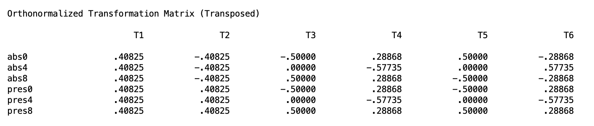{alt="SPSS orthonormalized transformation matrix with six columns T1 through T6 and six rows for abs0 abs4 abs8 pres0 pres4 pres8 showing the D variable coefficients"}

This output isn't necessary to know, but it can verify whether or not SPSS is calculating the correct difference scores from the appropriate full/reduced models.
T1 is the grand mean and is not of interest. The remaining columns correspond to the
five D variables from Section 3. T2 assigns negative weights to the three
Noise-Absent variables and positive weights to the three Noise-Present variables,
which is the Noise main effect D variable (D3). T3 and T4 assign opposite signs
to the 0-degree and 8-degree conditions while treating the two Noise levels
symmetrically, which are the two Angle main effect D variables (D1 and D2). T5
and T6 flip the sign pattern between the Noise-Absent and Noise-Present rows,
which is the signature of an interaction: the angle contrast is being applied in
opposite directions across noise conditions. These are D4 and D5.

If these sign patterns do not match what you expect based on your `/WSFACTORS`
specification and variable order, stop and correct the syntax before reading any
further output.

Next in the output is the grand mean test in the "Between-Subjects Effects" block. 

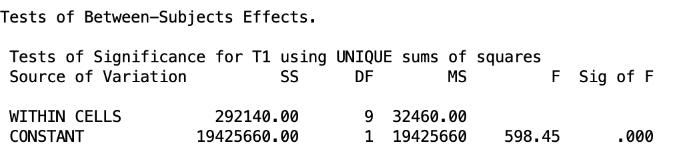{alt="SPSS Between-Subjects Effects table showing the F test for the grand mean intercept"}

Recall that this is not that important since it is obvious that the mean of all people averaged together is not 0.

Next in the list is the main effect of Noise.

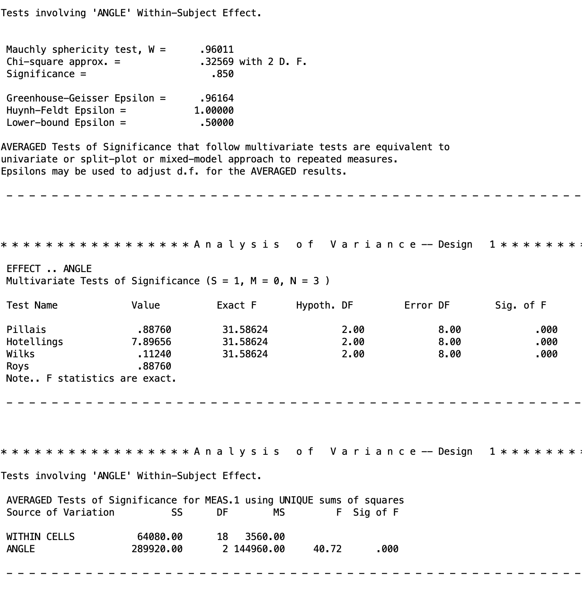{alt="SPSS output table showing the F test for the Noise main effect with F(1,9) = 33.77, p < .001"}

This shows us that the main effect of noise is significant $p < .001$. Recall what I said in Section 5. Since there is only two levels for this variable, the univariate and multivariate approaches will be equivalent. So there is only one table of output. So there is a significant difference between the means of the present Nois group while averaging over the Angle groups.

Next in the output is the main effect of Angle. This output has more to it since
Angle has three levels, which means two D variables are involved and SPSS
produces both a multivariate and a univariate section.

{alt="SPSS output for the Angle main effect showing Mauchly's sphericity test, four multivariate test statistics, and the univariate averaged F test"}

The output starts with **Mauchly's test of sphericity**. This tests whether the
variances of the D variables are equal, which is the assumption the univariate
approach requires. A significant Mauchly's test is a warning that the univariate
results below it may not be trustworthy as spherecity does not hold. However, even when Mauchly's test is not
significant, it is not a guaranteed that sphericity holds, especially with small
samples where the test has low power. This is one of the reasons we prefer the
multivariate approach. 

Below that is the **multivariate tests** section, which is the output we care
about. SPSS reports four test statistics: Pillai's trace, Hotelling's trace,
Wilks' lambda, and Roy's largest root. These are four different mathematical
approaches to the same underlying question: is the effect real or is it noise?
They were developed at different points in history and each has slightly
different statistical properties. Roy's largest root is the most powerful but
also the most anti-conservative, Pillai's trace is the most robust when sample
sizes are small or covariances are unequal, and Wilks' lambda and
Hotelling's trace fall somewhere in between. In practice they tend to diverge
most in designs with many dependent variables where the effect is not
concentrated in a single contrast but spread unevenly across several, such as a
MANOVA with five or six outcome measures and a small sample. In our design,
however, SPSS prints "$F$ statistics are exact," which means the design is simple
enough that all four methods produce precisely the same F value rather than
slightly different approximations. It does not matter which row you read. Thus, we know that the
Angle main effect is significant ($p$ < .001) 

This means that reaction time differs significantly across angle levels when
combining across noise conditions. Participants were slower to respond as the
angle of rotation increased, with average reaction times rising from 477 ms at
0 degrees to 585 ms at 4 degrees to 645 ms at 8 degrees.

At the bottom is the **univariate averaged tests** section. This is the output
you would read if you were taking the univariate approach, which pools error
across D variables under the sphericity assumption. As discussed in Section 5,
we do not use this. It is shown here only so you know what it is and can
confidently skip past it.

Lastly, we have the interaction effect at the very end of the output.

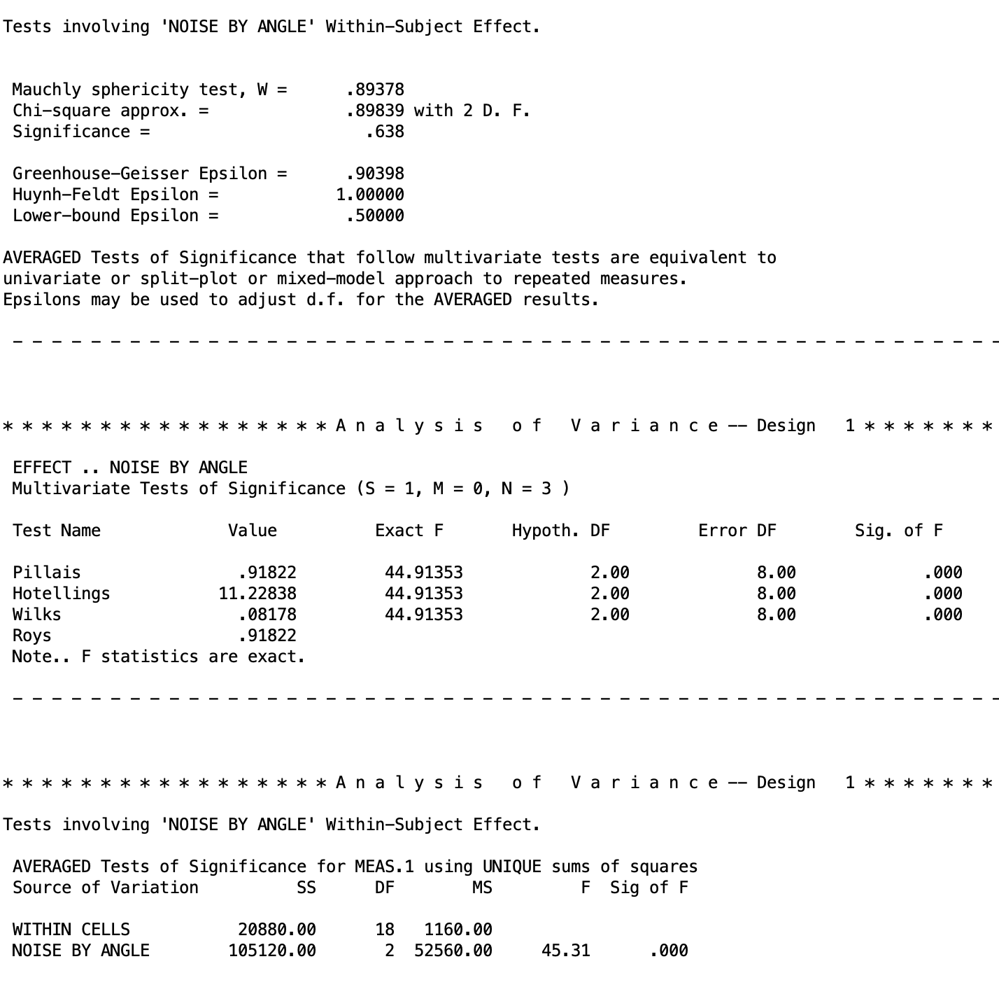{alt="SPSS output for the Noise by Angle interaction effect showing Mauchly's test, Pillai Hotelling Wilks and Roy multivariate statistics, and the univariate averaged F test"}

We know this is the interaction as it is `NOISE BY ANGLE`. Recall that `BY` means we are crossing the variables. The structure of this output is identical to what we saw for the Angle main
effect: Mauchly's test at the top, the multivariate tests in the middle, and the
univariate averaged tests at the bottom. Read the multivariate section and skip
the rest. The interaction is significant, $p < .001$.

This means that the effect of noise on reaction time is not the same across all
angle conditions. At 0 degrees, noise made almost no difference (462 ms vs. 492
ms). By 8 degrees, that gap had grown to 234 ms (528 ms vs. 762 ms). In other
words, noise becomes increasingly disruptive as the mental rotation task gets
harder.

## 7. Follow-Up Tests: Decision Tree

Just like what we discussed in the Two-Way Between-Subjects ANOVA and Higher-Order Between-Subjects ANOVA lessons, there are a set of follow-up tests you should conduct, depending on whether ot not the interaction is significant.

The decision logic for follow-up tests in a two-way within-subjects design mirrors the structure you already know from two-way between-subjects ANOVA: the interaction result determines which path you take, and every comparison you make within that path uses the D variable framework introduced above. 

For convenience, I am pasting the same flowchart we used prior again.

```{mermaid}
%%| echo: false
flowchart TD
    A[Is the A x B<br/>interaction significant?] -->|Yes| B[Test simple effects<br/>OR interaction contrasts]
    A -->|No| F[Is the main effect<br/>of A significant?]
    B --> C[Simple effects: effect of<br/>one factor at each level<br/>of the other]
    B --> D[Interaction contrasts: does<br/>a specific contrast on A<br/>depend on B?]
    C -->|Significant<br/>simple effect| E[Cell means comparisons<br/>within that slice]
    F -->|Yes| G[Individual contrasts<br/>for marginal means]
    F -->|No| H[Is the main effect<br/>of B significant?]
    H -->|Yes| I[Individual contrasts<br/>for marginal means]
    H -->|No| J[Stop, nothing<br/>further to test]
```

------------------------------------------------------------------------

## 8. Type I Error Correction

Before I continue to the follow up tests, I just want to remind you of the Type I error corrections. Since we are doing follow up tests, this is something you have to keep in mind. I am going to defer to the Two-Way Between-Subjects ANOVA lesson for a lot of the details, as the general concepts about deciding on families and controlling for each branch of the flow chart is covered in detail there.

However, there are two differences:

1) **Tukey's HSD is not appropriate for within-subjects comparisons.** Tukey's procedure assumes that all comparisons share a common error variance. In a within-subjects design, that assumption is equivalent to requiring sphericity, and the multivariate approach is used precisely to avoid making that assumption. Applying Tukey's procedure here would reintroduce the problem we sidestepped by choosing the multivariate approach, and familywise Type I error would no longer be controlled at the nominal level when sphericity is violated. Between-subjects designs do not face this restriction because pooling error across cells is defensible when the homogeneity of variance assumption holds. Within-subjects designs have no analogous safe pooling structure without sphericity.

2 **The Scheffé correction becomes the Roy-Bose correction.** The Roy-Bose extension is the within-subjects analogue of the Scheffé correction. It controls the familywise error rate over the entire family of possible contrasts for a given effect, making it appropriate for post hoc exploration. The specific critical value formula depends on which type of comparison you are making.

This requires specific equations for the critical values.

**For marginal means comparisons** (main effect follow-up on a factor with a levels):

$$CV_{Roy-Bose} = \frac{(n-1)(a-1)}{n-a+1} \cdot F(.05;\, a-1,\, n-a+1)$$

**For interaction contrasts:**

$$CV_{Roy-Bose} = \frac{(n-1)(a-1)(b-1)}{n-(a-1)(b-1)} \cdot F(\alpha_{.05};\, (a-1)(b-1),\, n-(a-1)(b-1))$$
> Recall that in planned contrast, if you want to be optimal, you should compare the Bonferroni and Roy-Bose critical values, and go with the method that has the lowest critical $F$ value.

SPSS doesn't have an easy way to introduce the Roy-Bose procedure, so if you wish to do this, you would need to manually calculate the critical value to compare your tests' $F$ statistic with.

Going forward, I am going to be ignoring these and just compare the results to an unadjusted $\alpha = .05$.

## 9. Marginal Means Comparison

This section applies when the interaction is **not** significant and a main effect is. Though our data does have a significant interaction, we will pursue a hypothetical where this is not true. The first thing to do is check the main effects of each variable. If the main effects are significant, then we need to follow up with marginal mean comparisons. In our case, all main effects were significant. So now the goal is to compare specific marginal means for these factors while average across levels of the other factor(s).

For the case of Noise, we actually can't do marginal means comparisons since there are only two groups. So the main effect compares those two means directly. Therefore, we will conduct marginal means for Angle.

### SPSS for Marginal Means

Let's say we are interest in comparing the 0 degree Angle measurement to the 4 degree Angle measurement.

The SPSS code for this is as follows.

``` 
MANOVA
  abs0 abs4 abs8 pres0 pres4 pres8
  /WSFACTORS noise(2) angle(3)
  /CONTRAST(angle) = special(1  1  1    
                              1 -1  0  
                              1  1 -2)  
  /PRINT TRANSFORM
  /WSDESIGN = angle(1) angle(2).      
```

As always for within-subjects designs using MANOVA, the variable order in the `MANOVA` command and the factor
specification in `/WSFACTORS` must be consistent with each other. If they do not
match, the contrast weights will be applied to the wrong cells and the output
will be incorrect without any warning from SPSS. Use `/PRINT TRANSFORM` to
verify that the D variables SPSS constructed match what you intended before
reading any results. See the One-Way Within-Subjects ANOVA lesson for more detail.

The `/CONTRAST(angle)` subcommand defines the contrast matrix for the Angle
factor. The first row is always a grand mean row that SPSS, given as a row of 1's. The second row compares 0 degrees against 4 degrees, averaging across both
noise conditions. The third row compares the average of 0 and 4 degrees against
8 degrees, averaging across noise conditions. The reason I included this complex comparison is not because I am intereted in it conceptually, but I included it because the two contrasts in this matrix must
orthogonal to each other, meaning they carve up the angle effect into two
non-overlapping pieces and can therefore be tested in the same command without
any issues. **REMEBER THAT ALL CONTRASTS FOR WITHIN-SUBJECTS FACTORS MUST BE ORTHOGONAL.** Sometimes this requires adding non-important contrasts. This is ok. You will just ignore the output in your study if you did not plan to be interested in them. 

Lastly, the `/WSDESIGN` subcommand tells SPSS which rows of the contrast matrix to
actually test. `angle(1)` requests the test of the first substantive contrast
row (0 vs. 4 degrees) and `angle(2)` requests the second (average of 0 and 4
vs. 8 degrees). Since these are marginal means, not including anything about Noise in this line automatically tells SPSS to marginalize over Noise.

If you want to test polynomial trends for Angle instead, replace the contrast matrix rows with the appropriate polynomial coefficients:

``` spss
* Trend contrasts for Angle marginal means.
MANOVA
  abs0 abs4 abs8 pres0 pres4 pres8
  /WSFACTORS noise(2) angle(3)
  /CONTRAST(angle) = special(1  1  1    
                             -1  0  1   
                              1 -2  1) 
  /PRINT TRANSFORM
  /WSDESIGN = angle(1) angle(2).
```

Recall that the linear and polynomial trend contrasts are orthogonal by default.

The output for the contrasts are given in two blocks. The first block is for the
first, focal contrast that compares 0 degrees against 4 degrees while combining
over Noise:

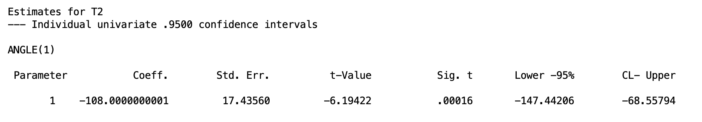{alt="SPSS estimates table for ANGLE(1) showing coefficient standard error t-value significance and 95% confidence interval"}

The coefficient of -108 tells us that the marginal mean at 0 degrees is 108 ms
lower than the marginal mean at 4 degrees, averaging across both Noise
conditions. This difference is significant, $p < .001$, with a 95% confidence
interval ranging from -147 ms to -69 ms. In other words, participants were
reliably slower to respond when the angle of rotation increased from 0 to 4
degrees, regardless of whether Noise was present or absent.

Even though we aren't interested in the complex comparison, I am including it
here for completion.

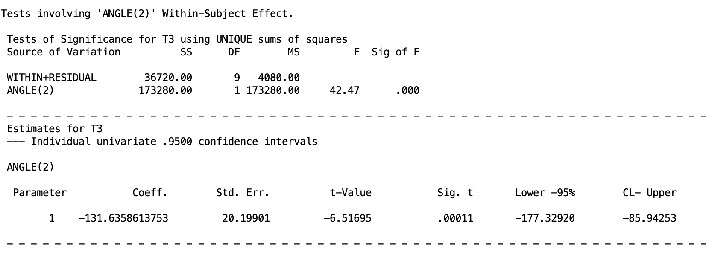{alt="SPSS significance test and parameter estimates table for ANGLE(2) showing F test sums of squares coefficient standard error t value significance and 95% confidence interval"}

The coefficient of -131.64 tells us that the average of the 0 and 4 degree
marginal means is 131.64 ms lower than the 8 degree marginal mean, combining
across both noise conditions. This difference is also significant, $p < .001$,
with a 95% confidence interval ranging from -177 ms to -86 ms. Participants were
reliably slower at 8 degrees than at the lower two angle levels.

Now we turn to the branch of the flow chart when the interaction is significant.

## 10. Simple Effects

Simple effects are looking at the effect of one factor at specific levels of the other factor(s). Recall that this should only be done when the interaction is significant in the omnibus test, which is true in our data. 

> Recall that "simple" means within a level of a factor. 

The logic is to restrict attention to the subset of variables that correspond to one level of the conditioning factor. D variables formed within that subset use the same contrast logic as before but applied only to those variables. Test the simple effect with a multivariate $F$ if the focal factor has more than two levels, or with the the generic $F$ test if it has exactly two levels.

For our data, the interaction tells us that noise and angle do not operate
independently. Looking at the cell means, noise makes almost no difference at 0
degrees (462 ms vs. 492 ms, a gap of 30 ms), but that gap grows dramatically as
the rotation angle increases: 150 ms at 4 degrees and 234 ms at 8 degrees. This
pattern suggests that noise becomes increasingly disruptive as the mental
rotation task gets harder. The natural way to unpack this is to test the simple
effect of Noise separately at each angle level, asking: is noise making a
significant difference here, and does that answer change depending on which angle
we are looking at?

### SPSS Syntax: Simple Effect of Noise Within Angle

Though we could do simple effect tests for Angle within Noise, conceptually, we
are much more interested in the simple effects of Noise within the different
levels of Angle. The following syntax does this.

```spss
MANOVA
  abs0 abs4 abs8 pres0 pres4 pres8
  /WSFACTORS noise(2) angle(3)
  /PRINT TRANSFORM
  /WSDESIGN = noise W angle(1),
              noise W angle(2),
              noise W angle(3).
```

The `/WSDESIGN` subcommand is where the simple effects are specified. The `W`
keyword means "within," so `noise W angle(1)` is asking for the effect of Noise
within the first level of Angle, which is the 0 degree condition. The number in
parentheses after `angle` refers to the level of the conditioning factor, not a
contrast row, so `angle(1)`, `angle(2)`, and `angle(3)` correspond to the 0, 4,
and 8 degree conditions respectively. Running all three in the same command
produces a separate test for each angle level in a single pass through the
output.

The other rules of within-subjects syntax applies.

At the top of the output, we have the difference scores from `/PRINT TRANSFORM`,
but I will skip that. The simple effects are reported in different output chunks
in order of how you specified them in `/WSDESIGN`. The following output goes from
the first level of Angle to the last:

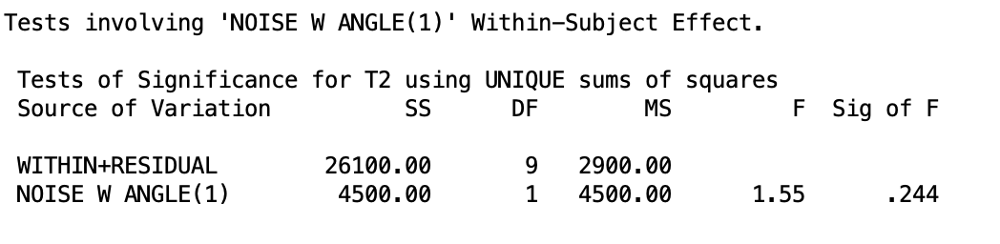{alt="SPSS significance test for NOISE W ANGLE(1) showing F(1,9) = 1.55, p = .244"}

At 0 degrees, the simple effect of Noise is not significant, $p = .244$. The 30
ms gap between Noise Absent (462 ms) and Noise Present (492 ms) at this angle
level is small enough that we cannot rule out chance as an explanation.

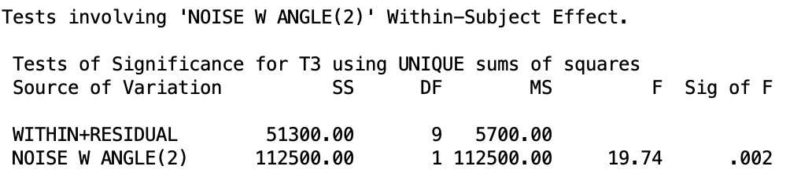{alt="SPSS significance test for NOISE W ANGLE(2) showing F(1,9) = 19.74, p = .002"}

At 4 degrees, the simple effect of Noise is significant, $p = .002$. The gap has
grown to 150 ms (510 ms vs. 660 ms), and we can now conclude that noise is
genuinely slowing participants down at this level of rotation.

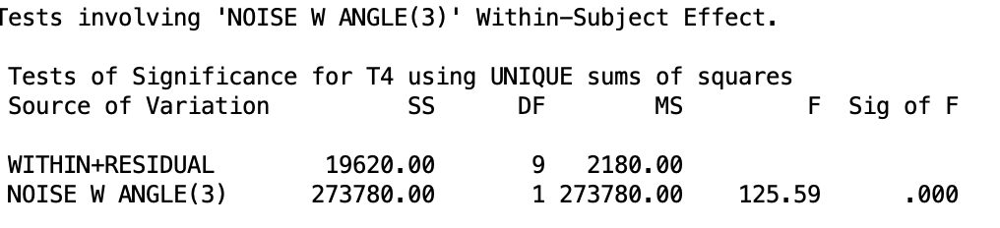{alt="SPSS significance test for NOISE W ANGLE(3) showing F(1,9) = 125.59, p < .001"}

At 8 degrees, the simple effect of Noise is highly significant, $p < .001$. The
gap has grown to 234 ms (528 ms vs. 762 ms), and the error term is actually
smaller here than at the other angle levels, making this the most decisive test
of the three. Taken together, these three simple effects show that
Noise has no meaningful impact when the rotation task is easy (0 degrees), but becomes
increasingly disruptive as the task gets harde (8 degrees).

Because Noise has only two levels, SPSS produces a single table per angle level with no separate multivariate vs. univariate distinction. The results are equivalent in both frameworks.

There are two more simple effects we can do for Noise within Angle, but we will skip this for now. Now we turn to what to do after getting significant simple effects.

## 11. Cell Means Comparisons

Once a simple effect is established as significant, the next step is to compare specific cell means. Recall that simple effects just tell you there is a difference in the means of one factor within specific levels of another factor. It does not tell you where this difference lies. Cell mean comparisons can lead us there.

The logic follows to form a single D variable that captures the contrast of interest, applying weights only to the outcome variables within the relevant level of the factors. Though this can get pretty technical, so we will by pass it.

### SPSS Syntax: Cell Mean Comparisons

There are many cell mean comparisons we could look at. For now, let's say we are interest in comparing the linear trend 0 degrees Angle level towards the 8 degrees Angle level within the two different Noise groups. 

The syntax would be the following

``` 
MANOVA
  abs0 abs4 abs8 pres0 pres4 pres8
  /WSFACTORS noise(2) angle(3)
  /CONTRAST(angle) = special(1  1  1    
                               1  0 -1 
                               1 -2  1) 
  /PRINT TRANSFORM
  /WSDESIGN = angle(1) W noise(1),     
              angle(1) W noise(2),     
              angle(2) W noise(1),      
              angle(2) W noise(2).     
```

The `/CONTRAST(angle)` subcommand defines the contrast matrix for Angle. As
always, the first row is the grand mean row required by SPSS. The second row is the linear contrast, which
compares 0 degrees against 8 degrees by assigning weights of 1 and -1 to those
conditions and 0 to the 4 degree condition, which drops it from the comparison
entirely. The third row is a quadratic contrast that compares the average of
the 0 and 8 degree conditions against the 4 degree condition. These two contrasts
are orthogonal to each other, which is a requirement for running them in the same
`MANOVA` command. If your desired contrasts are not orthogonal, they must each
go in their own separate command.

The `/WSDESIGN` subcommand then specifies which comparisons to test and where.
The number in parentheses **before** the `W` refers to a row of the contrast
matrix, so `angle(1)` means the first substantive contrast row (linear) and `angle(2)` means the second (quadratic). The number in parentheses
**after** the `W` refers to the level of the conditioning factor, so `noise(1)`
is the Noise Absent condition and `noise(2)` is the Noise Present condition.
Putting it together, `angle(1) W noise(1)` tests the linear trend
within Noise Absent, and `angle(1) W noise(2)` tests the same comparison within
Noise Present.

There will be a lot of output for this syntax, so we will briefly cover all the
cell mean comparisons only. It is important to keep in mind what each piece of
the design line refers to what comparison, as the output will be labeled based
on that.

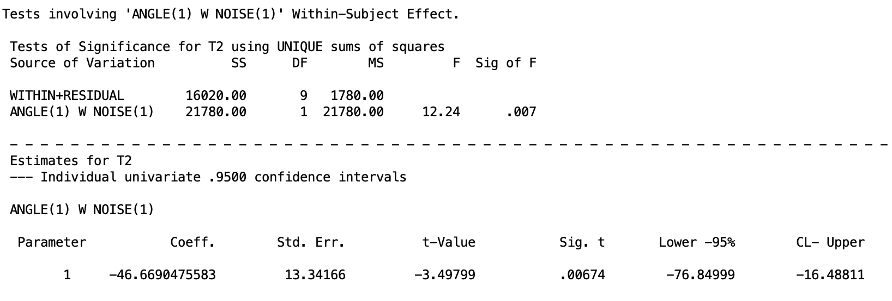{alt="SPSS significance test and parameter estimates for ANGLE(1) W NOISE(1) showing F(1,9) = 12.24, p = .007 and coefficient of -46.67"}

Within the Noise Absent condition, participants were significantly faster at 0
degrees than at 8 degrees, $p = .007$. The coefficient of -46.67 ms tells us the
size of that gap: reaction times at 0 degrees were about 47 ms lower than at 8
degrees when Noise was absent.

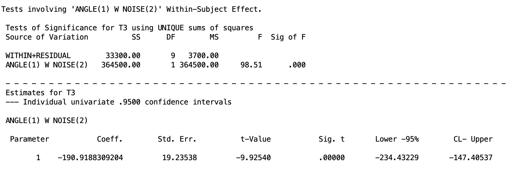{alt="SPSS significance test and parameter estimates for ANGLE(1) W NOISE(2) showing F(1,9) = 98.51, p < .001 and coefficient of -190.92"}

Within the Noise Present condition, the same comparison is again significant,
$p < .001$, but the effect is dramatically larger. The coefficient of -190.92 ms
means that reaction times at 0 degrees were nearly 191 ms lower than at 8
degrees when noise was present. Comparing this to the 47 ms gap in the Noise
Absent condition makes the interaction concrete: Noise amplifies the Angle effect
by a factor of roughly four.

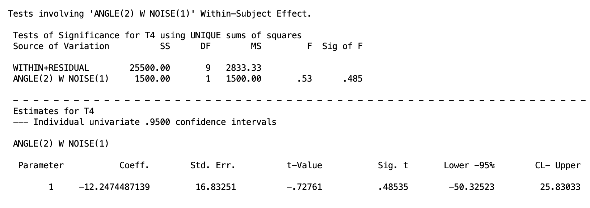{alt="SPSS significance test and parameter estimates for ANGLE(2) W NOISE(1) showing F(1,9) = 0.53, p = .485 and coefficient of -12.25"}

The quadratic contrast within Noise Absent is not significant, $p = .485$. The
average of the 0 and 8 degree conditions does not meaningfully differ from the 4
degree condition when noise is absent, suggesting the Angle effect is fairly
linear in that condition.

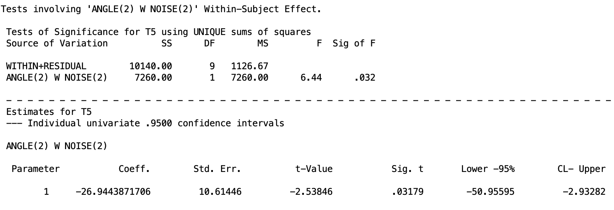{alt="SPSS significance test and parameter estimates for ANGLE(2) W NOISE(2) showing F(1,9) = 6.44, p = .032 and coefficient of -26.94"}

The quadratic contrast within Noise Present is significant, $p = .032$. When
noise is present, the 4 degree condition pulls away from the average of the 0
and 8 degree conditions, suggesting the Angle effect is not purely linear under
noise. The pattern is more complex, with the 4 degree condition showing a
disproportionately large reaction time relative to what a straight line through
0 and 8 degrees would predict.

Keep in mind that before I ran the test, I said I was only interested in the linear trend. So realistically and ethically, I should only look at those effects and plan my Type I error control around this. However, if I decide to include the quadratic effects, this is a bit $p$ hacky, so it will be imperative to do Type I error control. It is recommended practice to stick to what you planned, regardless of the outcome of the test. In fact, not doing this and people just taking any signficant results is part of the reason for the replication crisis. Be the change you want to see!

## 12. Interaction Contrasts

The last follow-up tests are interaction contrasts. Interaction contrasts offer an alternative path for decomposing a significant interaction without first computing simple effects. Rather than asking about the full effect of one factor at each level of the other, an interaction contrast asks whether a specific contrast on Factor A differs between two specific levels of Factor B.

The D variable logiv for an interaction contrast uses an element-wise product of the coefficient vector for a contrast on Factor A with the coefficient vector for a contrast on Factor B. Again, its a bit complicated, so we will skip it.

### SPSS Syntax: Interaction Contrasts

Let's say we are interested in whether or not the linear and quadratic trend
differ across the two Noise groups. That is, does the way reaction time changes
across angle levels depend on whether noise is present or absent? Rather than
testing the full simple effect of Angle within each Noise condition, interaction
contrasts let us ask this question one trend at a time: does the linear
increase across angle levels differ between noise conditions, and separately,
does the quadratic bend differ between noise conditions?

The SPSS syntax to do this is given below:

``` spss
MANOVA
  abs0 abs4 abs8 pres0 pres4 pres8
  /WSFACTORS noise(2) angle(3)
  /CONTRAST(noise)  = special(1  1   
                               1 -1)  
  /CONTRAST(angle) = special(1  1  1  
                              1  0 -1  
                              1 -2  1) 
  /PRINT TRANSFORM
  /WSDESIGN = angle(1) BY noise(1),   
              angle(2) BY noise(1).   
```

This syntax introduces two new elements compared to what we have seen before.
First, we now need a `/CONTRAST` specification for both factors, not just Angle.
The Noise contrast matrix has a grand mean row and a single substantive row
comparing Noise Absent against Noise Present. The Angle contrast matrix is the
same one used in the cell means comparisons: a grand mean row, a 0 vs. 8 degree
row, and a quadratic row. Again, contrasts must be orthogonal here.

The key new element is the `BY` keyword in `/WSDESIGN`. Where `W` specifies a
simple effect of one factor within a level of another, `BY` crosses a specific
contrast from one factor with a specific contrast from another. So `angle(1) BY
noise(1)` takes the first substantive Angle contrast (0 vs. 8 degrees) and
crosses it with the first substantive Noise contrast (Absent vs. Present),
producing a single D variable that asks: is the 0 vs. 8 degree difference bigger
in one noise condition than the other? `angle(2) BY noise(1)` does the same
thing for the quadratic Angle contrast. As before, the number before `BY` refers
to a contrast row for Angle and the number after `BY` refers to a contrast row
for Noise, not a factor level.

If you have more levels in each within-subjects factor, the design line can get very messy, but the logic stays the same.

We will go over the output of each interaction contrast piece by piece. Make
sure you are looking at the correctly labeled part of the output.

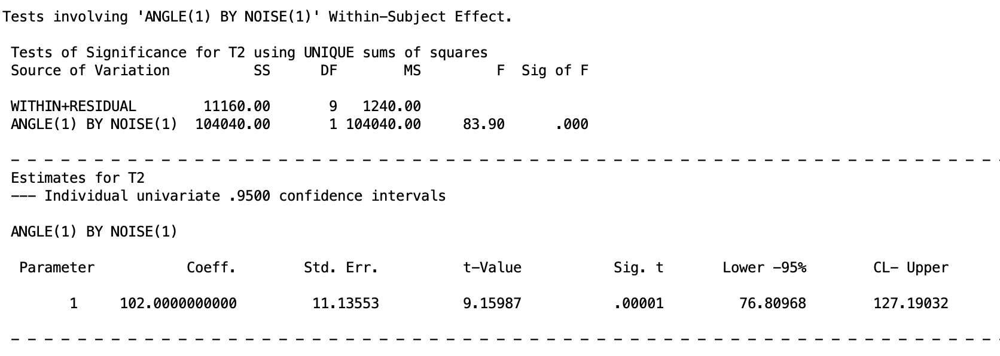{alt="SPSS significance test and parameter estimates for ANGLE(1) BY NOISE(1) showing F(1,9) = 83.90, p < .001 and coefficient of 102.00"}

The linear Angle contrast differs significantly between Noise conditions,
$p < .001$. The coefficient of 102 ms tells us the size of that difference: the
gap between 0 and 8 degrees is 102 ms larger under Noise Present than under
Noise Absent. In other words, the linear increase in reaction time across Angle
levels is substantially steeper when Noise is present, which is the core of what
the interaction is capturing.

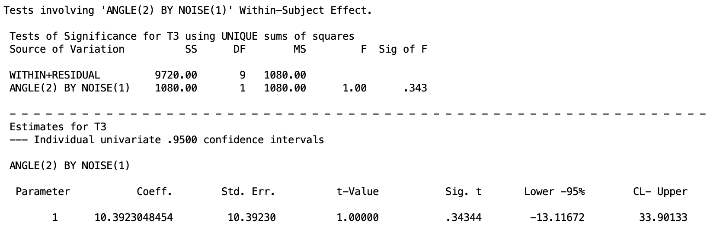{alt="SPSS significance test and parameter estimates for ANGLE(2) BY NOISE(1) showing F(1,9) = 1.00, p = .343 and coefficient of 10.39"}

The quadratic Angle contrast does not differ significantly between noise
conditions, $p = .343$. The bend in the Angle effect, that is, whether the 4
degree condition falls above or below a straight line connecting 0 and 8 degrees,
is similar regardless of whether Noise is present or absent. 

Taken together, the two interaction contrasts show us that Noise changes the slope of the
Angle effect but not its shape.

## 13. A Brief Note on Higher-Order Designs

The logic of the two-way within-subjects design extends naturally to designs
with three or more within-subjects factors. A 2x3x4 design, for example, would
produce three main effects, three two-way interactions, and one three-way
interaction, all tested using the same D variable framework. The total number of
D variables needed is still (abc - 1), partitioned among effects in the same way:
a - 1 for Factor A, b - 1 for Factor B, c - 1 for Factor C, (a-1)(b-1) for the
A x B interaction, and so on up to (a-1)(b-1)(c-1) for the three-way
interaction.

The SPSS `MANOVA` syntax scales up in a straightforward way. You add the
additional factor to `/WSFACTORS`, extend the variable list accordingly, and
make sure the variable order is consistent with the factor specification as
described in Section 6. The `/PRINT TRANSFORM` check becomes even more important
in higher-order designs because there are more D variables to verify and more
opportunities for a variable ordering mistake to go undetected.

Follow-up tests and Type I error control follow the same logic described in the
Higher-Order Between-Subjects ANOVA lesson. The interaction hierarchy still
applies: start with the highest-order interaction and work downward. The
within-subjects specific considerations from Section 8 also carry over directly,
Bonferroni and Roy-Bose Scheffe remain the appropriate correction strategies and
Tukey remains unavailable.

The one thing that does become more complicated in higher-order within-subjects
designs is the D variable bookkeeping. In a three-way design the interaction D
variables are formed by multiplying the coefficients of all three main effect
contrast vectors together, which can produce a large number of D variables that
are easy to lose track of. Carefully labeling your D variables before running any
syntax and verifying the transformation matrix output before interpreting results
is especially important here.

Realistically, I am not familiar with any studies that would do a design like this in psychology. Perhaps in other fields of study, but in Psychology, it is hard enough to get people to commit to any ammount of repeated-measures experiments, especially if the length of time is more than one day. 

But just keep this all in mind for whatever you might try to do/analyze in the future.

------------------------------------------------------------------------

## 14. Summary

The multivariate approach to higher-order within-subjects designs is a coherent extension of the one-way case. Every effect in the design is captured by a set of D variables formed from weighted combinations of the original repeated-measures variables. The omnibus test for each effect is a multivariate $F$ test that asks whether the population means of those D variables are simultaneously zero. Follow-up tests use the same D variable logic.

In general, the step-by-step process on how to handle two-way or higher order within-subjects ANOVAs follow the between-subjects form. The SPSS syntax and output gets more messy, but the procedure remains the same. However, for Type I error control, you cannot use the Tukey HSD correction and you must use the Roy-Bose correction instead of Scheffé. 


## Discussion Questions

**1.** A researcher designs a 4x2 within-subjects study with factors Condition (4 levels) and Time (2 levels). How many D variables are needed in total, and how many are assigned to each effect?

<details>

<summary>Click to reveal answer</summary>

The total number of D variables needed is (ab - 1) = (4)(2) - 1 = 7. The Condition main effect requires a - 1 = 3 D variables. The Time main effect requires b - 1 = 1 D variable. The Condition x Time interaction requires (a - 1)(b - 1) = 3 D variables.

</details>

------------------------------------------------------------------------

**2.** You specify `/WSFACTORS noise(2) angle(3)` but accidentally list the variables as `abs0 pres0 abs4 pres4 abs8 pres8`. What will happen to the transformation matrix, and how would you detect the problem?

<details>

<summary>Click to reveal answer</summary>

SPSS uses the variable list and the `/WSFACTORS` specification together to figure
out which variable belongs to which cell. The first factor named in `/WSFACTORS`
groups the variables into blocks, and the second factor determines the order
within each block. So `/WSFACTORS noise(2) angle(3)` tells SPSS to expect two
noise blocks, each containing three angle conditions in order, giving the
variable arrangement `abs0 abs4 abs8 pres0 pres4 pres8`.

If you list the variables as `abs0 pres0 abs4 pres4 abs8 pres8` but keep
`/WSFACTORS noise(2) angle(3)`, SPSS will still run without an error, but it
will assign the wrong variable to the wrong cell. It will treat `abs0` and
`pres0` as the two angle conditions within the first noise level, and `abs4` and
`pres4` as the two angle conditions within the second noise level, which is not
what the data actually represent. The D variables it constructs will be
meaningless combinations of the original variables and the output will be
silently wrong.

You would catch this by checking the `/PRINT TRANSFORM` output. T2, which should
show equal negative weights for all three Noise Absent variables and equal
positive weights for all three Noise Present variables, will instead show a
different pattern. Any mismatch between the transformation matrix and the D
variable definitions from Section 3 is a sign that the variable order or the
factor specification needs to be corrected before reading any results.

</details>

------------------------------------------------------------------------

**3.** Explain in your own words why the multivariate and univariate approaches give identical results for the Noise main effect but not for the Angle main effect or the interaction.

<details>

<summary>Click to reveal answer</summary>

The Noise main effect is represented by a single D variable because Noise has
only two levels. With only one D variable there is nothing to pool and no
sphericity assumption to worry about, so the multivariate and univariate
approaches are doing exactly the same calculation and will always give the same
answer. The Angle main effect and the interaction each require two D variables.
The univariate approach pools the error across those D variables under the
sphericity assumption, while the multivariate approach does not. When sphericity
does not hold, the two approaches give different answers and we trust the
multivariate output. The general rule is simple: when an effect has only one D (i.e., has two levels)
variable the two approaches agree, and when there is more than one D variable (i.e., more than two levels)
they may not. 

</details>

------------------------------------------------------------------------

**4.** A colleague argues that Tukey's HSD should be used to control familywise error rate when comparing cell means in a within-subjects design, because it is more powerful than Bonferroni. How do you respond?

<details>

<summary>Click to reveal answer</summary>

Tukey's HSD is not appropriate for within-subjects comparisons. Tukey assumes
that all comparisons share a common error variance, which is the assumption of Spherecity. This is the same assumption
we have been trying to avoid by using the multivariate approach in the first
place. Using Tukey here would reintroduce the very problem we sidestepped.
The appropriate alternatives are Bonferroni for a small planned set of
comparisons and the Roy-Bose Scheffe extension for post hoc exploration.
Bonferroni can actually be more powerful than Roy-Bose Scheffe when the number
of planned comparisons is small.

We could use Tukey if we do have sphericity and are doing the univariate method.
However, the univariate method is not preferred over the multivariate method due
to the fact that sphericity is rarely guaranteed in practice, and with small
samples like ours there is not enough power to reliably detect when it is
violated. The multivariate approach works regardless, so there is little reason
to take the risk.

</details>

------------------------------------------------------------------------

**5.** A researcher runs a 2x4 within-subjects design crossing Feedback Type
(Positive, Negative) with Practice Sessions (1, 2, 3, 4) and finds a
significant interaction. What follow-up options do they have, and give an
example of three specific tests they could run?

<details>

<summary>Click to reveal answer</summary>

When the interaction is significant there are two broad paths, as shown in the
decision tree: simple effects or interaction contrasts.

The simple effects path involves testing the effect of one factor at each level
of the other. There are 4 simple effects of Feedback Type within each session
level, and 2 simple effects of Practice Sessions within each feedback level,
giving 6 simple effects in total. Any that come back significant can then be
followed up with cell means comparisons within that slice. Three specific
examples would be: the simple effect of Feedback Type at Session 1, the simple
effect of Feedback Type at Session 4, or the simple effect of Practice Sessions
within the Positive Feedback condition.

The interaction contrasts path instead asks whether a specific contrast on one
factor depends on a specific contrast on the other. Three specific examples
would be: does the linear trend across sessions differ between Positive and
Negative feedback, does the quadratic trend across sessions differ between the
two feedback types, or is the difference between Session 1 and Session 4
larger under one feedback condition than the other.

</details>