## 1. What Is a Split-Plot Design?

The designs covered in prior lessons have been either entirely between-subjects or entirely within-subjects. In many research situations, however, it is natural to combine both types of factors in the same study. A design that includes at least one between-subjects factor and at least one within-subjects factor is called a **split-plot design**, also referred to as a mixed factorial design.

Split-plot designs arise whenever one factor cannot practically be manipulated over repeated measures Consider a study examining how newborn weight changes over the first four days of life, and whether that trajectory differs depending on whether infants are exposed to a rhythmic heartbeat sound. Because a given infant can only be in one nursery condition, group membership (heartbeat versus control) must be a between-subjects factor. But weight can be measured repeatedly on the same infant, so day of measurement is a within-subjects factor. The result is a 2 (group) × 4 (day) split-plot design.

The worked example throughout this lesson uses exactly this scenario. The dataset `SplitPlot.sav` contains weight measurements (in ounces) for 14 newborn infants: 7 assigned to the heartbeat condition (group 1) and 7 assigned to the control condition (group 2), each weighed on days 1 through 4.

Like the within-subjects designs covered in One-Way Within-Subjects ANOVA and Higher-Order Within-Subjects ANOVA, split-plot designs can in principle be balanced or unbalanced. A balanced split-plot design has equal sample sizes across all levels of the between-subjects factor and equal numbers of observations across all levels of the within-subjects factor for every participant. An unbalanced design has unequal group sizes, missing observations within participants, or both. The current example is balanced: both groups contain exactly 7 infants and every infant has a weight recorded on all four days. If the between-subjects groups were unbalanced, the choice of sums of squares type for the between-subjects tests would require attention, as discussed in Higher-Order Between-Subjects ANOVA. If observations were missing within participants across days, additional decisions about how to handle those gaps would be needed before the within-subjects tests could proceed. Both situations introduce complications beyond what a balanced design requires, and both are outside the scope of this lesson. Unfortunately, when I helped TA the course, I was not given this material so I am unsure the appropriate way to do these methods, and I don't want to give improper information. Just know that if you have unbalanced designs, you will need to adjust your process.

## 2. Two Separate Error Terms

One of the defining features of a split-plot design is that it requires **two distinct error terms**, one for between-subjects effects and one for within-subjects effects.

In a purely between-subjects design, as covered in One-Way Between-Subjects ANOVA and Two-Way Between-Subjects ANOVA, the error term reflects variability among individuals within the same cell. All observed variance is between-person variance, and that pooled within-cell variance serves as the denominator for every $F$ test.

In a purely within-subjects design, as covered in One-Way Within-Subjects ANOVA and Higher-Order Within-Subjects ANOVA, each participant contributes scores under all conditions. The D variable approach removes stable between-person differences from the error term, leaving only trial-to-trial variability within persons as the error.

A split-plot design has both kinds of variability. When testing the between-subjects main effect, the relevant question is whether groups differ on average across all measurement occasions. To capture this, each participant's scores are averaged across all levels of the within-subjects factor into a single summary score called M. Because M averages across all days, it represents each participant's overall level on the outcome, stripping away the within-subjects variation entirely. Individual differences between participants remain in M, so the appropriate error term is the pooled within-group variance in M across participants, just as in a one-way between-subjects ANOVA. When testing effects that involve the within-subjects factor, the relevant question concerns differences in D variables. Because D variables remove between-person baseline differences, the appropriate error term is the within-group variance in those D variables.

So, for the between-subjects parts of the model, we are interested in M, for the within-subjects parts of the model, we are interested in D.

The practical consequence is that the between-subjects main effect and the effects involving the within-subjects factor are tested against different denominators and will generally have different degrees of freedom. SPSS MANOVA handles this automatically.

## 3. The M and D Variable Framework

The full/reduced model comparison framework generalizes naturally to the split-plot case, using variable logic introduced in Higher-Order Within-Subjects ANOVA but applied to the M and D variables.

### The M variable and the between-subjects main effect

To test the main effect of group, each participant's scores are averaged across all levels of the within-subjects factor. In the current example, with $b = 4$ days, this gives:

$$M_{ij} = (Y_{1ij} + Y_{2ij} + Y_{3ij} + Y_{4ij}) / 4$$

where $Y_{kij}$ is the score for participant $i$ in group $j$ on day $k$. Averaging across days reduces each participant to a single value. Once we focus on $M$, the within-subjects factor has been removed and we have a straightforward one-way between-subjects comparison of group means on $M$. The full model is the same as we have used in the between-subjects cases, its just the outcome is now the M variable:

$$M_{ij} = \mu + \alpha_j + \varepsilon_{ij}$$

The null hypothesis that the group means on $M$ are equal in the population restricts $\alpha_j = 0$, giving the reduced model $M_{ij} = \mu + \varepsilon_{ij}$. The error term for this test is the pooled within-group variance in $M$ across the $N - a$ degrees of freedom, where $a$ is the number of levels of the between-subjects factor.

### D variables and the within-subjects effects

To test the main effect of the within-subjects factor, day, and the group-by-day interaction, D variables are formed from the within-subjects factor exactly as in a purely within-subjects design. With $b = 4$ days, three full models for three D variables are needed. Using orthogonal polynomial contrasts, these capture the linear, quadratic, and cubic trends across days:

-   $D_1$ (linear): $-3Y_{1ij} - 1Y_{2ij} + 1Y_{3ij} + 3Y_{4ij}$
-   $D_2$ (quadratic): $1Y_{1ij} - 1Y_{2ij} - 1Y_{3ij} + 1Y_{4ij}$
-   $D_3$ (cubic): $-1Y_{1ij} + 3Y_{2ij} - 3Y_{3ij} + 1Y_{4ij}$

The main effect of day asks whether the D variables have nonzero grand means, averaging over groups. The null hypothesis is $H_0: \mu_1 = \mu_2 = \mu_3 = 0$, meaning there is no systematic change in weight across days when pooling both groups. The restricted model sets all D variable grand means to zero. For more information, I refer you to the Higher-Order Within-Subjects ANOVA lesson where this is covered in more detail.

The group-by-day interaction asks whether the D variables differ across the between-subjects groups, that is, whether the pattern of weight change over days is the same for control and heartbeat infants. The null hypothesis is $H_0: \alpha_{1j} = \alpha_{2j} = \alpha_{3j} = 0$ for all groups, meaning age group has no effect on any of the D variables. The restricted model removes the group effects from the D variable models.

Both the main effect of day and the interaction are tested using the within-group variance in the D variables as the error term, with $N - a - b + 2$ degrees of freedom in the denominator for a 2-group design.

## 4. SPSS Syntax for the Omnibus Test

The omnibus test for a split-plot design is run using MANOVA in SPSS. The syntax structure should look familiar from prior within-subjects lessons, with the addition of the `BY group` specification and a `/DESIGN` statement for the between-subjects factor.

```         
MANOVA
    day1 day2 day3 day4 BY group(1 2)
    /WSFACTORS day(4)
    /WSDESIGN day
    /RENAME M Linear Quad Cubic
    /ERROR=WITHIN
    /PRINT CELLINFO(MEANS) SIGNIF(UNIV) TRANSFORM
    /DESIGN group.
```

Each line serves the following purpose:

-   `day1 day2 day3 day4 BY group(1 2)` lists the within-subjects outcome variables followed by the between-subjects grouping variable and its range of values (1 to 2).
-   `/WSFACTORS day(4)` declares day as a within-subjects factor with 4 levels. Note, this line and the line above that lists the within-subjects variables must follow the same pattern logic as discussed in the One-Way Within-Subects ANOVA lesson.
-   `/WSDESIGN day` specifies that the full within-subjects design includes the day factor.
-   `/RENAME M Linear Quad Cubic` names the transformed variables: $M$ for the mean and Linear, Quad, and Cubic for the three default polynomial D variables. The splitplot method gives lets you test trend contrasts easily by using `SIGNIF(UNIV)` (shown down below), so you can include this line if you wish to rename them and make them clearer in the output. Recall that if you do this, you need four names here, including one for the M mean variable. If you do not have four names, then one or more of the contrasts will be named improperly.
-   `/ERROR=WITHIN` directs SPSS to use within-cell error for all tests.
-   `/PRINT CELLINFO(MEANS) SIGNIF(UNIV) TRANSFORM` requests cell means, univariate follow-up contrasts for each D variable (what re renamed in `/RENAME` above), and the transformation matrix. We will cover these below.
-   `/DESIGN group` places the between-subjects factor on the right side of the model equation, so SPSS tests the group main effect on $M$ and the group-by-day interaction on the D variables simultaneously.

One thing to keep in mind is that you should put within-subjects related variables on the `/WSDESIGN` line (the `W` meaning within-subjects) and the between-subjects variables should just go on the regular `/DESIGN` line. The ordering of the lines *does* matter. The `/WSDESIGN` line must come first, or else the `/DESIGN` line, which also calculates the interaction, won't know what the within-subjects models are.

This single block of syntax produces three tests: whether groups differ overall (main effect of group), whether scores change across days on average (main effect of day), and whether the pattern of change across days differs between groups (the interaction). The `SIGNIF(UNIV)` option additionally prints a separate test for each individual day-to-day contrast, which allows us to examine specific trends and group differences at each step.

The SPSS output for split-plot designs can get very messy, so I will cover the output from top to bottom.

The first part of the output is the cell means and descriptive statistics we requested with `CELLINFO(MEANS)`. Here, we can see how each group's mean heart rate changes across the four days.

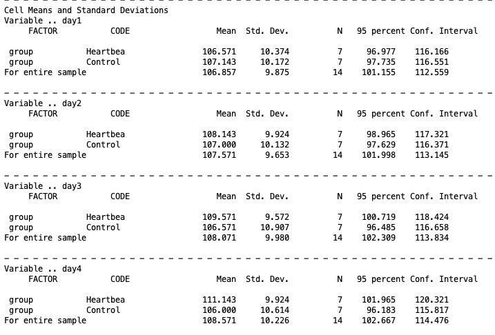

Looking at the Heartbeat group, means increase steadily from 106.6 on day 1 to 111.1 on day 4, suggesting a consistent upward trend. The Control group shows a much flatter pattern, moving from 107.1 on day 1 to 106.0 on day 4. This descriptive pattern already hints at a potential group-by-day interaction, which the omnibus tests below will formally evaluate.

The next piece of the output comes from requesting `TRANSFORM`.

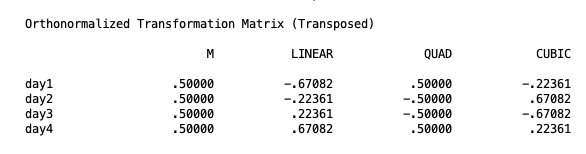

This is the orthonormalized transformation matrix that SPSS uses to convert the four repeated measures (day1–day4) into a set of orthogonal contrasts. The M column represents the overall mean across days (used for the group main effect test), while LINEAR, QUAD, and CUBIC represent the linear, quadratic, and cubic trend components of the day factor respectively. These coefficients are what get applied behind the scenes when testing whether scores change across days in a straight line, a curve, or a more complex pattern. This output isn't necessary, but it is helpful to see what the contrasts are doing under the hood of SPSS. This can come in handy when we start specifying our own contrasts.

The next piece is the between-subjects test. This section reports the test of the main effect of group, evaluated on the $M$ variable, which represents each participant's mean across all four days.

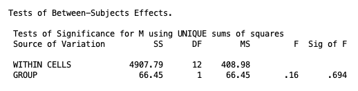

The result is non-significant, $F(1, 12) = 0.16$, $p = .694$, indicating that the two groups do not differ in their overall average heart rate when collapsing across days. However, this should not be interpreted until we know the significance of the interaction.

The next section reports Mauchly's test of sphericity, which evaluates whether the variances of the differences between all pairs of repeated measurements are equal — a required assumption for the univariate approach to repeated measures.

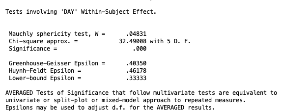

The test is significant, $p < .001$, indicating that the sphericity assumption is violated. If you recall, this means that the univariate tests for the within-subjects effects must be avoided. However, it is recommended to use the multivariate tests anyway because they do not assume sphericity and are therefore valid regardless of the correlation structure among the repeated measures. See the Within-Subjects ANOVA lesson for more info.

The next chunk of output is for the interaction tests, specifically the group-by-day interaction.

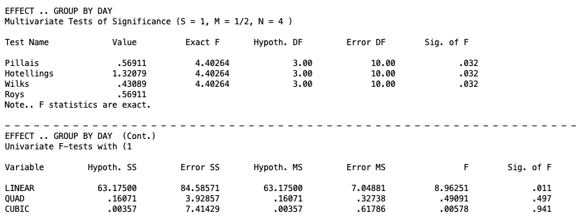

The multivariate tests all agree: the group-by-day interaction is significant, $p = .032$. This tells us that the pattern of weight change across the four days is not the same for both groups. In other words, knowing which group an infant was in changes the picture of how weight evolves over time. Because this interaction is significant, we cannot meaningfully summarize the effect of days without specifying which treatment group we are talking about, and we cannot summarize the effect of the treatment groups without specifying which day we are looking at. This is the result that drives all of our follow-up decisions: with a significant interaction, simple effects and interaction contrasts take priority over main effects.

The univariate trend contrasts break down exactly where the interaction is coming from. The linear component is significant, $p = .011$, meaning the two groups diverge specifically in their linear rate of weight change across days. The quadratic and cubic components are both non-significant ($p = .497$ and $p = .941$ respectively), indicating that no more complex curvilinear pattern distinguishes the groups. In substantive terms, infants in the Heartbeat condition gained weight at a steady linear rate across the four days, while infants in the Control condition did not show this same upward trajectory. The divergence between the groups is simple and consistent: it builds gradually and linearly across the observation period rather than accelerating, decelerating, or reversing at any point.

The next piece of output is the main effect of Day.

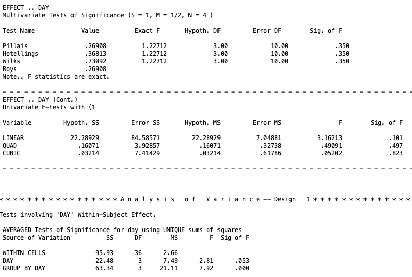

The multivariate tests show that the main effect of day is non-significant, $p = .350$. Averaged over both groups, weight does not change meaningfully across the four days of observation. However, this result needs to be interpreted carefully given that the group-by-day interaction is significant. Regardless, a non-significant main effect of day does not mean that weight is stable across days for everyone. It means that when the two groups are combined, their opposing trajectories cancel each other out: the Heartbeat group's steady increase and the Control group's relative flatness average together into an overall trend that is indistinguishable from zero. This is precisely why a significant interaction makes the main effect of day difficult to interpret on its own. The averaged picture obscures the real story rather than summarizing it.

The "univariate" trend contrasts tell the same story. The linear component is non-significant, $p = .101$, as are the quadratic and cubic components ($p = .497$ and $p = .823$ respectively). None of the trend components survive when the groups are pooled, further confirming that the overall Day effect is being masked by the divergent group trajectories.

The bottom portion of the output shows the univariate repeated measures summary that assumes spherecity ($p = .053$), however since spherecity was violated, we can't use this piece of output. Likewise, this table gives the univariate test for the `GROUP BY DAY` interaction, which is significant ($p = .000$). However, since spherecity wasn't upheld, we cannot use this significance, but the multivariate test was significant regardless.

### A note on multivariate test statistics when $a > 2$

When there are more than two levels of the between-subjects factor ($a$), the four multivariate test statistics (Pillai's trace, Wilks's lambda, Hotelling's trace, Roy's greatest characteristic root) can yield different results for the interaction test. In that case, Wilks's lambda is the most commonly reported statistic in the literature. For the current example with $a = 2$, all four statistics are equivalent, so this distinction does not arise.

## 5. Follow-Up Tests

The decision tree for follow-up tests in a split-plot design draws directly on what was established in prior lessons, but I will reprint it here:

```{mermaid}
%%| echo: false
flowchart TD
    A([Omnibus MANOVA]) --> B{Interaction<br/>significant?}
    B -- Yes --> D[Simple effects<br/>and/or interaction contrasts]
    B -- No --> C[Interpret main effects]
    D --> I{Which factor<br/>do you fix?}
    I --> J[Fix a level of the<br/>within-subjects factor<br/>Test between-subjects<br/>differences at that level]
    I --> K[Fix a level of the<br/>between-subjects factor<br/>Test within-subjects<br/>differences at that level]
    J --> L{Significant?}
    K --> M{Significant?}
    L -- No --> N([Stop])
    L -- Yes --> O[Compare specific levels<br/>of between-subjects factor]
    M -- No --> P([Stop])
    M -- Yes --> Q[Compare specific levels<br/>of within-subjects factor]
    D --> R[Interaction contrasts<br/>Does a specific within-subjects<br/>contrast differ across groups?]
    C --> E{Between-subjects<br/>main effect<br/>significant?}
    E -- No --> F{Within-subjects<br/>main effect<br/>significant?}
    E -- Yes --> G[Compare marginal means<br/>of between-subjects factor]
    F -- No --> Z([Stop])
    F -- Yes --> H[Compare marginal means<br/>of within-subjects factor]
```

When the interaction is not significant, marginal means for each factor are examined and compared as needed. When the interaction is significant, simple effects are tested and, if significant, cell mean comparisons are conducted within each simple effect. Interaction contrasts provide a more focused alternative to simple effects when a specific hypothesis about how the two factors combine is of interest.

The key distinction from purely between-subjects or purely within-subjects designs is that the error term used for any given follow-up test depends on the nature of the effect being tested. Follow-up tests on between-subjects effects use the between-subjects error term. Follow-up tests on within-subjects effects or the interaction use the within-subjects error term. For practical intents and purposes, however, the process will be the same as other two-way designs. 

## 6. Marginal Means

In our example, the interaction term was significant, but let's take the hypothetical that it was not significant. In this instance, we would be going down the right branch of the chart above. The next step is to assess the main effects of the within-subjects and between-subjects effects. The main effects are just the individual factor effects while averaging over the other factor. When these effects are significant, then we move on to do marginal means comparisons.

Assuming our interaction was not significant, in our example, we found that neither of the main effects were significant. So realistically, in that scenario, we should cease to do any further testing. But let's take one more hypothetical and assume both main effects were significant.

Starting with the between-subjects main effect, in the current example, we know that Group has only two levels, so the main effect of group is itself the marginal means comparison and no additional syntax is needed. If group had three or more levels, specific contrasts would be specified using `/CONTRAST(group) = SPECIAL`. 

Though this is redundant, you can still specify a marginal mean comparison of two groups by making a contrast. The following syntax illustrates the structure for completeness:

```         
MANOVA
    day1 day2 day3 day4 BY group(1 2)
    /WSFACTORS day(4)
    /ERROR=WITHIN
    /CONTRAST(group) = SPECIAL ( 1  1
                                 1 -1 )
    /DESIGN = group(1).
```

-   `/CONTRAST(group) = SPECIAL` specifies a custom contrast matrix for the between-subjects factor. The first row (1 1) is the grand mean parameter. The second row (1 -1) compares group 1 (heartbeat) against group 2 (control), averaging over days.
-   `/DESIGN = group(1)` requests the test of the first contrast of group, which is the pairwise comparison of interest.

Unlike contrasts for the within-subjects factor, the rows of a `/CONTRAST(group)` matrix do not need to be orthogonal to one another. This follows from the same principle established in One-Way Between-Subjects ANOVA: for independent groups, non-orthogonal contrasts still yield valid tests. 

Importantly, if the contrast is for the between-subjects factor, this information must go on the `/DESIGN` line. 

The output for this test can be interpreted as the effect of group 
on weight averaged across all four days. In the current example, 
this contrast tests whether heartbeat and control infants differ 
in their overall average weight when the four days are pooled 
together. Given that the between-subjects main effect was 
non-significant in the omnibus test, we would expect this contrast 
to also be non-significant, and it will reproduce the same result. 
The two groups do not differ meaningfully in their overall weight 
level across the observation period. What distinguishes them is not 
where they start or how heavy they are on average, but rather how 
their weight changes across days, which is captured by the 
interaction rather than the main effect.

Moving on to the within-subjects main effect, we compare marginal means for D variables if the within-subjects main effect is significant. Because these comparisons involve D variables, the contrast matrix for the within-subjects factor **must be orthogonal.**

The marginal mean comparison for a specific within-subjects contrast tests whether that contrast is nonzero when averaged over all groups. For example, the linear trend for day averaged over groups asks whether weight shows a systematic upward or downward trajectory, pooling control and heartbeat infants.

The following syntax tests the linear and pairwise comparisons of day as marginal mean tests:

```         
MANOVA
    day1 day2 day3 day4 BY group(1 2)
    /WSFACTOR = day (4)
    /CONTRAST(day) = SPECIAL( 1  1  1  1
                              -3 -1  1  3
                               1 -1 -1  1
                              -1  3 -3  1)
    /WSDESIGN = day(1) day(2) day(3)
    /ERROR=WITHIN
    /DESIGN = group.
```

-   `/CONTRAST(day) = SPECIAL` defines the transformation matrix for the within-subjects factor. The first row is the $M$ variable (all 1s). The remaining three rows define orthogonal contrasts: linear (-3 -1 1 3), quadratic (1 -1 -1 1), and cubic (-1 3 -3 1) polynomial contrasts.
-   `/WSDESIGN = day(1) day(2) day(3)` requests tests for each of the three contrasts in turn.
-   `/DESIGN = group` keeps the between-subjects factor on the right side of each model, so the tests correctly use the pooled within-group error across both groups.

The marginal mean tests appear in the `/WSDESIGN` line output labeled `DAY(1)`, `DAY(2)`, and `DAY(3)`, corresponding to the linear, quadratic, and cubic contrasts respectively. Note that the `/CONTRAST` line that defines the contrast for a specific factor must come *before* the design line this factor is put on.

For within-subjects tests, by-product interaction contrasts also appear in the output (labeled `GROUP BY DAY(1)` etc.) and test whether each trend differs between groups, but these are follow-ups to the interaction, not the main effect. Thus, they should *not* be interpreted if you are looking at marginal means. We wills till give an interpretation of them for completion.

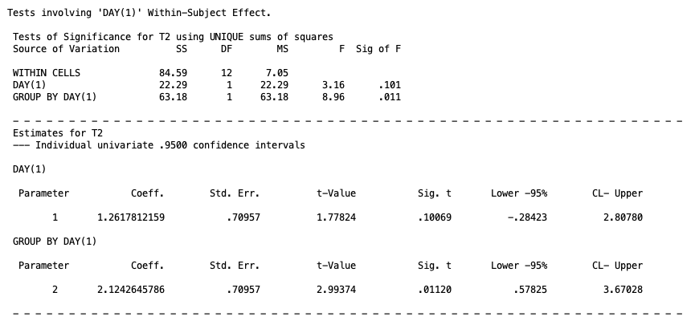

The first output block tests `DAY(1)`, the linear trend across days.
The marginal mean test for the linear trend is non-significant,
$p = .101$. Averaged across both groups, weight does not show a
meaningful linear increase or decrease across the four days. The
by-product interaction contrast `GROUP BY DAY(1)` also appears in
the output but should be set aside here, since we are treating the
interaction as non-significant for the purposes of this example. Recall, that the confidence interval for this term would have to be rescaled by dividing by 3 in this context because the contrasts coefficients for the linear term were scaled up.

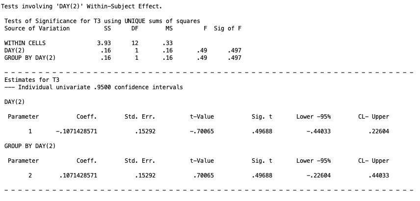

The second output block tests `DAY(2)`, the quadratic trend.
The marginal mean test is non-significant, $p = .497$, indicating
that weight does not follow a curved trajectory across days when
the two groups are pooled. The quadratic interaction contrast is
likewise non-significant and is set aside for the same reason.

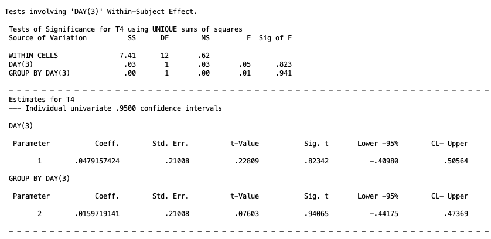

The third output block tests `DAY(3)`, the cubic trend. The
marginal mean test is non-significant, $p = .823$, and there is
no evidence of any S-shaped reversal in the weight trajectory
across days. Taken together, none of the three trend components
reach significance when averaged across groups, suggesting that
weight does not change systematically across the four days when
the two groups are combined. Recall, that the confidence interval for this term would have to be rescaled by dividing by 3 in this context because the contrasts coefficients for the cubic term were scaled up.

Trend contrasts are convenient because they are all orthogonal by construction. to test a pairwise comparison instead of a trend, the contrast rows are replaced with a pairwise difference. For example, if we want to compare the mean weight on day 1 versus day 3, by necessity, you will need to create two additional contrasts for the syntax to work. So you might try this:

```         
MANOVA
    day1 day2 day3 day4 BY group(1 2)
    /WSFACTOR = day (4)
    /CONTRAST(day) = SPECIAL( 1  1  1  1
                               1 -1  0  0
                               0  1 -1  0
                               0  0  1 -1)
    /WSDESIGN = day(1) day(2) day(3)
    /ERROR=WITHIN
    /DESIGN = group.
```

Here the second row (1 -1 0 0) captures the day 1 versus day 2 difference that you are interested in. However, **this is not orthogonal to the (0 1 -1 0)**. So the results of the output will be wrong. This is just one more friendly reminder to make sure the contrasts are orthogonal. A proper matrix that is orthgoonal might have been:

```
/CONTRAST(day) = SPECIAL( 1  1  1  1
                               1 -1  0  0
                               1  1 -2  0
                               1  1  1 -3)
```

If you wanted to also test day 2 versus day 3, you would need a different MANOVA syntax code all together. This is all to say, that you will not be able to test all contrasts you will want at once, but will have to make redundant contrasts that aren't important just to keep orthogonality. It is not proper science to interpret these non-important contrasts, so if you do need to include these types of contrast, make sure you don't do post hoc analysis on them.

## 9. Simple Effects

Because the interaction is significant in the current example, simple effects are the appropriate follow-up. A simple effect is the effect of one factor at a single fixed level of the other factor. In a split-plot design, two kinds of simple effects are possible: the between-subjects effect at a fixed level of the within-subjects factor, and the within-subjects effect at a fixed level of the between-subjects factor. For more detail of the general concept, see the Two-Way Between-Subjects ANOVA lesson.

### Simple effects of the between-subjects factor at fixed levels of the within-subjects factor

This type of simple effect asks whether groups differ on a single measurement occasion. For example, do control and heartbeat infants differ in weight specifically on day 1, or specifically on day 3? At a fixed level of the within-subjects factor, there is no within-subjects variation to contend with, so the test reduces to a one-way between-subjects comparison on that single $Y$ variable. The between-subjects error term is used.

The `MWITHIN` keyword in SPSS requests these tests simultaneously for all levels of the within-subjects factor:

```         
MANOVA
    day1 day2 day3 day4 BY group(1 2)
    /WSFACTORS day(4)
    /WSDESIGN MWITHIN day(1), MWITHIN day(2), MWITHIN day(3), MWITHIN day(4)
    /RENAME day1 day2 day3 day4
    /ERROR=WITHIN
    /PRINT TRANSFORM
    /DESIGN group.
```

-   `/WSDESIGN MWITHIN day(1), MWITHIN day(2), MWITHIN day(3), MWITHIN day(4)` requests the effect of group separately within each level of day. `MWITHIN day(1)` tests the group effect at day 1, `MWITHIN day(2)` at day 2, and so on. You can think of `MWITHIN` in this line as asking to test the between-subjects `M` variable within different levels of day.
-   `/RENAME day1 day2 day3 day4` preserves the original variable names in the output for easier reading. This is not necessary.
-   `/DESIGN group` keeps the between-subjects factor on the right side of the model. It is neccessary to include this tern.

The output arrives in four separate sections, one for each day. Each section contains two rows of interest. The `MWITHIN DAY(k)` row tests whether the grand mean at that day differs from zero, which is not a question of any analytical interest here. The `GROUP BY MWITHIN DAY(k)` row tests whether the two groups differ in weight at that specific day, which is the simple effect we actually care about. All four sections share the same within-cells error term drawn from the between-subjects portion of the design. We will focus on the `GROUP BY MWITHIN DAY` rows throughout.

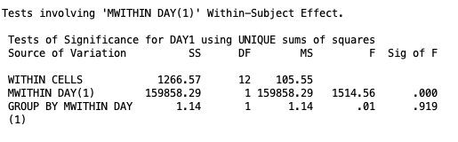

At day 1, the test of the group effect in the row labeled `GROUP BY MWITHIN DAY (1)` is non-significant, $p = .919$. The two groups do not differ in birth weight on the first day of measurement, which is expected: random assignment should have produced comparable starting weights, and indeed it did.

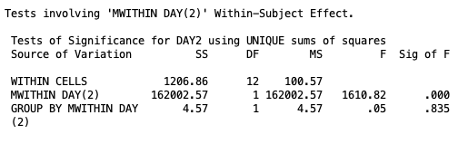

At day 2, the group effect remains non-significant, $p = .835$. The groups are still tracking closely one day after birth, with no detectable difference in weight between the control and heartbeat conditions.

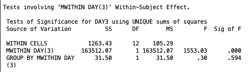

At day 3, the group effect is again non-significant, $p = .594$. The divergence between conditions that will eventually appear in the interaction has not yet produced a statistically detectable difference when the groups are compared at this single time point.

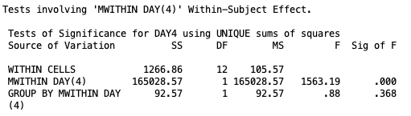

At day 4, the group effect remains non-significant, $p = .368$. Taken together, the four day-specific tests tell a consistent story: at no individual measurement occasion do the two groups differ significantly in weight. This might seem surprising given that the interaction was significant, but it is not a contradiction. The interaction reflects a difference in the *shape* of the trajectory across all four days, not necessarily a difference large enough to be detected at any single point in isolation. The control group's gradual weight loss and the heartbeat group's relative stability produce a diverging pattern over time, but with only seven participants per group the day-specific comparisons do not have the power to isolate that difference at any one occasion.

We still need to check the simple effects in the between-subjects factor.

### Simple effects of the within-subjects factor at fixed levels of the between-subjects factor

This type of simple effect asks whether weight changes across days within a specific treatment group. For example, does weight change significantly across days among control infants? Among heartbeat infants? At a fixed level of the between-subjects factor, the problem reduces to a one-way within-subjects design, and D variables carry the information about change across days.

SPSS uses a pooled error term by default for these tests, which assumes homogenous vairances. SPSS, however, does not offer an alternative, so we will still use its pooled error term. 

The SPSS output for this will look like

```         
MANOVA
    day1 day2 day3 day4 BY group(1 2)
    /WSFACTORS day(4)
    /WSDESIGN day
    /ERROR=WITHIN
    /PRINT SIGNIF(UNIV) TRANSFORM
    /DESIGN MWITHIN group(1), MWITHIN group(2).
```

-   `/WSDESIGN day` specifies the full within-subjects design.
-   `/DESIGN MWITHIN group(1), MWITHIN group(2)` requests the within-subjects effect separately within each level of group. `MWITHIN group(1)` tests the day effect for control infants and `MWITHIN group(2)` tests it for heartbeat infants.

The output for this syntax arrives in multiple pieces and can look cluttered at first glance. The first piece, labeled **Tests of Between-Subjects Effects**, contains the `MWITHIN GROUP(1)` and `MWITHIN GROUP(2)` rows. These test whether each group's mean, averaged across all four days, differs from zero. This is not a question of any interest and can be ignored, so the output won't be replicated here.

The second and third pieces, labeled **EFFECT .. MWITHIN GROUP(1) BY DAY** and **EFFECT .. MWITHIN GROUP(2) BY DAY**, are the simple effects we actually care about. Each contains a multivariate test block followed by a univariate block. The multivariate test is the simple effects test we care about, but SPSS gives the three trend contrasts by default. Meaning, T2 represents the linear contrast, T3 represents the quadratic contrast, and T4 represents the cubic contrast. However these are cell mean comparisons and should be ignored until we know the significance of the simple effects. The output is

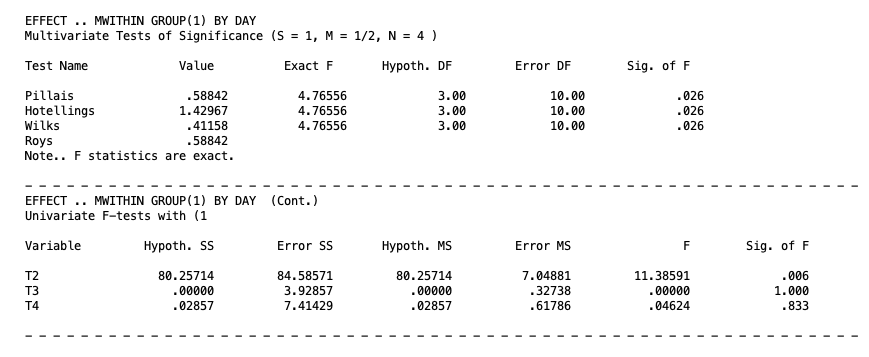

For the heartbeat group, the multivariate test of the day effect is significant, $p = .026$. Weight changes meaningfully across the four days among infants in the heartbeat condition. Given this significance, the trend contrasts become informative. The T2 row, representing the linear component, is significant, $p = .006$, while the quadratic (T3, $p = 1.000$) and cubic (T4, $p = .833$) components are not. The day effect in the heartbeat group is therefore well described as a linear trend: weight changes steadily and consistently across the four measurement occasions.

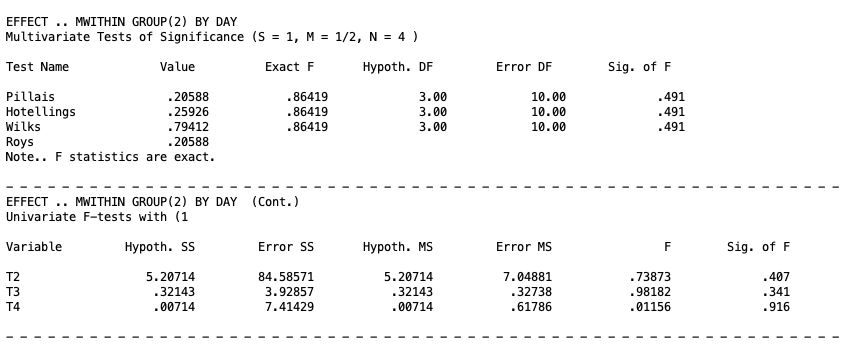

For the control group, the multivariate test is non-significant, $p = .491$. Weight does not change significantly across days among infants in the control condition. Because the overall simple effect is not significant, the trend contrasts for this group are not interpreted.

Together these two simple effects explain the significant interaction. The heartbeat group shows a significant linear change in weight over time, while the control group does not. It is the divergence between these two trajectories that produces the significant `GROUP BY DAY` interaction in the omnibus analysis.


The final piece of the output at the bottom is labeled **Tests involving 'DAY' Within-Subject Effect**, which presents an averaged (univariate) summary across both groups. This recaps the same information and is only of interest if you want to know the results of the univariate tests on the within-subjects factor.

## 10. Cell Mean Comparisons

When a simple effect is significant and the factor involved has more than two levels, cell mean comparisons narrow down which specific differences drive the simple effect. Which ones 

### Cell means for the between-subjects factor at a fixed level of the within-subjects factor

When the between-subjects factor has more than two levels, a significant simple effect at a given level of the within-subjects factor only establishes that at least two groups differ at that occasion. Specific group contrasts can be tested by adding a `/CONTRAST(group)` specification. With only two groups in the current example, the simple effect and the cell mean comparison are the same test, so the syntax below illustrates the structure rather than adding new information:

```         
MANOVA
    day1 day2 day3 day4 BY group(1 2)
    /WSFACTORS day(4)
    /WSDESIGN MWITHIN day(1), MWITHIN day(2), MWITHIN day(3), MWITHIN day(4)
    /RENAME day1 day2 day3 day4
    /ERROR=WITHIN
    /PRINT TRANSFORM
    /CONTRAST(group) = SPECIAL ( 1  1
                                 1 -1 )
    /DESIGN group(1).
```

-   `/CONTRAST(group) = SPECIAL` defines the group contrast. The second row (1 -1) compares control against heartbeat at each fixed level of day.
-   `/DESIGN group(1)` requests the test of the first contrast of group within each level of day.


### Cell means for the within-subjects factor at a fixed level of the between-subjects factor

When the within-subjects factor has more than two levels, a significant simple effect within a given group only establishes that at least two time points differ for that group. Specific contrasts across days within a group can be tested using the same approach as marginal mean comparisons for the within-subjects factor, but with the `/DESIGN` line changed to `MWITHIN group(j)`.

The following syntax tests trend contrasts for day within each group:

```
MANOVA
    day1 day2 day3 day4 BY group(1 2)
    /WSFACTORS day(4)
    /CONTRAST(day) = SPECIAL ( 1  1  1  1
                              -3 -1  1  3
                               1 -1 -1  1
                              -1  3 -3  1)
    /WSDESIGN day
    /RENAME M Linear Quadratic Cubic
    /ERROR=WITHIN
    /PRINT SIGNIF(UNIV) TRANSFORM
    /DESIGN MWITHIN group(1), MWITHIN group(2).
```

-   `/CONTRAST(day) = SPECIAL` defines polynomial trend contrasts as the D variables. The second row is the linear component ($-3, -1, 1, 3$), the third is the quadratic component ($1, -1, -1, 1$), and the fourth is the cubic component ($-1, 3, -3, 1$). These three rows are mutually orthogonal, as required.
-   `/RENAME M Linear Quadratic Cubic` names the transformed variables so the output labels match the trend component each D variable represents.
-   `/DESIGN MWITHIN group(1), MWITHIN group(2)` produces the simple effects of day within each group, with trend-labeled univariate follow-up rows.


The output for this syntax is very lengthy, but it comes in three main pieces.

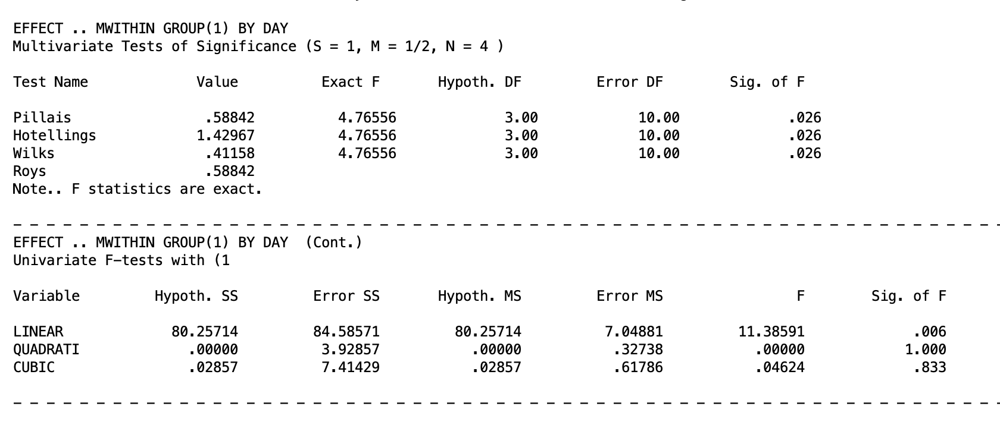

For the heartbeat group, the multivariate test confirms a significant day effect, $p = .026$. Turning to the univariate trend contrasts, the linear component is significant, $p = .006$, while the quadratic ($p = 1.000$; not actually 1, but SPSS is rounding up) and cubic ($p = .833$) components are not. The heartbeat group's weight trajectory across the four days is well described as a straight line. So weight increases at a steady, consistent rate with no acceleration, deceleration, or reversal.

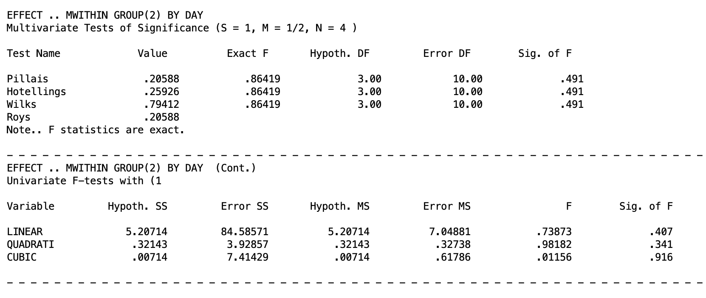

For the control group, the multivariate test is non-significant, $p = .491$. None of the univariate trend components approach significance either: linear ($p = .407$), quadratic ($p = .341$), and cubic ($p = .916$). So none warrant interpretation. Weight in the control group does not change in any systematic way across the four days.

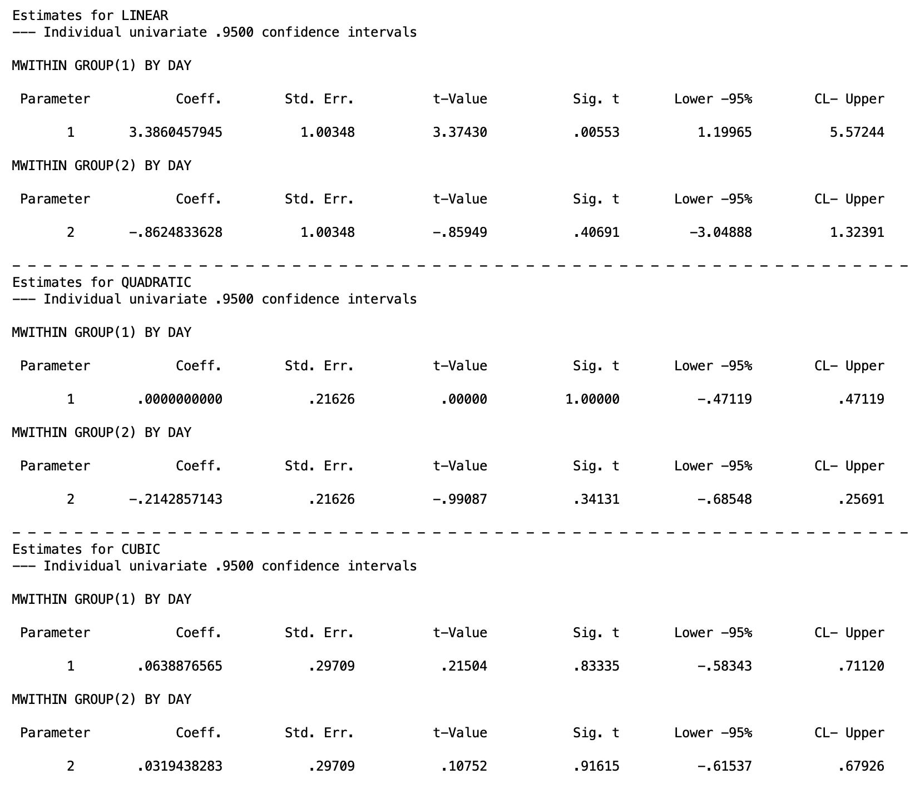

The parameter estimates block puts concrete numbers on the trend coefficients and adds confidence intervals. However, recall that the linear and cubic contrast coefficients were scaled up by 3, so the confidence intervals reported here must be divided by 3 to recover the original metric. Therefore, the corrected 95% confidence interval for the linear trend in the heartbeat group is $[0.400, 1.857]$, and for the cubic trend is $[-0.194, 0.237]$.

## 11. Interaction Contrasts

An interaction contrast tests a focused hypothesis about how two specific contrasts from each factor combine. Rather than asking whether the interaction is significant in general, an interaction contrast asks something like: does the linear trend in weight across days differ between the control and heartbeat groups? This is more specific than the omnibus interaction test and more interpretable than a full set of simple effects.

The logic of an interaction contrast in a split-plot design matches what was established in Higher-Order Within-Subjects ANOVA: form a D variable that captures a specific within-subjects contrast, then test whether that D variable differs across levels of the between-subjects factor.

For the current example, testing whether the linear trend in weight across days differs between groups uses the linear D variable ($D_1 = -3Y_{1ij} - 1Y_{2ij} + 1Y_{3ij} + 3Y_{4ij}$) and a contrast that compares the between-subjects groups (1 -1; for two groups). This contrast is already available as a by-product of the omnibus syntax, but it can also be requested explicitly:

```         
MANOVA
    day1 day2 day3 day4 BY group(1 2)
    /WSFACTOR = day (4)
    /CONTRAST(day) = SPECIAL( 1  1  1  1
                              -3 -1  1  3
                               1 -1 -1  1
                              -1  3 -3  1)
    /WSDESIGN = day(1) day(2) day(3)
    /ERROR=WITHIN
    /CONTRAST(group) = SPECIAL ( 1  1
                                 1 -1 )
    /DESIGN = group(1).
```

-   `/CONTRAST(day) = SPECIAL` defines linear, quadratic, and cubic D variables.
-   `/WSDESIGN = day(1) day(2) day(3)` requests the test of each D variable.
-   `/CONTRAST(group) = SPECIAL` defines the group contrast (1 -1 compares control versus heartbeat).
-   `/DESIGN = group(1)` requests the test of the group contrast, which when combined with the within-subjects contrasts produces the interaction contrasts.

In the output given below, the row labeled `GROUP(1) BY DAY(1)` tests whether the linear trend in weight differs between control and heartbeat infants. `GROUP(1) BY DAY(2)` tests whether the quadratic trend differs, and `GROUP(1) BY DAY(3)` tests the cubic trend. Given the pattern in the data, the linear interaction contrast is expected to be significant, reflecting that weight increases linearly across days in the heartbeat group but not in the control group. You do not need to look at the other pieces of the output since they are unrelated to the interaction contrast.

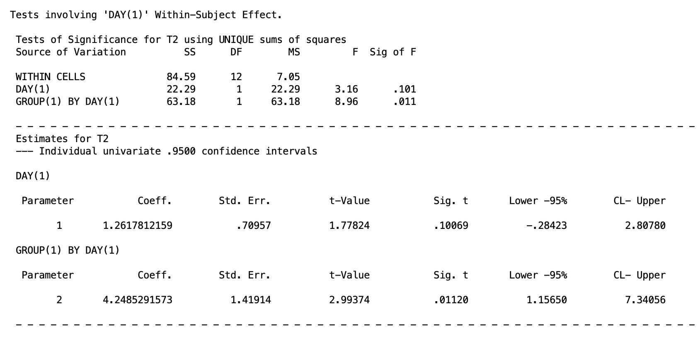

The `GROUP(1) BY DAY(1)` row confirms that the linear trend differs significantly between groups, $p = .011$. The parameter estimate for this interaction contrast is $4.249$, $p = .011$. Recall that the confidence interval needs to be divided by 3. So the 95% confidence interval of $[.386, 2.447]$. The two groups have meaningfully different linear trajectories across the four days, with the heartbeat group rising and the control group remaining flat.

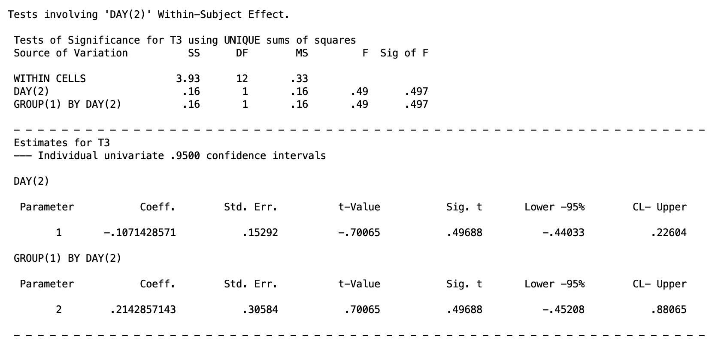

The `GROUP(1) BY DAY(2)` row is non-significant, $p = .497$.  The 95% confidence interval is [-.452, .881]. The two groups do not differ in the degree of curvature in their weight trajectories.

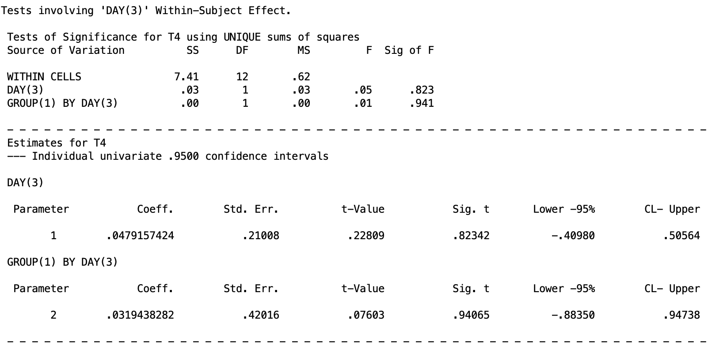

The `GROUP(1) BY DAY(3)` row is non-significant, $p = .941$. Recall that you need to divide the confidence intervals by 3, so the 95% confidence interval is [-.883, .947]. There is no difference between groups in the cubic component of the trajectory. Taken together, the interaction between group and day is carried entirely by the linear trend component, and its shape is straightforward: heartbeat infants gain weight steadily across the four days while control infants do not.


## 12. Type I Error Control

In any design with multiple follow-up tests, the risk of inflated Type I error across the family of tests must be managed. The same one-family versus two-family framework from prior lessons applies here, with one additional consideration: the appropriate correction method depends on whether the test involves the between-subjects factor or the within-subjects factor.

For comparisons involving the **between-subjects factor** only, Tukey's HSD is available when the factor has more than two levels, because participants are independent across groups. The general advice structure follows the same situations as in One-Way Between-Subjects ANOVA and Two-Way Between-Subjects ANOVA.

For comparisons involving the **within-subjects factor** or the **interaction**, Tukey's HSD is not appropriate because observations within the same participant are correlated, and the Roy-Bose test needs to be used in replacement of the Scheffé test. Other than this, the advice structure follows the same as the One-Way Within-Subjects ANOVA and Higher-Order Within-Subjects ANOVA lessons.

## 13. Summary

Split-plot designs combine the efficiency of within-subjects measurement with the practical necessity of between-subjects grouping. The key ideas to carry forward from this lesson are:

-   The between-subjects main effect is tested on the $M$ variable using the between-subjects error term, exactly as in a one-way between-subjects ANOVA.
-   The within-subjects main effect and the interaction are tested on D variables using the within-subjects error term.
-   SPSS MANOVA produces all three omnibus tests from a single block of syntax. The `SIGNIF(UNIV)` option prints trend-specific marginal mean tests and interaction contrasts as by-products.
-   Follow-up tests use the error term appropriate to the nature of the effect: between-subjects error for group comparisons, within-subjects error for day comparisons and the interaction.


## Discussion Questions

**Question 1.** In the split-plot design, explain in your own words why two separate error terms are needed for the omnibus tests. What is each error term capturing, and why would it be inappropriate to use the between-subjects error term when testing the within-subjects main effect?

<details>

<summary>Click to reveal answer</summary>

The between-subjects error term captures variability among individuals within the same group, that is, how much participants differ from one another on the averaged score $M$. This kind of variability reflects stable individual differences in, for example, birth weight. The within-subjects error term captures variability in D variables within groups, reflecting how much participants differ from one another in their pattern of change across days. Using the between-subjects error term to test the within-subjects main effect would be inappropriate because it would include stable individual differences in the denominator even though those differences have already been removed from the D variable. The D variable is a difference score, so between-person baseline differences cancel out. The appropriate denominator reflects only within-person variability across measurement occasions.

</details>

------------------------------------------------------------------------

**Question 2.** In the current example, the interaction between group and day is significant. A colleague argues that you should still interpret the main effect of day because it is also significant. How would you respond?

<details>

<summary>Click to reveal answer</summary>

The significant interaction means that the effect of day on weight depends on which group the infant belongs to. Weight increases across days in the control group but remains flat or slightly decreases in the heartbeat group. Reporting the main effect of day averaged over both groups obscures this fundamentally different pattern. The marginal mean for day represents a mixture of two quite different trajectories, and characterizing the data by that average would be misleading. When the interaction is significant, simple effects or interaction contrasts should be reported instead, because they describe the relationship between day and weight separately for each group.

</details>

------------------------------------------------------------------------

**Question 3.** The omnibus syntax with `/PRINT SIGNIF(UNIV)` produces by-product tests labeled `GROUP BY DAY(1)`, `GROUP BY DAY(2)`, and `GROUP BY DAY(3)`. What are these tests, and under what circumstances would you use them rather than the omnibus interaction test?

<details>

<summary>Click to reveal answer</summary>

These by-product tests are interaction contrasts. Each one tests whether a specific trend in weight across days differs between the control and heartbeat groups: `GROUP BY DAY(1)` tests whether the linear trend differs between groups, `GROUP BY DAY(2)` tests the quadratic trend, and `GROUP BY DAY(3)` tests the cubic trend. They are more focused than the omnibus interaction test, which only establishes that some aspect of the day pattern differs between groups. Interaction contrasts are most useful when the researcher has a specific a priori hypothesis about which component of the interaction is driving the effect, or when the omnibus interaction is significant and the goal is to characterize exactly which trends differ across groups.

</details>

------------------------------------------------------------------------

**Question 4.** You run the omnibus test on the baby data and find that the main effect of group is not significant but the interaction is. What does this pattern of results tell you, and what follow-up tests would you conduct?

<details>

<summary>Click to reveal answer</summary>

A nonsignificant main effect of group with a significant interaction indicates that when weight is averaged across all four days, the two groups do not differ, but the groups do differ in their pattern of weight change across days. This is consistent with the actual data: the control group starts slightly lower on average and gains weight, while the heartbeat group starts slightly higher and remains flat, so the averages over days are similar even though the trajectories diverge. The appropriate follow-up tests are simple effects and interaction contrasts, not marginal means for group. Specifically, one would test the simple effect of group at each day to see when the groups diverge, and test interaction contrasts to characterize which trends in the day factor differ between groups.

</details>

------------------------------------------------------------------------

**Question 5.** In this lesson, two types of within-subjects contrast matrices were illustrated: polynomial trend contrasts and pairwise adjacent comparisons. Describe a research context in which pairwise comparisons would be more informative than trend contrasts, and one in which trend contrasts would be more informative.

<details>

<summary>Click to reveal answer</summary>

Pairwise adjacent comparisons are more informative when the within-subjects factor represents discrete occasions with no meaningful underlying continuum, or when the researcher wants to know specifically which consecutive time points differ. For example, if the four days in the current study are separated by an intervention that occurs between day 2 and day 3, the day 2 versus day 3 comparison carries specific theoretical weight that a linear trend would not capture cleanly. Trend contrasts are more informative when the within-subjects factor is a quantitative variable measured at equally spaced intervals and the researcher is interested in the overall shape of change over time. In the current example, a significant linear trend in the control group captures the straightforward weight gain pattern efficiently, whereas listing all pairwise comparisons between days 1, 2, 3, and 4 would provide redundant information without adding interpretive clarity.

</details>
