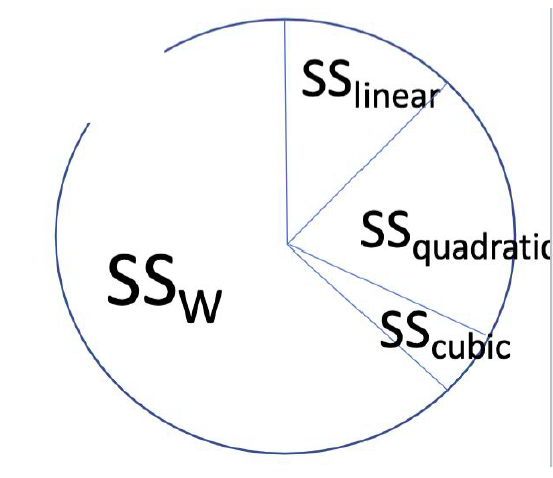
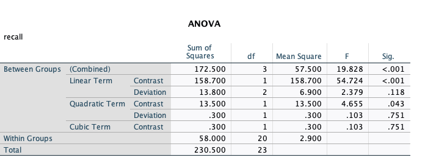
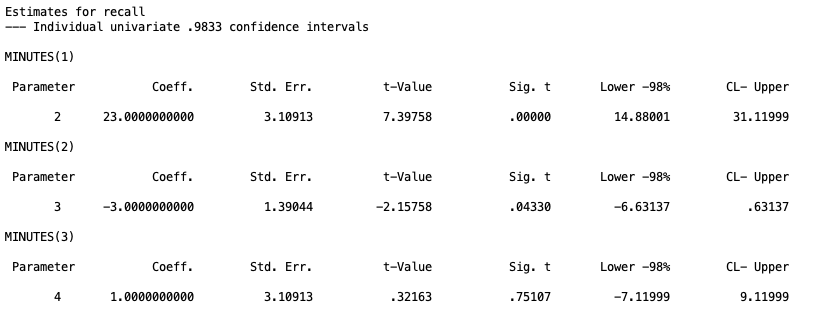

## 1. Introduction

So far in this series, the grouping variable in our ANOVA has been purely categorical. Drug therapy, biofeedback, dietary modification, and combination treatment have no natural order. There is no sense in which "biofeedback" comes before or after "drug therapy."

Trend analysis is for a different situation: when the levels of your independent variable are ordered and numeric. Study time, dosage, age group, and number of practice trials are all examples of variables where you could do a trend analysis as they have natural ordering. When the group variable has this kind of structure, we are not just asking "do the groups differ?" We can ask a more specific question: "does the outcome change in a systematic way as the group increases?"

That systematic change is called a **trend**. A trend can be linear (a straight increase or decrease), or it can be nonlinear (quadratic, cubic, and so on). Trend analysis lets us test for each of these patterns directly, using the same contrast machinery from Lesson 2.

Trend analysis is just a special case of contrast testing. The only thing that changes is how the contrast coefficients are chosen. Instead of picking coefficients to test a specific group comparison, we pick coefficients that trace out a specific shape (a line, a parabola, an S-curve, etc.) across the ordered levels of the grouping variable.

First, we will run through all of the types of trend tests you can do, and then we will overview how to do each in SPSS because it is very simple.

## 2. The Running Example

The dataset we will be using is the TrendAnalysis.sav data.

These data represent recall scores of 24 children that were randomly assigned to one of four experimental conditions. Each child was given a fixed amount of time to study a list of 12 words, and their ability to recall the words was measured afterward, scored in the number of words they successfully recalled. The four experimental conditions was the length of time between memorizing the words and being asked to recall the words. The table below represents the study deisgn (each cell is a child's unique score).

|          | 1 Minute | 2 Minutes | 3 Minutes | 4 Minutes |
|----------|----------|-----------|-----------|-----------|
|          | 2        | 6         | 6         | 11        |
|          | 3        | 8         | 8         | 10        |
|          | 1        | 5         | 10        | 7         |
|          | 2        | 3         | 5         | 9         |
|          | 0        | 7         | 10        | 8         |
|          | 4        | 7         | 9         | 9         |
| **Mean** | **2**    | **6**     | **8**     | **9**     |

We can easily observe that the means climb steadily from 2 to 9 as study time increases, which suggests a linear trend. But notice the increase slows down between 3 and 4 minutes (8 to 9) compared to the jump between 1 and 2 minutes (2 to 6). That kind of flattening is exactly the sort of thing trend analysis is built to detect, as there either could be a nonlinear trend that eplains this tapering or that this tapering actually isn't a big deal.

## 3. The Linear Trend as a Model Comparison

We can frame the test for a linear trend the same way we full and reduced models in the first lesson. In this situation, the full model represents *all* of the trend effects we are interested in. For example, if we are testing for a linear trend, the full model would be

**Full model:** $$Y_{ij} = \beta_0 + \beta_1 X_j + \varepsilon_{ij}.$$

Here $X_j$ is the study time for group $j$, $\beta_0$ is the intercept, and $\beta_1$ is the slope: how much recall is expected to change for each one-unit increase in study time. For those who are familiar with linear regression, one can see the obvious similarity between this model and a regression model. This is because, they are the same thing, however for ANOVA $X_j$ must be a discrete grouping variable, whereas regression can have a continuous $X_j$ predictor, but this is besides the point of this lesson.

The restricted model is just a model that lacks our effect of interest, the linear trend:

**Restricted model** $$Y_{ij} = \beta_0 + \varepsilon_{ij}$$

Comparing these two models gives us the necessary values to conduct an $F$ test to test the significance of the linear trend.

**Null hypothesis:** the linear slope is zero. $$\beta_1 = 0$$

A significant F means we reject the null hypothesis that no linear trend exists.

As a side note, we didn't cover the full and reduced model comparison in the contrast-focused lessons, but just know that you can specify *any* contrast comparison in a similar manner.

### Building the linear contrast

The contrast coefficients for a linear trend come directly from the values of X, centered around their mean:

$$c_j = X_j - \bar{X}$$

For our four study times (1, 2, 3, 4), $\bar{X} = 2.5$, giving the contrast coefficients of $-1.5, -0.5, 0.5, 1.5$. If you notice, the trend for these contrast coefficients increases linearly from left to right, increasing by 1 each time. This allows us to see how much the means of the data are structured in a linear line.

These coefficients work fine, but by convention we usually rescale to whole numbers: $-3, -1, 1, 3$. These two sets of coefficients give identical F statistics and identical p-values, but they differ only if you are interpreting the coefficient itself as a slope estimate or building a confidence interval.

## 4. Testing the Linear Trend

For a linear trend, the null hypothesis is simply that no linear trend exists.

$$H_0: \psi_{linear} = 0$$

Following what we learned in the contrast lesson, we can calulate a contrast value of the linear contrast

$$\psi_{linear} = 2(-3) + 6(-1) + 8(1) + 9(3) = 23$$

Skipping some math, this will end up giving us an $F$ statistic of

$$F_{1,20} =  54.724$$

Compare this against the critical value $F_{1, N-a} = F_{1,20} = 4.35$. Since 54.724 far exceeds the critical value, we reject the null and conclude there is a statistically significant linear trend in recall across the four study times. So as time between memory recall increased, the ammount of words the children were able to recall increased linearly.

## 5. Testing for Nonlinearity

Finding a significant linear trend tells us recall tends to go up as study time increases, but it does not tell us whether a straight line is actually a *good* description of the data. The means (2, 6, 8, 9) suggest the rate of increase might be slowing down, aka there is a bend downward near the end of the trend. Testing for nonlinearity answers exactly that question: is there meaningful curvature left over after the linear trend is accounted for?

We can understand this as a test between a full and restricted model as well.

**Full model:** $$Y_{ij} = \beta_0 + \beta_1 X_j + \beta_2 X_j^2 + \cdots + \beta_{a-1} X_j^{a-1} + \varepsilon_{ij}$$

**Restricted model:** $$Y_{ij} = \beta_0 + \beta_1 X_j + \varepsilon_{ij}$$

Here, $\beta_2 X_j^2 + \cdots +\beta_{a-1} X_j^{a-1}$ represents *any* nonlinear trend that one can test. You are limited by the number of groups you have because it takes $a$ points to pin down a curve of degree $a-1$, so with only 3 groups you have just enough information to bend a line into a single curve (quadratic), not enough to bend it into an S-shape (cubic).

So, this test is not specific to what types of nonlinearity exists. The null hypothesis for this test is

**Null hypothesis:** *all* of the nonlinear slopes are zero. $$\beta_2 = \beta_3 = \cdots = \beta_{a-1} = 0$$

Because the restricted model here already includes the linear term, this test asks specifically whether anything *beyond* a straight line is needed.

However, one should note that a nonsignificant nonlinearity test does not prove the relationship is linear. It may simply reflect low statistical power to detect curvature with this sample size. Conclusions about linearity should be based on both the test result and your theoretical understanding of the variable, not the test alone.

If this test is significant, and you reject the null, it would mean a straight line does *not* adequately capture the pattern, and that real curvature exists on top of the linear trend.

Typically in research that use ANOVA, it is less of interest to test for generic nonlinearities, and instead, it is more useful to hypothesize about specific types of nonlinearities and test those. As a result, there isn't an easy "nonlinear" contrast you can test in programs in SPSS. So we will turn to specific nonlinear trend contrasts.

## 6. Testing a Specific Nonlinear Trend

Sometimes the nonlinearity test above is too coarse. It lumps every nonlinear term together. If you have a specific hypothesis (for example, that the relationship is quadratic rather than cubic) you can test that single trend directly, using the same contrast logic as before.

### Full and restricted models for a single trend

The full and restricted models here look similar to the above section, but with one important difference: instead of testing *every* nonlinear term the models are simply testing a specified number of them. For example, to test a quadratic trend, the full model is

**Full model quadratic:** $$Y_{ij} = \beta_0 + \beta_1 X_j + \beta_2 X_j^2  + \varepsilon_{ij}$$

For a cubic trend, the full model is

**Full model cubic:** $$Y_{ij} = \beta_0 + \beta_1 X_j + \beta_2 X_j^2 + \beta_3 X_j^3  + \varepsilon_{ij}$$

Note that when testing a higher order nonlinear trend, all lower order trends are included in the model. E.g., if we want to test the cubic trend, the linear and quadratic trends are still included. This is because a cubic shape is still free to also bend linearly and quadratically along the way, so those simpler trends have to stay in the model to be accounted for.

The restricted models are simply the smaller model that does not include the specific trend you are interested in.

**Reduced model quadratic:** $$Y_{ij} = \beta_0 + \beta_1 X_j +  \varepsilon_{ij}$$

**Reduced model cubic:** $$Y_{ij} = \beta_0 + \beta_1 X_j + \beta_2 X_j^2 +  \varepsilon_{ij}$$

Therefore, the null hypothesis of each is simply either the quadratic trend or the cubic trend are 0 for their respective models.

**Null hypothesis quadratic:** the quadratic slope is zero (in the full qudartic model. $$\beta_2 = 0$$

**Null hypothesis cubic:** the linear slope is zero (in the full cubic model). $$\beta_3 = 0$$

This logic continues for even higher nonlinear trends. However, practically speaking, it is rare you would ever test for trends higher than quadratic. Most of the time in ANOVA-based trend analysis, you wouldn't have enough data or groups to study cubic trends. Also, there is a threat of something called **overfitting**. This is when the model becomes so flexible that it starts bending to fit noise in your specific sample rather than capturing a real, generalizable pattern, producing a trend that looks impressive in this data but fails to hold up in a new sample.

If we were to go back to the pie analogy from the contrast lesson, we can also demonstrate how we can split up the sum of squares between ($SS_b$) amongst the trend contrasts.



If any of the trends are significant, that means there is a significant ammount of the $SS_b$ wedge being taken up by that type of trend.

# 7. Trend coefficients

There are a variety of trend contrasts and coefficients depending on what type of trend you are interested in and how many groups you have. Below we give sets of orthogonal polynomial contrasts for each group level. That is, if you use the linear and quadratic contrasts for a model with 3 group levels, these are guranteed to be orthogonal.

| Levels | Trend     | Coefficients     |
|--------|-----------|------------------|
| 3      | Linear    | -1, 0, 1         |
| 3      | Quadratic | 1, -2, 1         |
| 4      | Linear    | -3, -1, 1, 3     |
| 4      | Quadratic | 1, -1, -1, 1     |
| 4      | Cubic     | -1, 3, -3, 1     |
| 5      | Linear    | -2, -1, 0, 1, 2  |
| 5      | Quadratic | 2, -1, -2, -1, 2 |
| 5      | Cubic     | -1, 2, 0, -2, 1  |
| 5      | Quartic   | 1, -4, 6, -4, 1  |

A few things worth flagging about this table:

-   These coefficients assume **equal spacing** of the group variable. If your study times were 1, 2, 4, and 8 minutes instead of 1, 2, 3, and 4, these specific values would no longer be correct.
-   You do not need to use every row of the table together. You can test just the linear trend without worrying about needing the others. However, the full set for a given number of levels is also guaranteed to be linearly independent, so you can include all of them at once without violating contrast assumptions. Note that you should think about the types of trends you want to test before hand so you minimize Type I error inflation (or you need to apply a correction we discussed in the previous lesson).
-   You cannot test for a trend that requires more groups than you have. With only 3 groups, there is no such thing as a cubic trend.

### The relationship between the omnibus ANOVA test and contrasts

It is worth pausing on how the overall omnibus ANOVA F test relates to any individual contrast, including a trend contrast like the quadratic one above. They are answering different questions, and the significance of one does not guarantee anything about the significance of the other.

The omnibus test asks only whether the group means differ *somewhere*. A contrast asks something more specific: whether one particular pattern among the means, a pairwise difference, a complex comparison, or a trend, is present. Because of this, you can have a significant omnibus F with no single contrast reaching significance. Since the omnibus is just comparing different ammounts of variability, it is possible that the overall variability may be spread across several small differences in the means rather than concentrated in any one comparison. The reverse is also possible: a contrast can be significant even when the omnibus test is not, especially when that contrast was planned in advance and targets exactly where the effect lives, since a focused 1 df test can be more powerful than the broader omnibus test it is drawn from.

**Neither result implies the other.** A nonsignificant omnibus test does not mean a specific trend like the quadratic cannot be significant on its own, and a significant quadratic trend does not require the omnibus test to also be significant. This is exactly why the planned versus post hoc distinction from the previous lesson matters here: if the quadratic trend was specified in advance, testing it directly preserves power. If it was chosen only after looking at the data, it is a post hoc decision and needs the more conservative correction.

## 8. SPSS Implementation: ONEWAY

The easiest way to run a full trend analysis in SPSS is through `ONEWAY`, using the `/POLYNOMIAL` subcommand.

```         
ONEWAY
recall BY minutes
/POLYNOMIAL= 3
/MISSING ANALYSIS.
```

**Line by line:**

-   `ONEWAY` opens the one-way ANOVA procedure.
-   `recall BY minutes` specifies the outcome (`recall`) and the grouping variable (`minutes`).
-   `/POLYNOMIAL= 3` tells SPSS to test trends up through the 3rd degree (linear, quadratic, cubic). The number you supply here should be $a - 1$, where $a$ is the number of groups. With 4 groups, the highest possible trend is cubic, hence 3.
-   `/MISSING ANALYSIS` handles missing data using listwise deletion within each analysis. This technically isn't necessary in this case since there are no missing values, but I give it here anyway.



This single subcommand automatically produces the full orthogonal trend breakdown: linear, quadratic, and cubic contrasts, each with their own SS, df, F, and significance, plus a "deviation" row after each trend that test fwhatever variability is left over once that trend and any lower-order trends are accounted for (this is not of our interest).

## 9. SPSS Implementation: MANOVA

`ONEWAY` is convenient, but it does not give you confidence intervals or let you easily apply a correction for multiple trend tests. Also, it is not compatible with more complicated ANOVAs that we will do in the future. For those reasons, I recommend you specify the trend contrasts using `MANOVA` in a similar fashion we've done in the past two lessons.

I am going to do a trend analysis for the linear, quadratic, and cubic trend for our four groups (while controlling for Type I error inflation).

```         
MANOVA recall BY minutes (1 4)
/print=cellinfo(means)
/error=within
/cinterval=individual(.9833)
/contrast(minutes) = special (1 1 1 1
                              -3 -1 1 3
                               1 -1 -1 1
                              -1 3 -3 1 )
/design = minutes(1) minutes(2) minutes(3).
```

**Line by line:**

-   `MANOVA recall BY minutes (1 4)` declares the outcome and the grouping variable, with levels coded 1 through 4.
-   `/print=cellinfo(means)` prints the group means alongside the test output.
-   `/error=within` pools the within-groups variance as the error term, exactly as in Lessons 2 and 3.
-   `/cinterval=individual(.9833)` controls the confidence level used for each individual parameter estimate. Here, .9833 corresponds to a Bonferroni-corrected alpha of $.05/3 = .0167$, since we are testing three trends (linear, quadratic, cubic) as a planned family.
-   `/contrast(minutes) = special(...)` is where the orthogonal polynomial coefficients go. The first row, `1 1 1 1`, is always required and represents the grand mean. The remaining three rows are the linear, quadratic, and cubic coefficients from the table in Section 7.
-   `/design = minutes(1) minutes(2) minutes(3).` tells SPSS to test each of the three custom contrast rows (excluding the grand mean row of 1's) as a separate effect in the output. This is the same syntax pattern used in Lesson 3 for testing multiple planned contrasts at once.



A reminder carried over from the contrast lesson: MANOVA reports a $t$ value for each parameter, not an $F$. To recover the F statistic, you simply need to square the t-value: $F = t^2$. For example, the $t$ statistic linear trend, $t = 7.39758$, which gives us $F=7.39758^2 = 54.72$.

**NOTE:** As discussed in the contrast lesson, since we scaled the linear and cubic trend coefficients up by 3 (e.g. for linear, we have (-3, -1, 1, 3) instead of (-1, -1/3, 1/3, 1)), we must divide the confidence interval ends for the linear and cubic trend by 3. So the confidence interval for the linear trend needs to change from $[14.88,~31.12]$ to $[4.96,~10.37]$.

## 10. Pratice Questions

These sets of questions were something I gave to students during our lab. So they could be helpful to go over. The answers (but not SPSS output) are given in drop downs

**Q1: From SPSS, is the linear trend significant at the .05 level?**

<details>

<summary>Click to reveal answer</summary>

Yes. The linear term contrast has $p < .001$.

</details>

------------------------------------------------------------------------

**Q2: From SPSS, is the quadratic trend significant at the .05 level?**

<details>

<summary>Click to reveal answer</summary>

Yes. The quadratic term contrast has $p = .043$.

</details>

------------------------------------------------------------------------

**Q3: From SPSS, is the cubic trend significant at the .05 level?**

<details>

<summary>Click to reveal answer</summary>

No. The cubic term contrast has $p = .751$.

</details>

------------------------------------------------------------------------

**Q4: A researcher went into this project wanting to test every potential trend contrast. Do they need to worry about Type I error inflation, and if so, how should they handle it?**

<details>

<summary>Click to reveal answer</summary>

Yes. Testing the linear, quadratic, and cubic trends all at once is exactly the situation the multiple correction lesson was built around: running several tests inflates the overall (experimentwise) Type I error rate above the nominal .05, even though each individual test is conducted at .05. Since these three trend tests are typically planned in advance (the researcher decided beforehand to examine each polynomial degree), this falls under the **planned pairwise** branch from Lesson 3's decision tree, and **Bonferroni** is the natural correction.

With 3 planned comparisons, the per-comparison alpha becomes:

$$\alpha_{Bonferroni} = \frac{.05}{3} = .0167$$

which is why the `/cinterval=individual(.9833)` line in Section 8 used .9833, since $1 - .0167 = .9833$.

Code given:

```         
MANOVA recall BY minutes (1 4)

/print=cellinfo(means)

/error=within

/cinterval=joint(.95) univariate(scheffe)

/contrast(minutes) = special (1 1 1 1

-3 -1 1 3

1 -1 -1 1

-1 3 -3 1 )

/design = minutes(1) minutes(2) minutes(3).
```

</details>

------------------------------------------------------------------------

**Q5: Using the Bonferroni correction, did the significance of the linear, quadratic, or cubic trend change?**

<details>

<summary>Click to reveal answer</summary>

The raw (uncorrected) significance values for each trend stay the same regardless of which confidence interval option you request. What changes is the alpha threshold you compare them against. At the corrected threshold of $\alpha = .0167$:

-   **Linear:** Sig. = .00000, still significant.
-   **Quadratic:** Sig. = .04330. This was significant at the uncorrected .05 level, but .0433 is greater than .0167, so it is **no longer significant** after the Bonferroni correction.
-   **Cubic:** Sig. = .75107, still not significant.

This is the practical consequence of multiple testing correction: the quadratic trend that looked significant in the simple ONEWAY output in Section 8 does not survive once we account for the fact that three trends were tested together.

</details>

------------------------------------------------------------------------

For the following two questions, refer to this syntax:

```         
MANOVA recall BY minutes (1 4)

/print=cellinfo(means)

/error=within

/cinterval=individual( ? )

/contrast(minutes) = special (1 1 1 1

-3 -1 1 3

1 -1 -1 1

-1 0 0 -1 )

/design = minutes(1) minutes(2) minutes(3).
```

**Q6: Suppose the researcher only planned to test the linear and quadratic trends. What value belongs in the blank in /cinterval?**

<details>

<summary>Click to reveal answer</summary>

With only 2 planned comparisons, $\alpha_{Bonferroni} = .05/2 = .025$, so the confidence level becomes $1 - .025 = .975$. The line should read `/cinterval=individual(.975)`.

</details>

------------------------------------------------------------------------

**Q7: What is wrong with the syntax above that would give incorrect results?**

<details>

<summary>Click to reveal answer</summary>

The third contrast row, `-1 0 0 -1`, is supposed to represent the cubic trend, but it does not match the correct orthogonal polynomial coefficients for a cubic trend with 4 levels, which are `-1 3 -3 1`. Beyond being the wrong shape, these coefficients do not even sum to zero ($-1 + 0 + 0 - 1 = -2$), which violates the basic requirement for a valid contrast. This contrast would not produce a meaningful cubic trend test, and because it is not orthogonal to the other rows, it would also distort the partitioning of $SS_{between}$ across the trends.

</details>

## 11. A Note on Unequal Sample Sizes

Everything above assumed equal group sample sizes, which is what guarantees orthogonality between trend contrasts. Real data is often unbalanced. When sample sizes differ across groups, there are two options for constructing the coefficients:

**Weighted**, which incorporates the sample size of each group: $$c_j = n_j(X_j - \bar{X}_w)$$

**Unweighted**, which ignores sample size and uses the simple mean of X: $$c_j = X_j - \bar{X}_U$$

If you are confident the only true trend in the population is linear, the weighted coefficients are more powerful. But if any nonlinear trend exists in the population, the weighted coefficients can produce a biased estimate of the linear slope. Since it is rarely possible to rule out nonlinearity ahead of time, the general recommendation is to use **unweighted** coefficients. SPSS allows you to define $c_j$ directly within the `/contrast` subcommand, so you control which version you are using.

## 11. Summary

| Question | Test | What it tells you |
|------------------------|------------------------|------------------------|
| Is there an overall linear trend? | Linear contrast, $F = SS_{linear}/MS_W$ | Whether recall changes at a constant rate as X increases |
| Is a straight line enough? | Nonlinearity test, $F = (SS_B - SS_{linear})/(a-2) \div MS_W$ | Whether meaningful curvature remains after the linear trend |
| Is there specifically a quadratic (or cubic, etc.) trend? | Single trend contrast, $F = SS_\psi/MS_{Error}$ | Whether one specific nonlinear shape describes the data |
| Are multiple trends being tested together? | Bonferroni-corrected planned contrasts | Whether trends remain significant once Type I error inflation is controlled |

The throughline connecting all of this back to the lessons on contrast testing because a trend contrast is just a contrast. The only thing that changes is where the coefficients come from. Once you have $\psi$, the F test, the confidence interval logic, and the multiple comparison corrections all work exactly the way they did before.

## Discussion Questions

1.  Why do the contrast coefficients for a linear trend need to sum to zero, and what would happen to $\psi_{linear}$ if they did not?
2.  The text noted that rescaling coefficients from $-1.5, -0.5, 0.5, 1.5$ to $-3, -1, 1, 3$ does not change the hypothesis test result. Explain why, in terms of the F statistic formula.
3.  Suppose a 5-group study found a significant linear trend and a significant quadratic trend, but the researcher only planned to test for linearity in advance. How should the quadratic finding be treated, and what correction (if any) is appropriate?
4.  Why does testing for nonlinearity as a single combined 2-df test (quadratic and cubic together) tend to have less power than testing the quadratic trend alone, even though they can draw on the same underlying variability?
5.  A colleague proposes using weighted trend coefficients because their groups have unequal sample sizes and they want the most powerful test possible. Under what circumstances would you caution them against this choice?
