## 1. Introduction

Every lesson so far in this series has involved a single factor. We have had one grouping variable (drug therapy, biofeedback, dietary modification, combination) and asked how the levels of that one variable relate to an outcome. But a great deal of research involves crossing two factors at once. This is called a **general factorial design**, or more specifically here, a **two-way between-subjects ANOVA**.

In a two-way design, every subject belongs to one level of Factor A and one level of Factor B at the same time. This lets us ask three separate questions in a single analysis:

1.  Does the outcome differ across levels of Factor A, ignoring Factor B? (**main effect of A**)
2.  Does the outcome differ across levels of Factor B, ignoring Factor A? (**main effect of B**)
3.  Does the effect of one factor depend on the level of the other factor? (**interaction effect**)

That third question is the one one-way designs can never answer, and it is often the most interesting one. Crossing two factors does not just let you ask two questions for the price of one. It lets you ask a question you could not ask at all with either factor alone.

Two-way designs also have the benefit of controlling for more error variation, thus lowering the $MS_{within}$ (recall, within-group variation equals error variation). Thus, we are taking a larger chunk out of the error slice of the pie to fill *both* group effects as well as the interaction.

```{=html}
<div class="concept-diagram">
<div style="display: flex; justify-content: center; gap: 40px; flex-wrap: wrap;">

<svg width="100%" viewBox="0 0 400 420" xmlns="http://www.w3.org/2000/svg" style="display: block; max-width: 320px;">
  <text x="200" y="30" class="title" font-size="18">One-way design</text>

  <path class="pie-a" d="M200,200 L200,50 A150,150 0 0,1 327.48,125 Z"/>
  <path class="pie-error" d="M200,200 L327.48,125 A150,150 0 1,1 200,50 Z"/>

  <text x="237" y="115" class="pie-label">A</text>
  <text x="178" y="260" class="pie-label">Error</text>
</svg>

<svg width="100%" viewBox="0 0 400 420" xmlns="http://www.w3.org/2000/svg" style="display: block; max-width: 320px;">
  <text x="200" y="30" class="title" font-size="18">Two-way design</text>

  <path class="pie-ab" d="M200,200 L200,50 A150,150 0 0,1 350,200 Z"/>
  <path class="pie-error" d="M200,200 L350,200 A150,150 0 0,1 173.96,347.72 Z"/>
  <path class="pie-a" d="M200,200 L173.96,347.72 A150,150 0 0,1 70.1,275 Z"/>
  <path class="pie-b" d="M200,200 L70.1,275 A150,150 0 0,1 200,50 Z"/>

  <text x="264" y="136" class="pie-label">A x B</text>
  <text x="258" y="269" class="pie-label">Error</text>
  <text x="148" y="274" class="pie-label">A</text>
  <text x="122" y="155" class="pie-label">B</text>
</svg>

</div>
</div>
```

Both circles represent the same total variance for the same subjects, just split apart differently depending on which terms the model includes. On the left, a one-way ANOVA only has factor A in the model, so any variability connected to the other factor B, including the A\*B interaction, has nowhere to go and gets absorbed into the error On the right, once B and the interaction are added to the model, that same variability gets pulled out into its own labeled slices, leaving a noticeably smaller error slice behind. A smaller error term generally means a more powerful test, since this causes the $MS_{error}$ to shrink and the $F$ statistic to grow for any effect you go on to test.

We will use the TwoWayBetween.sav dataset from throughout this lesson. This consists of an outcome variable called **score**, where lower scores mean a greater reduction in symptoms. This outcome is crossed with two factors:

-   **Diagnosis**: Schizophrenia or Depression (2 levels)
-   **Drug**: Drug 1, Drug 2, or Drug 3 (3 levels)

This is a 2x3 factorial design. By the end of the lesson you will be able to run the omnibus test, decide which follow-up procedure is appropriate based on what is and is not significant, and write the annotated MANOVA syntax for each one.

This is by far the densest lesson in the entire course as it introduces a lot of new concepts. Future lessons will be partially building on these concepts, so it is important to learn them here in just the two-way ANOVA context so you don't need to worry about learning them in the future again.

## 2. Setting Up the Data File

To represent group membership in a study with two or more factors, you need multiple grouping variables. For a two-factor study, three columns are required:

-   Scores on the dependent variable
-   Group membership for Factor A (diagnosis: Schizophrenia or Depression)
-   Group membership for Factor B (drug: 1, 2, or 3)

Here is a small example dataset, shown first in the "wide" layout you might sketch by hand, and then in the long format SPSS actually needs.

**Wide layout (for your own reference, not how SPSS wants it):**

|                        | Drug 1    | Drug 2   | Drug 3    |
|------------------------|-----------|----------|-----------|
| **Schizophrenia (A1)** | 8, 4, 0   | 8, 10, 6 | 4, 6, 8   |
| **Depression (A2)**    | 10, 6, 14 | 0, 4, 2  | 15, 9, 12 |

**Long format (how SPSS needs it):**

| score | diagnosis | drug |
|-------|-----------|------|
| 8     | 1         | 1    |
| 4     | 1         | 1    |
| 0     | 1         | 1    |
| 8     | 1         | 2    |
| ...   | ...       | ...  |
| 14    | 2         | 1    |
| 2     | 2         | 2    |
| 12    | 2         | 3    |

Each dependent variable lives in one column, and there should be as many grouping columns as there are between-subjects factors. Every row is a single subject's score plus their group membership on both factors.

Importantly, this dataset is **unbalanced**, which means that there is not an 
equal number of individuals in each group combination, as opposed to a 
**balanced** design where group sizes are equal. This distinction matters 
because balanced designs have a convenient property: the sums of squares for 
each effect partition cleanly and add up to the total, so the order in which 
effects are entered into the model does not affect their tests. The bottom line for balanaced designs is that you can procede as normal without needing to adjust your model/syntax.

When a design is unbalanced, this clean partitioning of the sum of squares breaks down. The sums of squares for 
one effect can depend on which other effects are already in the model, meaning 
that different computational approaches can yield different results for the same 
hypothesis. SPSS offers three types of sums of squares to handle this situation, which we covered in the very first  Introduction to SPSS and One-Way ANOVA lesson. The choice between them reflects a choice about what question is actually  being asked. Type III sums of squares, which test each effect after accounting 
for all other effects in the model, is the default in SPSS MANOVA and is 
generally the most appropriate choice for testing the effects of interest in an 
unbalanced factorial design. So in order to get Type III sum of squares, we need to make additions to the SPSS syntax for unbalanaced designs, which I will bring up when we go over the code.

## 3. Key Concepts: Main Effects, Interactions, Simple Effects, and Marginal Means

Before touching any syntax, it helps to fix the vocabulary using the same 2x3 grid we will analyze. Here are the cell means we will use as our running example for the rest of the lesson:

|                   | Drug 1 | Drug 2 | Drug 3 | Marginal mean |
|-------------------|--------|--------|--------|---------------|
| **Schizophrenia** | 4.000  | 9.333  | 5.250  | 6.194         |
| **Depression**    | 9.500  | 1.500  | 13.333 | 8.111         |
| **Marginal mean** | 6.750  | 5.417  | 9.292  |               |

A **cell mean** is the average score for one specific combination of factor levels, for example the mean of the Schizophrenia for Drug 1 is 4.000.

A **marginal mean** is the average for one level of one factor, collapsing across (averaging over) the other factor. The row marginal means collapsing across drug give you the overall mean for each diagnosis: 6.194 for Schizophrenia and 8.111 for Depression. The column marginal means collapse across diagnosis to give you the overall mean for each drug: Drug 1 = 6.750, Drug 2 = 5.417, and Drug 3 = 9.292)

The **main effect of Drug** asks whether the column marginal means differ from one another (i.e., are 6.750, 5.417, and 9.292 significantly different). The **main effect of Diagnosis** asks whether the row marginal means differ from one another (i.e., are 6.194 and 8.111 significantly different). Neither of these looks at the individual cells, only at the marginal averages.

The **interaction effect** asks whether the effect of Drug is the same across both levels of Diagnosis. Look at the table again: Drug 2 produces the lowest score for Depression (1.500) but the highest score for Schizophrenia among the three drugs aside from Drug 3 (9.333). The pattern of differences across drug is not the same in each row. At glance, this appears to be an interaction.

A **simple effect** is the effect of one factor at a single, fixed level of the other factor. For example, "the simple effect of Drug *within* Schizophrenia" only looks at the mean outcomes in the Schizophrenia row (4.000, 9.333, 5.250) and asks whether those three numbers differ. This is different from the main effect of Drug, which would average the Schizophrenia and Depression rows together first.

Keeping these four terms straight (main effect, interaction, simple effect, marginal mean) is the single most important thing in this lesson, because which one is significant determines which follow-up test you are allowed to run.

## 4. The Full and Reduced Models

Just like in the one-way case, every test in a two-way ANOVA is a comparison between a full model and a reduced model. Like before, these aren't necessary to know, but they are helpful in undertanding what the ANOVA is actually doing. The simplest and most intuitive way to write this model is in **effects notation**, which describes each factor's mean by pieces:

$$Y_{ijk} = \mu + \alpha_j + \beta_k + (\alpha\beta)_{jk} + \varepsilon_{ijk}$$

Here $\mu$ is the grand mean, $\alpha_j$ is the effect of Diagnosis level $j$, $\beta_k$ is the effect of Drug level $k$, and $(\alpha\beta)_{jk}$ is the interaction term, and $\varepsilon_{ijk}$ is the part of the cell means that is not explained by any of the groups.

Each effect is tested by comparing this full model to a reduced model that removes one piece:

**Testing the interaction:**

-   Full model: $Y_{ijk} = \mu + \alpha_j + \beta_k + (\alpha\beta)_{jk} + \varepsilon_{ijk}$
-   Reduced model: $Y_{ijk} = \mu + \alpha_j + \beta_k + \varepsilon_{ijk}$

**Null Hypothesis:** The interaction effect is 0. $(\alpha\beta)_{jk}=0$

------------------------------------------------------------------------

**Testing the main effect of Diagnosis (A):**

-   Full model: $Y_{ijk} = \mu + \alpha_j + \beta_k + \varepsilon_{ijk}$
-   Reduced model: $Y_{ijk} = \mu + \beta_k + \varepsilon_{ijk}$ (drop $\alpha_j$)

**Null Hypothesis:** The main effect of Diagnosis (A) is 0. $\alpha_j =0$

------------------------------------------------------------------------

**Testing the main effect of Drug (B):**

-   Full model: $Y_{ijk} = \mu + \alpha_j + \beta_k + \varepsilon_{ijk}$
-   Reduced model: $Y_{ijk} = \mu + \alpha_j + \varepsilon_{ijk}$ (drop $\beta_k$)

**Null Hypothesis:** The main effect of Drug (B) is 0. $\beta_k =0$

### Table Representation

One can understand the main effects in our scenario via the table below.

```{=html}
<div class="concept-diagram">
<svg width="100%" viewBox="0 0 760 380" xmlns="http://www.w3.org/2000/svg" style="max-width: 850px; display: block; margin: 0 auto;">
  <defs>
    <marker id="arrow-orange" viewBox="0 0 10 10" refX="8" refY="5" markerWidth="7" markerHeight="7" orient="auto-start-reverse">
      <path d="M0 0L10 5L0 10Z" fill="#e8923f"/>
    </marker>
    <marker id="arrow-teal" viewBox="0 0 10 10" refX="8" refY="5" markerWidth="7" markerHeight="7" orient="auto-start-reverse">
      <path d="M0 0L10 5L0 10Z" fill="#2c6e73"/>
    </marker>
  </defs>

  <text x="345" y="26" class="title">Main effect</text>
  <text x="345" y="55" class="header">Drug</text>
  <text x="195" y="82" class="header">1</text>
  <text x="345" y="82" class="header">2</text>
  <text x="495" y="82" class="header">3</text>

  <text x="40" y="155" class="axis-label" transform="rotate(-90 40 155)" text-anchor="middle">Diagnosis</text>
  <text x="95" y="135" class="row-label">S</text>
  <text x="95" y="195" class="row-label">D</text>

  <rect x="120" y="95" width="450" height="120" fill="none" stroke="#999" stroke-width="1"/>
  <line x1="120" y1="155" x2="570" y2="155" stroke="#999" stroke-width="1"/>
  <line x1="270" y1="95" x2="270" y2="215" stroke="#999" stroke-width="1"/>
  <line x1="420" y1="95" x2="420" y2="215" stroke="#999" stroke-width="1"/>

  <line x1="130" y1="130" x2="618" y2="130" stroke="#e8923f" stroke-width="2" marker-end="url(#arrow-orange)"/>
  <line x1="130" y1="190" x2="618" y2="190" stroke="#e8923f" stroke-width="2" marker-end="url(#arrow-orange)"/>

  <rect x="630" y="60" width="55" height="190" fill="none" stroke="#e8923f" stroke-width="1.5"/>
  <text x="657" y="155" class="callout-text" font-size="12" transform="rotate(-90 657 155)" text-anchor="middle">Main effect of diagnosis</text>

  <line x1="195" y1="95" x2="195" y2="282" stroke="#2c6e73" stroke-width="2" marker-end="url(#arrow-teal)"/>
  <line x1="345" y1="95" x2="345" y2="282" stroke="#2c6e73" stroke-width="2" marker-end="url(#arrow-teal)"/>
  <line x1="495" y1="95" x2="495" y2="282" stroke="#2c6e73" stroke-width="2" marker-end="url(#arrow-teal)"/>

  <rect x="120" y="290" width="450" height="50" fill="none" stroke="#2c6e73" stroke-width="1.5"/>
  <text x="345" y="320" class="callout-text">Main effect of drug</text>
</svg>
</div>
```

This diagram is a visual way to see what "averaging over the other factor" actually means. The orange arrows run horizontally, straight across the Schizophrenia (S) row and straight across the Depression (D) row, collapsing across all three drug columns to ask whether the diagnosis groups differ. That collapsing across drug is exactly what computing the diagnosis marginal means does, and it is why it is called the main effect of diagnosis: it looks only at the two row averages, ignoring which drug a person received.

The teal arrows do the same thing in the other direction. They run vertically straight down each drug column, collapsing across both rows of diagnosis, to ask whether the three drugs differ from one another. That is the main effect of drug: three column averages, ignoring which diagnosis group a person belonged to.

Neither arrow ever looks inside a single cell. That is the key distinction between a main effect and the cell-level detail you will need once an interaction is in play: a main effect only ever compares marginal averages, never individual cell means.

The interaction effect can be understood better with this table.

```{=html}
<div class="concept-diagram">
<svg width="100%" viewBox="0 0 760 270" xmlns="http://www.w3.org/2000/svg" style="display: block; margin: 0 auto;">

  <text x="405" y="30" class="title">Interaction effect</text>

  <text x="215" y="75" class="header">1</text>
  <text x="405" y="75" class="header">2</text>
  <text x="595" y="75" class="header">3</text>

  <text x="40" y="160" class="axis-label" transform="rotate(-90 40 160)" text-anchor="middle">Diagnosis</text>
  <text x="95" y="130" class="row-label">S</text>
  <text x="95" y="200" class="row-label">D</text>

  <rect x="120" y="90" width="190" height="70" class="fill-pink"/>
  <rect x="310" y="90" width="190" height="70" class="fill-pink"/>
  <rect x="500" y="90" width="190" height="70" class="fill-pink"/>

  <rect x="120" y="160" width="190" height="70" class="fill-green"/>
  <rect x="310" y="160" width="190" height="70" class="fill-green"/>
  <rect x="500" y="160" width="190" height="70" class="fill-green"/>

  <rect x="120" y="90" width="570" height="140" fill="none" stroke="#999" stroke-width="1"/>
  <line x1="120" y1="160" x2="690" y2="160" stroke="#999" stroke-width="1"/>
  <line x1="310" y1="90" x2="310" y2="230" stroke="#999" stroke-width="1"/>
  <line x1="500" y1="90" x2="500" y2="230" stroke="#999" stroke-width="1"/>

  <text x="405" y="113" class="cell-text">Effect of drug (Schizophrenia)</text>
  <rect x="388" y="150" width="34" height="20" fill="#ffffff" stroke="#999" stroke-width="0.5"/>
  <text x="405" y="164" class="cell-text">vs</text>
  <text x="405" y="205" class="cell-text">Effect of drug (Depression)</text>

</svg>
</div>
```

This diagram shows what an interaction actually compares: not raw scores, but the size of an effect. The pink row asks how much Drug 2 changes the outcome relative to Drug 1 within Schizophrenia. The green row asks that same question within Depression. The interaction effect is the *VS* comparison sitting on the line between them, whether that drug effect is the same size in both diagnosis groups, or whether it differs. If the Schizophrenia effect and the Depression effect are roughly equal, there is no interaction. In that case, the lines drawn this way would look the same in both rows. If they differ, as they do in our dataset, the effect of drug genuinely depends on diagnosis, and a single marginal mean comparing Drug 1 to Drug 2 averaged across both diagnosis groups would blur together two very different stories.

## 5. Running the Omnibus Test in SPSS

The first thing you do in a two-way ANOVA is to run the *omnibus* test. We use the term "omnibus" because this test includes the interaction and the main effects in one.

The general MANOVA syntax for a two-way between-subjects design looks like this:

```         
MANOVA
    score BY diagnosis (1 2) drug (1 3)
   /NOPRINT PARAM(ESTIM)
   /PRINT CELLINFO(MEANS)
   /METHOD=UNIQUE
   /ERROR=WITHIN
   /DESIGN.
```

Line by line:

-   `score BY diagnosis (1 2) drug (1 3)` tells SPSS that **score** is the dependent variable, **diagnosis** is the first factor with levels coded 1 through 2, and **drug** is the second factor with levels coded 1 through 3.
-   `/NOPRINT PARAM(ESTIM)` suppresses the parameter estimate table. We are not asking for it here because the default `/DESIGN` does not produce contrast estimates worth reading. We will turn this back on once we add contrasts later, but for now it clutters the output.
-   `/PRINT CELLINFO(MEANS)` requests the cell means and standard deviations table. This isn't necessary but is helpful.
-   `/METHOD=UNIQUE` tells SPSS to partition the sums of squares using the unique (Type III-equivalent) method, which is the standard choice and the only sensible one once cell sizes are unequal. This is important to include.
-   `/ERROR=WITHIN` specifies that $MS_{within}$ (the within-cells mean square) is the error term for every $F$ test in the design. There are other options for this that you can use in different situations, such as a seperate error term, but we aren't going to cover these.
-   `/DESIGN.` with nothing after it requests the default full factorial model. SPSS will automatically test the diagnosis main effect, the drug main effect, and the diagnosis by drug interaction. This is equivalent to writing it out explicitly: `/DESIGN diagnosis, drug, diagnosis by drug.` But, by default, we don't need to write this out.

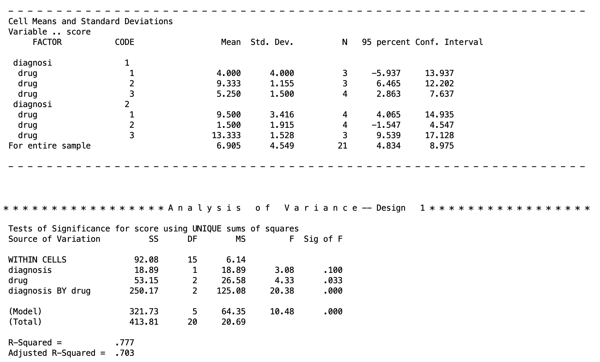{fig-alt="SPSS MANOVA output showing cell means and standard deviations by diagnosis and drug, followed by the omnibus ANOVA summary table with sums of squares, degrees of freedom, mean squares, F values, and significance for diagnosis, drug, and the diagnosis by drug interaction"}

When looking at the output for the omnibus test results, we can see that the main effect of diagnosis is not significant, the main effect of drug is significant, and the interaction is significant.

When the interaction is significant, that's usually the result worth chasing first. It means the effect of Drug is not the same across the two diagnosis groups, so the main effect of Drug describes an average pattern that may not hold for either group on its own. In fact, if your interaction is significant in a real experiment, you should ignore the main effects for the most part as they can't be interpreted since marginalizing over the other factor is innapropriate.

For the rest of this lesson, though, we are going to treat each of these results as a separate hypothetical scenario so we can walk through every follow-up procedure on the same set of cell means. Think of it less as "here is what we did with this dataset" and more as "here is what you would do if your own data came back looking a certain way"

## 6. Choosing Your Follow-Up Test: The Decision Tree

Which follow-up test is appropriate depends entirely on which effects came back significant. Below is a flow chart to help you make these decisions. Start at the top of the chart by assessing whether your interaction is significant or not. If the interaction is not significant, go to the right to examine the main effects. If the interaction is significant, then go to the left to examine the simple effects.

```{mermaid}
%%| echo: false
flowchart TD
    A[Is the A x B<br/>interaction significant?] -->|Yes| B[Test simple effects<br/>OR interaction contrasts]
    A -->|No| F[Is the main effect<br/>of A significant?]
    B --> C[Simple effects: effect of<br/>one factor at each level<br/>of the other]
    B --> D[Interaction contrasts: does<br/>a specific contrast on A<br/>depend on B?]
    C -->|Significant<br/>simple effect| E[Cell means comparisons<br/>within that slice]
    F -->|Yes| G[Individual contrasts<br/>for marginal means]
    F -->|No| H[Is the main effect<br/>of B significant?]
    H -->|Yes| I[Individual contrasts<br/>for marginal means]
    H -->|No| J[Stop, nothing<br/>further to test]
```

The same logic applies symmetrically if you are more interested in simple effects of A within levels of B rather than B within levels of A; you would just swap which factor is held fixed.

In words: if the interaction is not significant, you fall back to testing each main effect with marginal mean contrasts (covered next), exactly the way you tested contrasts among groups in Lesson 2. If the interaction is significant, marginal means become misleading (they average over a relationship that is not constant), so you instead test simple effects within each level of the other factor (covered later), and if those are significant, you compare individual cell means within that level.

## 7. Marginal Mean Comparisons (No Interaction, Significant Main Effect)

Suppose the interaction were not significant, but the main effect of Drug were. Averaging over diagnosis, the three drug marginal means (6.750, 5.417, 9.292) differ significantly from one another. But we do not yet know which pairs of drugs differ. A significant omnibus main effect tells you that the marginal means are not all equal, the same way a significant omnibus one-way ANOVA tells you the group means are not all equal, without telling you which pairs are responsible.

To understand it, here are table representations of both possible directions of marginal mean we can comapare.

The marginal means of drug is given as: 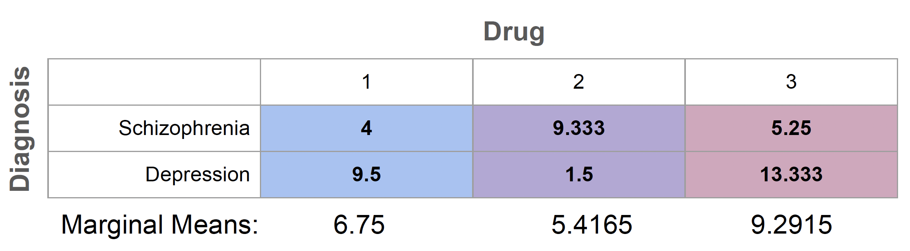{fig-alt="Table showing diagnosis by drug cell means, with Drug 1 shaded blue, Drug 2 shaded purple, and Drug 3 shaded pink, and a row of marginal means below for each drug column"}

The marginal means of diagnosis are given as:

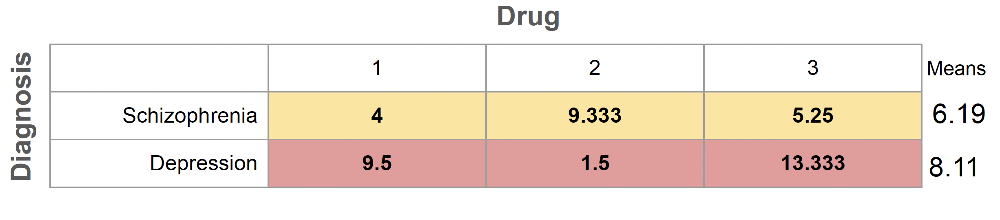{fig-alt="Table showing diagnosis by drug cell means, with the Schizophrenia row shaded yellow and the Depression row shaded red, and a marginal means column on the right showing 6.19 for Schizophrenia and 8.11 for Depression"}

To find out, we build a contrast matrix for drug, the same way we built contrast matrices for groups back in Lesson 2, except now the contrasts are applied to the marginal means rather than to a single set of group means.

Both tables show the same cell means, the only thing that changes is which direction you collapse across. The first table averages straight down each drug column, ignoring diagnosis entirely, to give you the marginal means of drug: 6.75, 5.4165, and 9.2915. The second table averages straight across each diagnosis row, ignoring drug entirely, to give you the marginal means of diagnosis: 6.19 for Schizophrenia and 8.11 for Depression. A significant main effect tells you that the relevant set of marginal means is not all equal, but it stops there. It does not tell you which specific pair is responsible. That is exactly the gap contrasts are built to close.

To figure this out, like we would with an ordinary ANOVA, we use contrast testing to address specific questions. For instance, we can test whether Drug 1 differs from Drug 2, and tests it directly against those marginal means, the same logic from Lesson 2 applied here to averages across diagnosis rather than to raw group means. Once you have a significant main effect and want to know where the difference actually lives, the contrast syntax in the next section is how you get there.

### Marginal Means in SPSS

Let's say we want to compare the marginal means of Drug 1 against Drug 2 and Drug 3 in two pairwise comparisons. This corresponds to the table of marginal mean comparisons given as

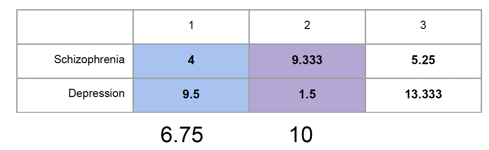{fig-alt="Table showing contrast for Drug 1 versus Drug 2, marginalizing across the diagnosis groups."}

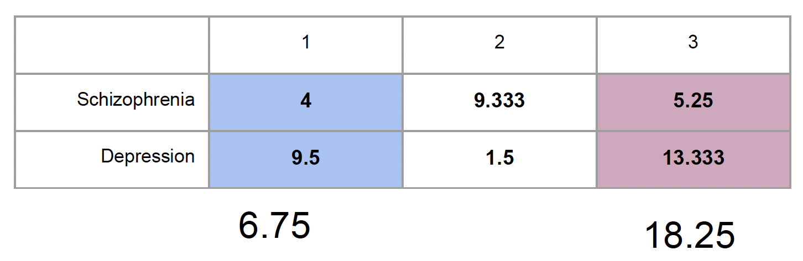{fig-alt="Table showing contrast for Drug 1 versus Drug 3, marginalizing across the diagnosis groups."}

The SPSS syntax for that would be

```         
MANOVA
    score BY diagnosis (1 2) drug (1 3)
   /NOPRINT PARAM(ESTIM)
   /PRINT CELLINFO(MEANS)
   /METHOD=UNIQUE
   /ERROR=WITHIN
   /CONTRAST(drug) = special (1  1  1
                               1 -1  0
                               1  0 -1)
   /DESIGN = drug(1), drug(2), diagnosis, diagnosis BY drug.
```

A few things to notice here:

-   The contrast matrix's first row, `1 1 1`, is always the equal-weighting row that defines the grand mean contribution; it is not itself tested. The second row, `1 -1 0`, compares Drug 1 to Drug 2. The third row, `1 0 -1`, compares Drug 1 to Drug 3.
-   On the `/DESIGN` line, `drug(1)` refers to the first contrast of drug (1, -1, 0), and `drug(2)` refers to the second contrast. It's easy to remember this as the number in the parenthese just references the order of the contrasts you specified.
-   Notice that diagnosis and diagnosis BY drug are also listed on the design line, even though we are not directly interested in testing them right now. This matters here specifically because our dataset is **unbalanced** (i.e., the sample sizes for each group are not equal). The /DESIGN line tells SPSS the full model to fit, and with unequal cell sizes, the drug contrasts are no longer orthogonal to the other effects in the model. If we left diagnosis and diagnosis BY drug off, SPSS would not be controlling for them, and our test of the drug contrasts would not match the omnibus analysis we already ran. With a **balanced** design (i.e., each group has the same sample size), this would not matter, since all the effects are mutually orthogonal and dropping unrelated terms would not change the result, the same reasoning you saw with the equal-n exception in the simple effects section later in this lesson. But since our cell sizes are unequal, the safest habit, and the one we will use throughout this lesson, is to include every effect that should remain in the model, not just the one you are testing.

The SPSS output for this chunk of code is given as

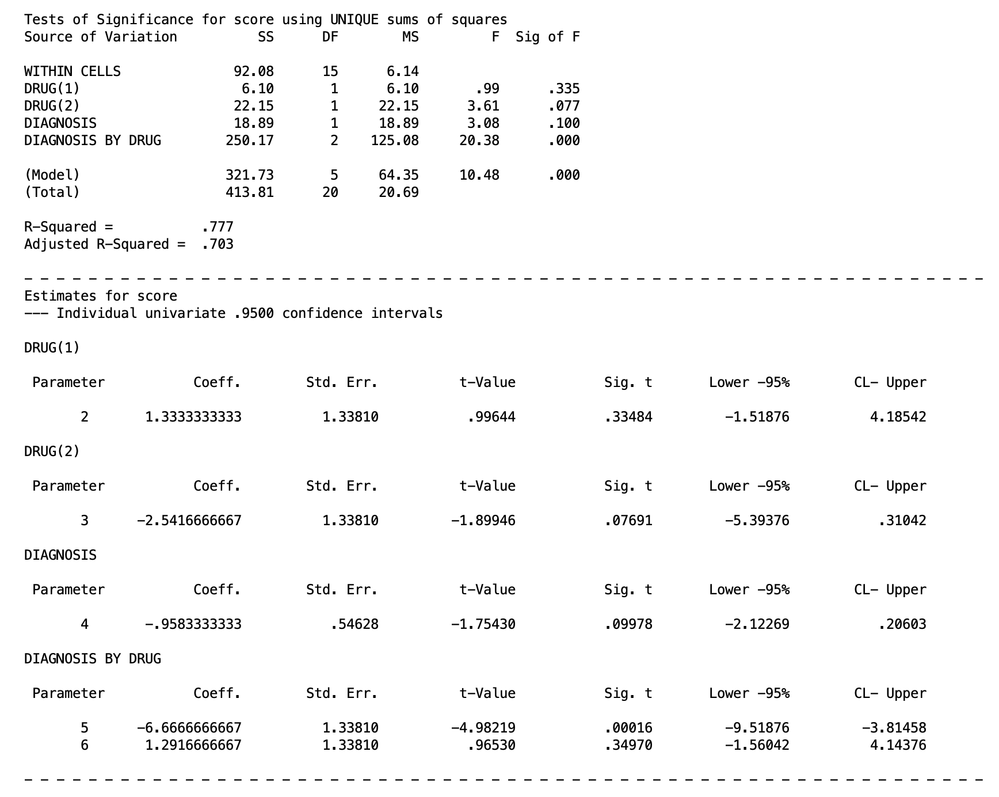{fig-alt="SPSS MANOVA parameter estimate table showing the coefficient, standard error, t-value, and significance for the DRUG(1) and DRUG(2) contrasts testing Drug 1 versus Drug 2 and Drug 1 versus Drug 3 marginal means"}

From this output, you only want to focus on the lines that say DRUG(1) and DRUG(2), sa these are the outputs for our contrasts. From this output, we can see (via the $F$ test in the top table or the $t$ tests in the bottom tables) that both contrasts are not significant. So we would fail to reject that the marginal means of Drug 1 is not different than Drug 2 or Drug 3.

If you recall from the contrast lesson, if you wish to test more marginal mean contrasts, you will need multiple MANOVA chunks of code.

Also, keep in mind here that we are doing multiple comparisons, so we need to think about Type I error corrections. I planned these contrasts initially, and these are just two pairwise comparisons, so following the Multiple Comparison lesson, I could use Bonferroni or Tukey after checking for the critical values, though since there are only three groups, Bonferroni is likely the more powerful option (review that lesson if needed).

## 8. Simple Effects (Significant Interaction)

Now suppose the interaction is significant instead (which happens to be the situation that actually describes our dataset). Marginal means are no longer the right thing to test, because averaging Drug 2's score across both diagnosis groups blends together a low score in Depression and a relatively high score in Schizophrenia. That average does not describe either group well.

Instead, we test the **simple effect** of Drug separately within each level of Diagnosis. This is conceptually just running two separate one-way ANOVAs of drug, one within Schizophrenia and one within Depression, except we do it inside a single MANOVA call so that both tests share the same pooled error term, $MS_{within}$, from the full design.

> Note: It is possible to do Simple Effects test as distinct one-way ANOVAs by running an ANOVA for depression scores across the drug groups and another ANOVA for schizophrenia scores across the drug groups. However, this will be much less powerful, since it is not using the $MS_{within}$ from the two-way ANOVA. Look back at the pie chart above, and see that using the two-way method means we are controlling for more error and getting more powerful results!

There are many possible simple effects for our model. The simple effects for diagnosis can be represented by these tables

{fig-alt="This table shows the two simple effects for each diagnosis. On top is the simple effect of drug within schizophrenia represented by the colored line (there should be distinct colors for each cell, but I didn't get that to work for this table. The table on the bottom shows the simple effect of drug within depression by the colored groups. The means at the end of the simple effect rows represent the marginal mean."}

The null hypotheses of simple effects is that the means of factor A within a single level of factor B do not differ from one another. So for example in the first table above, the null hypothesis is that the drug means of 4, 9.333, and 5.25 within schizophrenia do not differ. The alternative is that at least one of these means will be significantly different than the others.

In addition of these simple effects of diagnosis, there are also three simple effects for the drug groups that compare schizophrenia against depression within each individual drug, but we won't cover these.

### Simple Effects in SPSS

We will be sticking with the simple effects within diagnosis. In SPSS, simple effects do not require a custom contrast matrix. They are requested with a `W` (for "within") on the design line:

```         
MANOVA
    score BY diagnosis (1 2) drug (1 3)
   /NOPRINT PARAM(ESTIM)
   /PRINT CELLINFO(MEANS)
   /METHOD=UNIQUE
   /ERROR=WITHIN
   /DESIGN = drug W diagnosis(1), drug W diagnosis(2), diagnosis.
```

Here `drug W diagnosis(1)` means "test the effect of drug within the first level of diagnosis (Schizophrenia)," and `drug W diagnosis(2)` means the same thing within the second level (Depression). Notice the `(1)` and `(2)` are to the *right* of the `W` here, so they refer to levels of diagnosis, not to rows of a contrast matrix. This is a common point of confusion. So make sure you understand that when a parenthese number comes after a `W` in the design line, it is referring to a specific level of that variable. In all other cases, it is discussing a contrast.

We also keep `diagnosis` on the design line becasue our data is not balanced (see above).

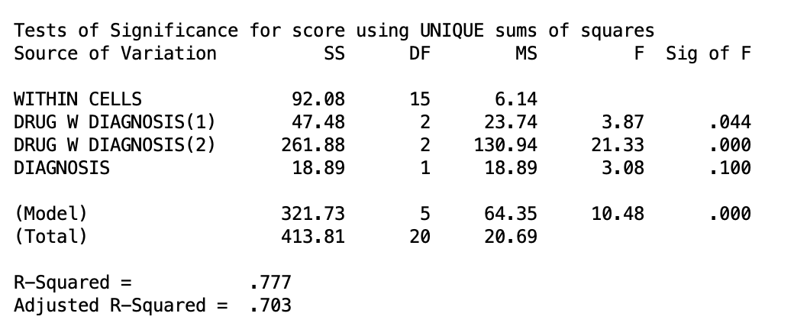{fig-alt="SPSS MANOVA output showing the simple effect of drug tested separately within diagnosis level 1 and diagnosis level 2, with sums of squares, degrees of freedom, mean squares, F values, and significance for each"}

Both simple effects are significant at the level of $\alpha = .05$. So we can conclude that the drug an individual takes matters within Schizophrenia as well as Depression. But just like a main effect, a significant simple effect only tells us that the three drug means differ somewhere within that diagnosis group, not which specific drugs differ. That is the next step.

## 9. Cell Mean Comparisons Within Simple Effects

If a simple effect comes back significant, meaning that there is *a* difference amongst the means within a one of the diagnoses, the natural next step is to compare specific drug pairs within that diagnosis level. This combines the two techniques you have already seen: a contrast matrix applied within a specific level of the other factor (from simple effects testing).

There are a many number of possible cell mean comparisons. For example, within either depression or schizophrenia, we want to compare Drug 1 against Drug 2. These are two cell mean comparisons (Drug 1 v 2 within depression, and Drug 1 v 2 within schizophrenia). We can see what this would be like in the following table

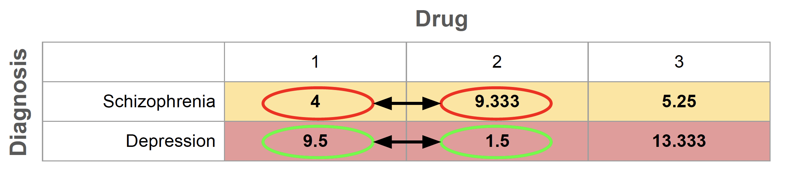{fig-alt="Table showing cell mean comparison contrast for Drug 1 versus Drug 2 within both schizophrenia and depression. The colors corespond to the means that are being compared."} Of course, there could be many many more. For example, we could do cell mean comparisons of Diagnosis just within Drug 1. However, if you notice, there are only two means within Diagnosis. So by nature, comparing both groups is the only cell mean comparison. This, as a matter in fact, is exactly what the simple effect for Drug 1 is already doing. Therefore, cell mean comparisons can only be done when the number of groups is greater than 2. This goes for all contrasts too, but it is helpful to keep that in mind now because the SPSS syntax for cell mean comparisons can get a bit confusing.

### Cell Mean Comparisons in SPSS

As there are many types of cell mean comparisons, there are many ways to specify the syntax. As a rule, cell mean comparison syntax consists of two pieces:

1)  A contrast piece (the cells you are comparing)

2)  A simple effects piece (the specific levels you are testing on)

Once you understand this, the process of specifying the code in SPSS will hopefully become a bit more inuitive.

Let's say we want to compare Drug 1 against Drug 2, and we want to compare Drug 2 against Drug 3 (the contrast piece). Let's say we want to do this within both levels of diagnosis (the simple effects piece). Visually, these four cell mean comparisons are described in the following table.

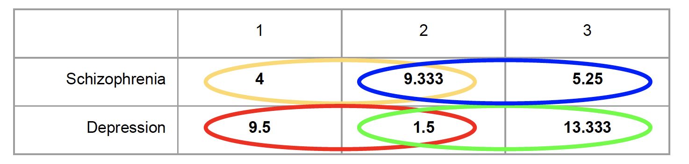{fig-alt="Table showing cell mean comparison contrast for Drug 1 versus Drug 2 and Drug 2 versus Drug 3 within both schizophrenia and depression. The colors corespond to the means that are being compared."}

The SPSS syntax is as follows.

```         
MANOVA
    score BY diagnosis (1 2) drug (1 3)
   /NOPRINT PARAM(ESTIM)
   /PRINT CELLINFO(MEANS)
   /METHOD=UNIQUE
   /ERROR=WITHIN
   /CONTRAST(drug) = special (1  1  1
                               1 -1  0
                               0  1 -1)
   /DESIGN = drug(1) W diagnosis(1), drug(2) W diagnosis(1),
             drug(1) W diagnosis(2), drug(2) W diagnosis(2),
             diagnosis.
```

The contast piece is specified in the matrix's second row (`1 -1 0`) compares Drug 1 to Drug 2, and the third row (`0 1 -1`) compares Drug 2 to Drug 3. This is akin to any contrast comparison. What is unique now is that within the design line, **for each contrast** we must specify we are testing them within each level of diagnosis. So, `drug(1) W diagnosis(1)` means "the first contrast (Drug 1 vs Drug 2) within the first level of diagnosis (schizophrenia)," and `drug(2) W diagnosis(2)` means "the second contrast (Drug 2 vs Drug 3) within the second level of diagnosis (depression). This follows suit for the others.

To help with making the syntax, recall what I said before. If you see a number in a parentheses *after* the `W`, it is talking about a specific level of the variable. Anywhere else, it is talking about a contrast.

It is necessary that you include all pieces of each cell mean comparison or else the sum of squares won't get partitioned correctly and your results will be incorrect. So it is important you figure out how many cell means you are actually comparing. Finally, since our data is not balanced (not equal in group sample size), we must include the factor we are looking within (`diagnosis`) in the design line to let SPSS know we must treat this as unbalanced. If you have equal group sample size, you don't need to do this.

The output for these tests is given below

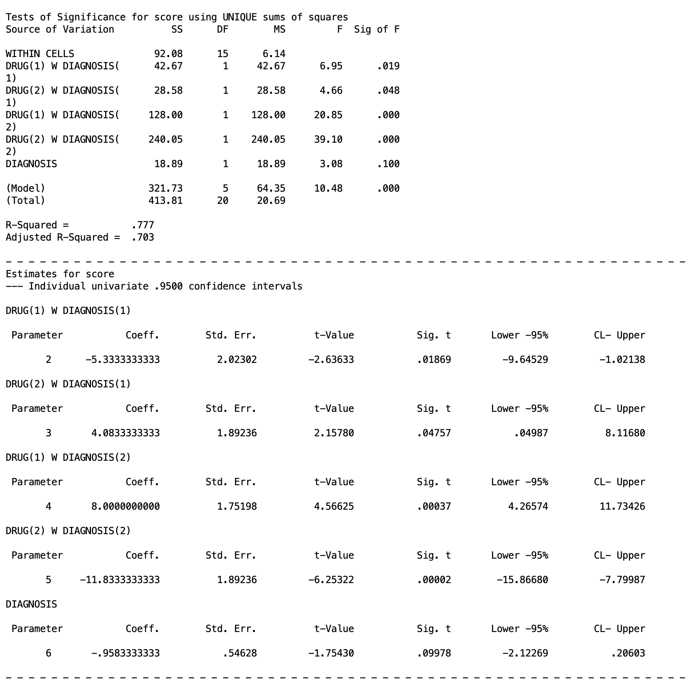{fig-alt="SPSS MANOVA parameter estimate table showing the four pairwise drug contrasts tested within each diagnosis level, with coefficients, standard errors, t-values, and significance"}

You can either look at the $F$ test table at the top or the get the $t$ statistics below to check significance. Please keep in mind what you labeled as each contrast and what levels represent yout `(1)` and `(2)` specification because you will have to find them on the output and interpret them correctly.

All four comparisons are significant in this example at the $\alpha=.05$ level. This means that Drug 1 and 2 differ within depression and schizophrenia, and Drug 2 and 3 also differ within depression and schizophrenia.

If you want to do more cell mean comparisons that are allowed in your contrast matrix, you will need to run another MANOVA chunk.

## 10. Type I Error Correction for Simple Effects and Cell Mean Comparisons

Just like all other types of follow up tests, you should consider Type I error corrections for simple effects and their cell mean comparisons. In fact, the number of tests you will be looking at will escalate quickly, so controlling for Type I error becomes even more pertinent. Look at the Multiple Comparison lesson if you are confused.

Unfortunately, when working with simple effects, there is not a clean and easy solution to controlling for Type I error rates, and Type I error control can get a bit more abstract, and honestly from my experience teaching this course, this is probably the most confusing part of the whole course for many people.

There are two main methods you can choose to go about it, and they differ in what you treat as a "family".

> Recall that a "family" in testing is a set of comparisons that you group together for purposes of error control. The whole point of correcting for Type I error, whether by Bonferroni, Tukey, or Scheffe, is to control the probability of making at least one false positive across an entire family of tests, not just within any single test on its own. Everything depends on how you draw the boundary around that family, since the same set of tests can be split into one large family or several smaller ones, and each choice leads to a different correction.

Previously, we talked about "experimentwise" error, which treats the whole experiment as one family. When working with simple effects, the family is the simple effects rather than the whole experiment. This means that you do not incorporate the omnibus tests at all (main effects or interaction) as a factor when controlling for Type I error. However, there are two different ways you can treat the simple effects as a family.

### Treating Simple Effects as One Family

The standard approach is to treat all the simple effects of a single factor as a single family. For instance, we would treat the two simple effects of Drug across both levels of Diagnosis as a single family of related questions. In this scenario, you are really asking one bigger question, "does the type of drug an individual receives matter, and does that depend on their diagnosis," and the two simple effect tests are two pieces of answering it. Under this view, you split your overall alpha across the b tests in the family, where b is the number of levels of the factor you are holding fixed:

$$\alpha_{per\,test} = \frac{\alpha}{b}$$

In our case, $b = 2$ as there are 2 levels of Diagnosis. So we get $\alpha/2 = .025$ per simple effect test. If you were instead testing simple effects of Diagnosis within each of the 3 drug levels, you would split alpha three ways, $.05/3 \approx .017$.

When you move on to cell mean comparisons, you then control for Type I error based on this corrected $\alpha$ level. That is, all decisisions and adjustment are made from $\alpha_{per~test}$ as opposed to just $\alpha = .05$. In our example, our decisions of the cell mean comparisons within the simple effects of the diagnosis levels should be using $\alpha = .025$ as the cut off. If you go back above to the SPSS in Section 9, you might actually notice the comparisons of Drug 1 vs Drug 2 in both depression and schizophrenia would no longer be significant.

However, it doesn't stop there. That would be the case only if we were looking at a single cell mean comparison. But just like all contrasts, we must decide on Bonferroni vs Tukey vs Scheffé based on the criteria discusses in the Multiple Comparisons lesson. The big caveat is that the decisiions made for those methods is based on $\alpha_{per~test}$ *not* $\alpha = .05$.

If you recall, the Bonferroni corrected $\alpha$ is

$$\alpha_{Bonferroni} = \frac{\alpha}{C}$$ where $C$ is the number of comparisons. When correcting for cell mean comparisons while treating all simple effects as a single family, we would divide $\alpha_{per~test}$ by C. So for our example, we would divide our $\alpha_{per~test}=.025$ by 4 as we are looking at 4 comparisons. This gets us a corrected Bonferroni alpha of

$$\alpha_{Bonferroni} = \frac{.025}{4}=.00625$$ In a nutshell, whenever you are using the basic $\alpha = .05$ for your Type I error control methods (like when calculating critical values), you need to use $\alpha_{per~test}$.

As one can see, this starts to make the rejection criteria get very small very fast. Well, that is intentional. If you are doing a multi-way ANOVA and are testing *everything*, then you are just asking for a Type I error. Realistically, you should be planning only to test a certain limited number of contrasts. That way, you don't need ridiculously low $p$ values to reject anything.

This is just one method of doing Type I error control for simple effects, however.

### Treating Simple Effects as Seperate Families

The alternative is to argue that the simple effect within Schizophrenia and the simple effect within Depression are not really part of the same inferential claim, they are two distinct, separately motivated questions about two distinct populations, and a Type I error in one has no bearing on your confidence in the other. Under this view each test gets its own full $\alpha = .05$ uncorrected. So there is no need of getting an $\alpha_{per~test}$. Thus, you can complete sidestep using different criteria in your Bonferroni/Tukey/Scheffé tests for the cell mean comparisons, and you can use just $\alpha = .05$ like normal instead. This has the immediate benefit of being much simpler.

This method is defensible, but it needs to be a deliberate choice you can justify, not a default you are choosing for convenience. In our example, if you cannot articulate why the two diagnosis groups represent genuinely separate research questions rather than two parts of one factorial story, the one-family, $\alpha_{per~test}$ approach is the safer and more conventional default.

SPSS doesn't have easy ways to do Tukey with MANOVA, but you should be able to do the Bonferroni and Scheffé methods in the MANOVA functions as discussed in the Multiple Comparisons lesson. For Tukey, you will most likely need to hand calculate some values.

In general for higher order ANOVAs than just one-way, it is good practice to *plan* tests you are interested in. This is to drastically reduce potential Type I error inflation. As a result, Bonferroni is often the best adjustment you can use in most scenarios.

## 11. Interaction Contrasts

Now we move on to our last piece of two-way ANOVA, interaction contrasts.

Cell mean comparisons answer "which specific cells differ," but some researchers argue they can be misleading on their own, because a cell mean difference blends together main effect variation and interaction variation. It does not isolate the interaction parameter, $(\alpha\beta)_{jk}$, by itself.

An **interaction contrast** does exactly that. It is a contrast of contrasts: the difference between a cell mean contrast in one level of A and the same cell mean contrast in another level of A. If the two contrasts are identical, the interaction contrast is zero (no interaction for that comparison). If they differ, that difference is a pure estimate of an interaction parameter.

As a concrete example with our data, let's say we want to know whether symptom improvement of Drug 1 vs Drug 2 differs between schizophrenia and depression. It is possible that Drug 1 and Drug 2 differ from one another, however it is possible that Drug 1 decreases symptoms in schizophrenia and increases them in depression, whereas Drug 2 increases symptoms in schizophrenia but decreases them in depression. Basic cell mean comparisons won't give you insight on this question.

This interaction contrast is represented in the table below

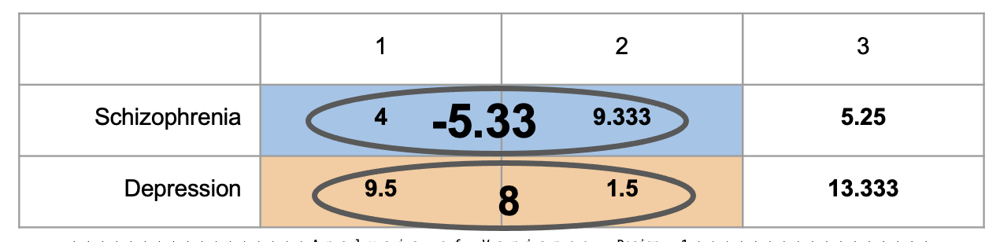{fig-alt="This table shows the two comparisons of Drug 1 vs Drug 2 against depression and schizophrenia. The colors represent the specific cell mean comparisons. The numbers in the center of the circle represent the mean differences being compared across the levels of diagnosis."}

Essentially, each circle is its own simple comparison, Drug 1 minus Drug 2, computed separately within each diagnosis group. Within Schizophrenia, that difference is $4 - 9.333 = -5.33$. Within Depression, that same comparison comes out to $9.5 - 1.5 = 8$. Neither of those numbers by itself answers our question. They are just two ordinary cell mean comparisons. What we actually want to know is whether those two differences are themselves different from each other, whether the Drug 1 vs Drug 2 gap looks the same regardless of diagnosis, or whether it flips or changes size depending on which diagnosis group you are looking at.

That is exactly what the interaction contrast computes: a difference of differences.

$$(\bar{Y}_{schiz,1} - \bar{Y}_{schiz,2}) - (\bar{Y}_{dep,1} - \bar{Y}_{dep,2}) = -5.33 - 8 = -13.33$$

A value of zero here would mean the Drug 1 vs Drug 2 comparison is identical across diagnosis groups, aka the difference in benefits of Drug 1 vs Drug 2 is exactly the same for people with schizophrenia and people with depression. In this case, we could probably prescribe medication the same for individuals with either.

However, the further this contrast value sits from zero, the more the size (or direction) of the drug comparison depends on diagnosis. A value of $-13.33$ is a large gap, consistent with what the raw numbers already hint at: Drug 1 outperforms Drug 2 within Schizophrenia, while the opposite is true within Depression, exactly the kind of crossed pattern that a single cell mean comparison could never reveal on its own.

For another visual representation, here is a bar graph of the two groups.

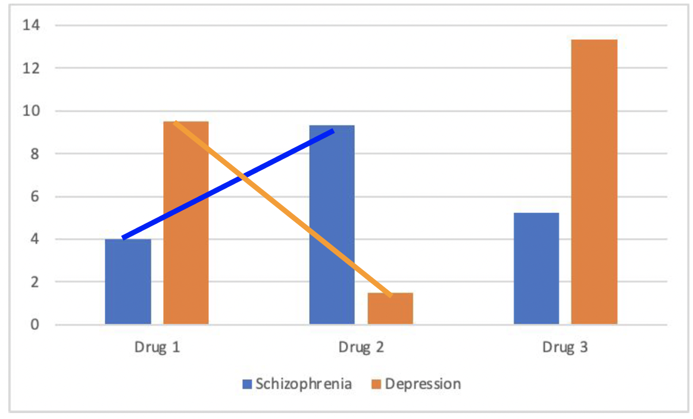{fig-alt="Bar graph showing cell means for Schizophrenia and Depression across Drug 1, Drug 2, and Drug 3. A line connects the Schizophrenia means across Drug 1 and Drug 2, and a separate line connects the Depression means across the same two drugs. The two lines cross between Drug 1 and Drug 2, visually showing the opposite direction of the drug effect across diagnosis groups."}

The table gave you the number, $-13.33$. This chart gives you the shape behind it. An interaction contrast is essentially a comparison of slopes, and the blue line rising while the orange line falls is what a large, significant interaction contrast looks like when drawn out, two simple effects that are not just both present but pointing in opposite directions. Notice Drug 3 sits outside this picture entirely, since this particular contrast was built only to compare Drug 1 against Drug 2. Basically, the takeaway here is that we can see that Drug 1 vs 2 clearly have different effects that depend on the type of diagnosis the individual has.

### Interaction Contrasts in SPSS

Interaction contrasts are requested by specifying two contrasts and seperating them with `BY` on the design line, which multiplies the coefficients from the two factors' contrast matrices together. The syntax for our example is

```         
MANOVA
    score BY diagnosis (1 2) drug (1 3)
   /NOPRINT PARAM(ESTIM)
   /PRINT CELLINFO(MEANS)
   /METHOD=UNIQUE
   /ERROR=WITHIN
   /CONTRAST(diagnosis) = special (1  1
                                    1 -1)
   /CONTRAST(drug) = special (1  1  1
                               1 -1  0
                               1  0 -1)
   /DESIGN = drug(1) BY diagnosis(1), drug(2) BY diagnosis(1),
             drug, diagnosis.
```

We have two contrast chunks, one for `drug`, which is the Drug 1 vs Drug 2 comparison we are interest in. I also threw in Drug 1 vs Drug 3 as an additional comparison because we must include one more. For `diagnosis` there was only one possible comparison we could make, which is just schizophrenia vs depression. One could imagine in a scenario where we introduce a third diagnosis, like general anxiety disorder, then we might need to specify in this `/CONTRAST(diagnosis)` line that we are only comparing schizophrenia and depression, but we are not looking at anxiety. In contexts where you only have 2 levels of a factor, however, there is only one possible comparisons.

In the `/DESIGN` line, we have to call the specific interactions by specifying the contrast against the other.

`drug(1) BY diagnosis(1)` tests whether the Drug 1 vs Drug 2 difference is the same in Schizophrenia as it is in Depression:

$$(4.000 - 9.333) - (9.500 - 1.500) = -5.333 - 8.000 = -13.333$$

`drug(2) BY diagnosis(1)` tests whether the Drug 1 vs Drug 3 difference is the same across diagnosis groups:

$$(4.000 - 5.250) - (9.500 - 13.333) = -1.250 - (-3.833) = 2.583$$

In this case, since there is no `W` anywhere, all numbered parenthese represent contrasts: `drug(1)` is Drug 1 vs Drug 2, `drug(2)` is Drug 1 vs Drug 3, and `diagnosis(1)` is schizophrenia vs depression. Including the `BY` inbetween the contrasts lets SPSS know we want to see their interaction.

Lastly, since we have unbalanced data (non-equal group sample sizes), we need to include the factors in the design line as well, with `drug` and `diagnosis`. If your data is balanced, this is not necessary.

The output for this SPSS code is given below:

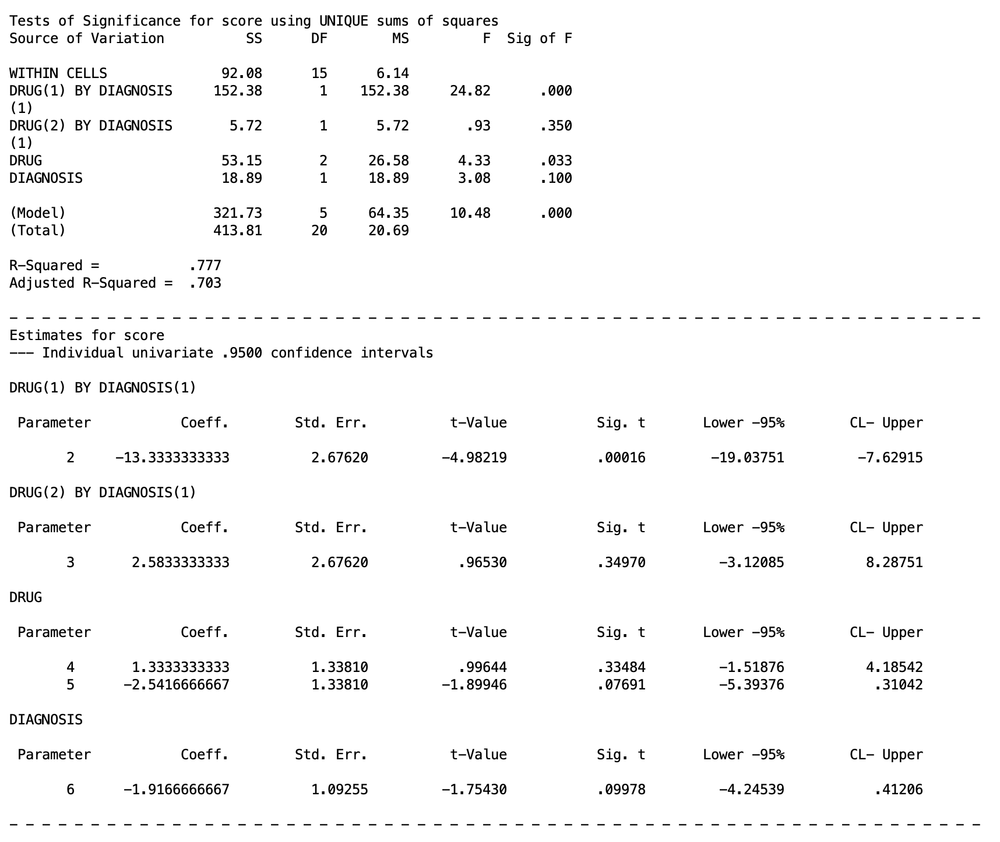{fig-alt="SPSS MANOVA parameter estimate table showing the two interaction contrasts testing whether the Drug 1 versus Drug 2 difference and the Drug 1 versus Drug 3 difference are consistent across diagnosis groups"}

From this, we can conclude the Drug 1 vs Drug 2 pattern is significantly different across diagnosis groups, but the Drug 1 vs Drug 3 pattern is not. Therefore, the way Drug 1 compares to Drug 2 genuinely depends on diagnosis, not just numerically but in a way that crosses direction entirely: Drug 1 outperforms Drug 2 in Schizophrenia, while Drug 2 outperforms Drug 1 in Depression. A clinician choosing between these two drugs would need to know the patient's diagnosis before that choice means anything. The Drug 1 vs Drug 3 relationship, by contrast, behaves consistently enough across diagnosis groups that the interaction contrast cannot rule out a constant effect, so whatever advantage or disadvantage Drug 3 has relative to Drug 1 does not depend on which diagnosis group you are looking at.

A useful equivalence to notice: omnibus `diagnosis BY drug` in Section 5 had 2 degrees of freedom, exactly $(a-1)(b-1) = (2-1)(3-1) = 2$. Testing `drug(1) BY diagnosis(1)` and `drug(2) BY diagnosis(1)` together is the same thing as testing the full interaction omnibus, just broken into two separate single-degree-of-freedom pieces. The omnibus interaction test is the joint test of all possible interaction contrasts at once; an individual interaction contrast like `drug(1) BY diagnosis(1)` tests just one of them.

Interaction contrasts can be planned in advance, the same way any other planned contrast can, which means you are not required to wait for a significant omnibus interaction before testing one. If your hypothesis was specifically about whether two particular drugs behave differently across diagnosis groups, you can test that directly.

Finally, issues of Type I error must be considered, and you should treat them in a similar manner to the general contrasts.

## 12. Applying This to Your Assignment

The lab assignment the graduate students were supposed to follow is given below if you want to try yourself.

The assignment uses **TwoWayBetween.sav**, with Drug (Drug X, Drug Y, Drug Z) crossed with Feedback (Present, Absent). Every syntax pattern from this lesson carries over directly, you are just swapping `diagnosis` for `feedback` and adjusting level counts as needed. The templates below assume `feedback (1 2)` and `drug (1 3)`, with drug coded so that 1 = Drug X, 2 = Drug Y, 3 = Drug Z.

**Omnibus ANOVA:**

```         
MANOVA
    score BY feedback (1 2) drug (1 3)
   /NOPRINT PARAM(ESTIM)
   /PRINT CELLINFO(MEANS)
   /METHOD=UNIQUE
   /ERROR=WITHIN
   /DESIGN.
```

**Marginal means of Drug X vs Drug Y, Drug X vs Drug Z, Drug Y vs Drug Z (Section 7 pattern):** build a 3x3 special contrast matrix for drug with each pairwise row you need, and keep `feedback` and `feedback BY drug` on the design line alongside the drug contrast rows you are testing.

**Marginal means of Feedback Present vs Absent (Section 7 pattern):** this is testing whether, averaging across all three drugs, the presence or absence of feedback changes the outcome on its own.

**Simple effects of Feedback within all levels of Drug, and simple effects of Drug within Feedback Absent (Section 8 pattern):** use `feedback W drug(1)`, `feedback W drug(2)`, `feedback W drug(3)` for the first; use `drug W feedback(2)` alone (assuming Absent is coded 2) for the second, since you only need the one level.

**Drug X vs Drug Y within Feedback Present, and within Feedback Absent; Drug Y and Z vs Drug X within both feedback levels; Drug X and Z vs Drug Y within both feedback levels (Section 9 pattern):** these are cell mean comparisons. Build a drug contrast matrix with the specific pairwise and complex comparisons you need, then list `drug(row) W feedback(1)` and `drug(row) W feedback(2)` for every row and every level on the design line.

**Test whether the effect of Drug X vs Drug Y is the same within Feedback Present and Absent, and the same for Drug Y vs Drug Z (Section 10 pattern):** these are interaction contrasts. Build contrast matrices for both feedback and drug, then use `drug(row) BY feedback(1)` on the design line for each comparison.

As you work through each of these, repeat the image-placeholder pattern from this lesson (`images/5.8.png`, `images/5.9.png`, and so on) for each output you generate, with alt text describing what that particular output shows.

## 13. Summary

| Situation | What to test | SPSS pattern |
|------------------------|------------------------|------------------------|
| Interaction not significant, a main effect is | Contrasts among the marginal means of that factor | Contrast matrix + factor level numbers on design line, other main effect and interaction kept on design line |
| Interaction significant | Simple effects of one factor within each level of the other | `W` with no contrast matrix needed |
| Simple effect significant | Cell mean comparisons within that level | Contrast matrix + `W` combined |
| Testing whether a specific comparison's size changes across the other factor | Interaction contrast | Contrast matrices for both factors + `BY` |

Every one of these is still a full versus reduced model comparison underneath, just like every test in this series has been. The cell means model is the most general thing you can fit; main effects, interactions, simple effects, and interaction contrasts are all just different ways of asking which pieces of that full model you can remove without losing meaningful fit.

## Discussion Questions

**Question 1: Does it matter what order the rows appear in the dataset?**

<details>

<summary>Click to reveal answer</summary>

No. MANOVA, like the regression-based models underlying it, treats each row as an independent observation. Sums of squares, means, and F values are computed from the full set of scores within each cell, not from the order those scores happen to appear in the file. Reordering the rows will not change any result.

</details>

------------------------------------------------------------------------

**Question 2: Does it matter whether diagnosis is coded as 0,1 or as 1,2?**

<details>

<summary>Click to reveal answer</summary>

No, as long as the coding is specified correctly in the syntax (for example `diagnosis (0 1)` instead of `diagnosis (1 2)`). The numbers are just labels for group membership. The F tests, sums of squares, and significance values will be identical either way; only the internal parameter labeling changes.

</details>

------------------------------------------------------------------------

**Question 3: Why don't we know where the specific differences in a significant main effect are yet?**

<details>

<summary>Click to reveal answer</summary>

A significant omnibus main effect, just like a significant one-way ANOVA, only tells you that the marginal means are not all equal somewhere among the levels. It does not identify which specific pairs differ. That requires planned or post hoc contrasts among the marginal means, the same logic from Lesson 2 and Lesson 3 applied to marginal rather than raw group means.

</details>

------------------------------------------------------------------------

**Question 4: Would the answer to Question 3 be different if the factor had only 2 levels instead of 3?**

<details>

<summary>Click to reveal answer</summary>

Yes. With exactly 2 levels, the omnibus main effect test and the single possible pairwise comparison are the same test. There is only one way two means can differ, so a significant 2-level main effect already tells you which two means differ and in which direction. With 3 or more levels, multiple comparisons are possible, so a significant omnibus result no longer pins down which specific pair (or pairs) is responsible.

</details>

------------------------------------------------------------------------

**Question 5: If there was a significant main effect of Diagnosis (a 2-level factor), would we know which means of Diagnosis differ?**

<details>

<summary>Click to reveal answer</summary>

Yes, by the same logic as Question 4. With only two levels, the main effect test is equivalent to comparing the two levels directly, so significance immediately tells you that Schizophrenia and Depression differ, with the direction given by which marginal mean is larger.

</details>

------------------------------------------------------------------------

**Question 6: Could we just include `drug(1)` on the design line, if that is the only contrast we care about?**

<details>

<summary>Click to reveal answer</summary>

Only safely if the contrasts are orthogonal, which is guaranteed with equal cell sizes but not with unequal ones. With unbalanced data, leaving other contrast rows or other effects off the design line can change how the sums of squares are partitioned, which changes the test of the one contrast you do care about. The safer default is to include every row of the contrast matrix and every other effect that belongs in the full model, even if you only plan to report one of them.

</details>

------------------------------------------------------------------------

**Question 7: When should we definitely keep `diagnosis` and `diagnosis BY drug` on the design line when testing drug marginal mean contrasts?**

<details>

<summary>Click to reveal answer</summary>

Always, when those terms belong in the model you are trying to match. The design line specifies the complete model SPSS fits. If `diagnosis` and `diagnosis BY drug` were part of the omnibus model you ran in Section 5, they need to stay in every follow-up model too, or the error term and degrees of freedom will no longer correspond to the same analysis, and your contrast test will not mean what you think it means.

</details>

------------------------------------------------------------------------

**Question 8: Will testing simple effects (Section 8) tell us which specific drugs differ within a given diagnosis group?**

<details>

<summary>Click to reveal answer</summary>

No. A significant simple effect, like a significant omnibus main effect, only tells you that the three drug means within that diagnosis group are not all equal. It does not say which pairs of drugs are responsible. That requires the cell mean comparisons from Section 9.

</details>

------------------------------------------------------------------------

**Question 9: What does the `(1)` mean in `drug W diagnosis(1)` on the design line?**

<details>

<summary>Click to reveal answer</summary>

Here the `(1)` is to the right of `W`, so it refers to a level of the factor, not a row of a contrast matrix. `drug W diagnosis(1)` means "test the omnibus effect of drug within the first level of diagnosis (Schizophrenia)."

</details>

------------------------------------------------------------------------

**Question 10: Why do we have to list so many effects on the design line for cell mean comparisons, when we only care about one pairwise contrast?**

<details>

<summary>Click to reveal answer</summary>

Because once contrasts are tested within separate levels of the other factor, they are not guaranteed to be orthogonal unless cell sizes are equal. SPSS needs the full set of contrasts and levels listed so it can correctly compute each one's unique contribution to the sums of squares. Leaving terms off can silently change the test of the one comparison you actually want.

</details>

------------------------------------------------------------------------

**Question 11: What is the difference between the `(1)` next to `drug` and the `(1)` next to `diagnosis` on a design line like `drug(1) W diagnosis(1)`?**

<details>

<summary>Click to reveal answer</summary>

The `(1)` next to `drug`, appearing to the left of `W`, refers to the first row of the drug contrast matrix (a specific comparison, such as Drug 1 vs Drug 2). The `(1)` next to `diagnosis`, appearing to the right of `W`, refers to the first level of the diagnosis factor (Schizophrenia). Same symbol, different meaning, depending on which side of the `W` it sits on.

</details>

------------------------------------------------------------------------

**Question 12: If we are only interested in testing contrasts within level 1 of diagnosis, do we also have to include the contrasts within the other levels of diagnosis?**

<details>

<summary>Click to reveal answer</summary>

It depends on whether cell sizes are equal. With equal n, contrasts tested within separate levels of the other factor are always orthogonal to each other, so you can safely leave out the levels you are not interested in. With unequal n, that orthogonality is not guaranteed, so it is safest to include the contrasts within every level of diagnosis, even the ones you will not report, plus the main effect of diagnosis itself to fully account for the model's degrees of freedom.

</details>

------------------------------------------------------------------------

**Question 13: When do we test interaction contrasts, before or after conducting the omnibus test?**

<details>

<summary>Click to reveal answer</summary>

Like any other planned comparison, an interaction contrast can be tested before the omnibus interaction test if it reflects a specific hypothesis you had going in. You are not required to find a significant omnibus interaction first. If instead you are exploring after the fact, without a specific prediction, you are in post hoc territory and should treat the interaction contrasts the way you would treat any unplanned comparison, including correcting for the number of tests run.

</details>

------------------------------------------------------------------------

**Question 14: Why is it unnecessary to compute interaction contrasts in a 2x2 design?**

<details>

<summary>Click to reveal answer</summary>

In a 2x2 design, each factor has only 1 degree of freedom, so the interaction term itself also has only $(2-1)(2-1) = 1$ degree of freedom. The omnibus interaction test already is the single possible interaction contrast; there is no finer breakdown to test, since there is only one way each factor can be compared.

</details>
