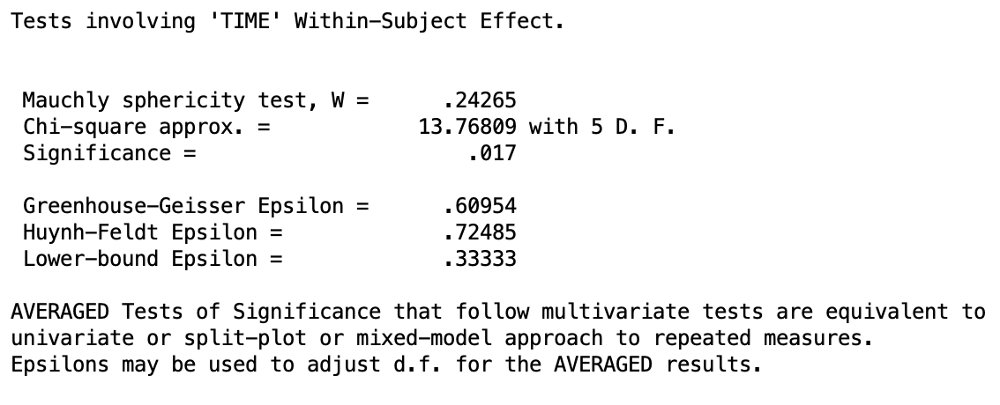
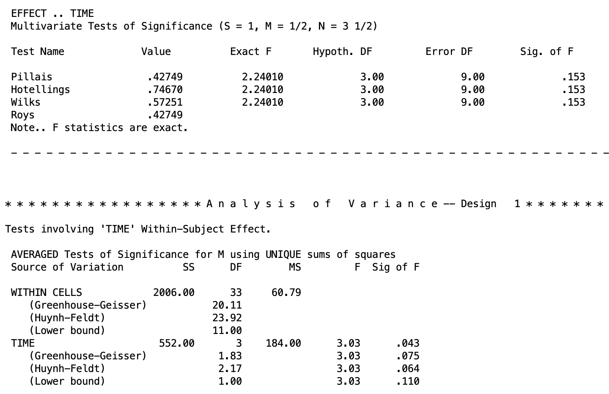
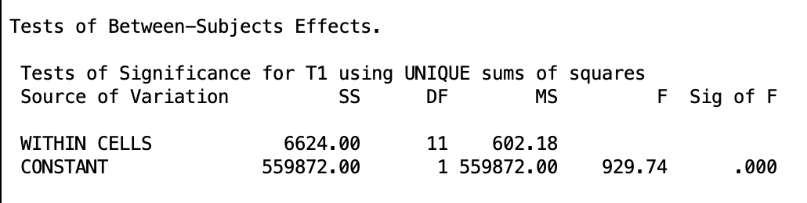
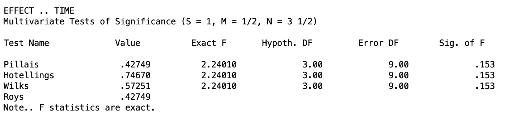
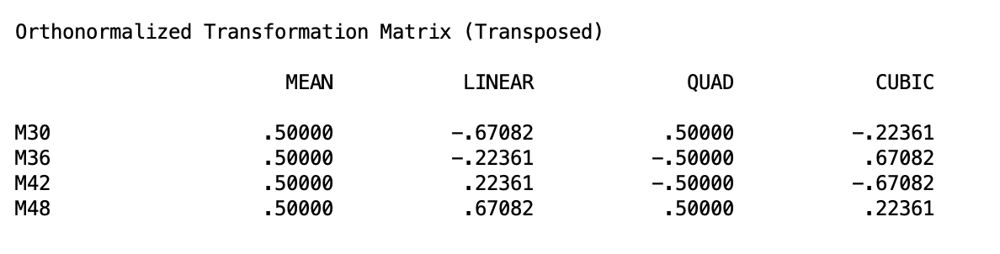
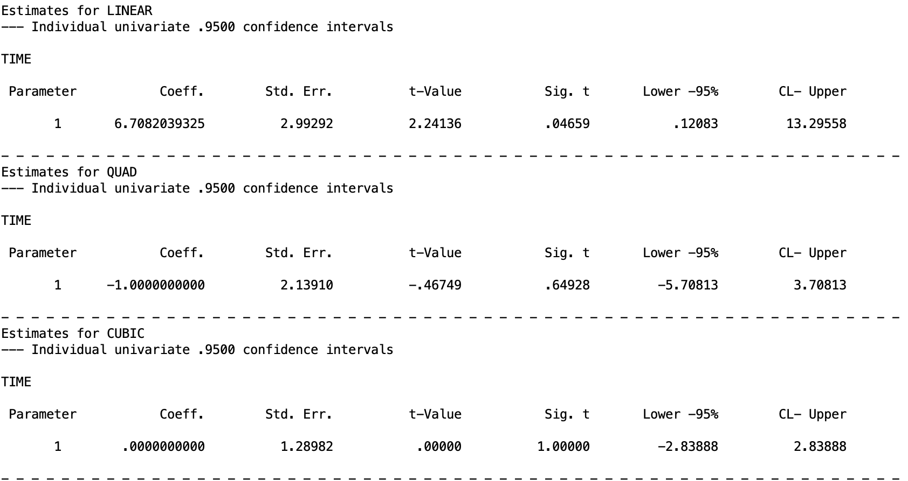

## 1. Introduction

In every lesson so far, we have worked with **between-subjects designs**: each participant appears in exactly one condition, and all comparisons are made across different groups of people. This lesson introduces a fundamentally different structure called the **within-subjects design** (also called a **repeated-measures design**). In this design, each participant is measured under every level of the factor. 

Within-subjects designs appear across a wide range of research contexts. A developmental psychologist might track children's vocabulary scores at ages 3, 4, 5, and 6 to ask whether language growth differs across developmental periods. In this case, time is the within-subjects factor. For another example, a clinical researcher might expose participants to four different dosages of an anxiolytic drug, measuring anxiety symptoms for each, without a period where the participants are not taking the drug (aka, they take each drug back-to-back). In this design are drug dosage is the within-subjects factor.

Within-subjects designs carry two important advantages over between-subjects designs.

**Efficiency.** Each participant contributes multiple scores on the outcome rather than one, so you need far fewer participants to achieve a given level of statistical power.

**Reduced error.** People differ from one another in stable ways. For example, some children consistently score higher, some consistently score lower. There are inter-personal differences that could skew the independent groups in ways that are not accounted for. In a between-subjects design, that stable individual variation isn't captured but gets absorbed into the error. This makes it harder to detect treatment effects. In a within-subjects design, each participant serves as their own comparison, and that stable individual variation can be isolated and removed from the error, leaving a much smaller residual.

The tradeoff is that repeated measurement introduces complications. Chief among them is the problem of **order effects**: participants may improve (or fatigue) simply from repeated exposure to a task, independent of any true treatment difference. Researchers address this through counterbalancing schemes such as crossover designs (for two levels) or Latin square designs (for more than two levels), and through wash-out periods between conditions. In a crossover design, half the participants complete condition A then B while the other half complete B then A, ensuring order effects cancel out across the groups. Latin squares extend this logic to three or more conditions by systematically rotating the order so that each condition appears in each position an equal number of times. If you ever see the term **wash-out period**, know that this is simply a gap between conditions long enough for any lingering effects of the previous condition to dissipate before the next one begins.

The dataset we will be working with is `OneWay-WithinSubjects.sav`. This scores from 12 children assessed at four ages: 30, 36, 42, and 48 months. These are age-normed general cognitive score from the McCarthy Scales of Children's Abilities. Every child contributes a score at every time point, making this a within-subjects design with one factor (time) at four levels. However, as you might notice. This "time" factor doesn't actually exist in the data set. You will see when we go over the syntax how this will be created.

> Note, this data is in a "wide" format, where each measurement occasion is in its own column and each individual has their own row. Each cell represents one score per person at a specific occasion Another format common with repeated measures is the "long" format, where individuals, within-subjects occasions, and the Y outcome are all in different columns. It *is* possible to do what we do here with long data, but it requires different syntax. And in the future, we will need to use syntax that matches the wide format data, so I am focusing on this specifically. If you are using data in the long format, you will need to figure out how to restructure it in the wide format.

There are two main frameworks for analyzing a one-way within-subjects ANOVA: the **univariate** approach and the **multivariate** approach. Broadly, they differ in how they handle the correlations among repeated measurements and what assumptions they require about the structure of those correlations, but we will dive into each in more detail in the subsequent sections.

## 2. Difference Scores

Difference scores are a fundamental concept for within-subjects designs, and they will come up repeatedly across both approaches covered in this and future lessons. Luckily, they are a rather straightforward and intuitive concept. A difference score is simply the result of subtracting one measurement from another for the same participant. If a child scores 96 at 30 months and 107 at 36 months, their difference score for that interval is 11. Rather than comparing group averages across conditions, a difference score tells you directly how much a single participant changed from one condition to the next.

Here is a brief overview on how they will come up in this lesson. In the univariate approach, the sphericity assumption (discussed later) is defined directly in terms of difference scores. In the multivariate approach, difference scores are the actual quantities being modeled.

If you are familiar with the **paired samples $t$ test**, the numerator of its equation ($\frac{\bar{X}_2 - \bar{X}_1}{s_D / \sqrt{n}}$) has a difference score. Within-subjects ANOVA extends this kind of idea to multiple paired samples. E.g., score at time 1 to score at time 2, score at time 2 to score at time 3, etc.

## 3. The Univariate (Mixed-Model) Approach

The univariate approach, also called the mixed-model approach, treats the repeated measurements as a single dependent variable observed under different conditions. It extends the logic of a two-way ANOVA without an interaction term, where one factor is the within-subjects condition and the other is the subject themselves. The key advantage of this approach is statistical power: by isolating stable individual differences as a separate source of variance, it removes them from the error term, leaving a smaller residual against which to test condition effects. The tradeoff is that the approach rests on an assumption about the structure of the data called sphericity, which we will cover in detail below. When that assumption holds, the univariate approach is generally the preferred choice.

This method has a lot of limitations when you try to extend it to higher-order within-subjects ANOVAs and is generally less powerful than the multivariate method.

### The Full/Reduced Model Framework

As in every previous lesson, we begin by writing out full and restricted models and asking how much error is reduced when we allow condition means to differ.

Let $Y_{ij}$ denote the score for subject $i$ in condition $j$. The **full model** for the univariate approach includes a grand mean, a condition effect, and a subject effect:

$$
Y_{ij} = \mu + \alpha_j + \pi_i + \varepsilon_{ij}
$$

where $\mu$ is the grand mean, $\alpha_j$ is the effect of the $j$th level of the within-subjects factor (e.g., time 1, time 2, etc.), $\pi_i$ is the effect of the $i$th subject (their stable individual tendency to score above or below the grand mean), and $\varepsilon_{ij}$ is the residual error.

The **restricted model** drops the condition effects entirely, constraining all $\alpha_j = 0$:

$$
Y_{ij} = \mu + \pi_i + \varepsilon_{ij}
$$

Therefore, the null hypothesis is $H_0\colon \alpha_1 = \alpha_2 = \cdots = \alpha_a = 0$, which is equivalent to saying all condition population means are equal. 

Notice that both models include the subject term $\pi_i$. By keeping subject effects in both models, we ensure that stable individual differences are accounted for rather than left as error. Essentially, this means we are comparing each participant's scores across conditions relative to their own baseline, rather than relative to the group as a whole. A child who consistently scores high across all time points contributes little error to the comparison. What matters is how their scores shift across conditions, not where they start.

If all of this seems a bit abstract, that's ok. These concepts are not needed to be able to conduct a within-subjects ANOVA. 

### The Sphericity Assumption

The univariate approach requires an assumption called **sphericity**. This *is* an important concept because if you don't have spherecity, then the basic output you will get will be unsound. The assumption of sphericity holds when, for any two levels of the factor, the difference scores $Y_{il} - Y_{im}$ have the same population variance across all possible pairs of levels. In plain terms, it means the factor does not affect some pairs of conditions more consistently than others.

For example, in the McCarthy data we have four time points, which means there are six possible pairs of difference scores: M36 - M30, M42 - M36, M48 - M42, M42 - M30, M48 - M36, and M48 - M30. Sphericity requires that the variance of each of these six difference scores be equal in the population. 

If children vary a great deal in how much they change between 30 and 36 months but vary very little in how much they change between 42 and 48 months, the variances of those two difference scores are not equal and sphericity is violated.

As a side note, there is a special case of sphericity is **compound symmetry**, where all variances equal and all *covariances* equal. Sphericity is a weaker requirement than compound symmetry. It can hold even when compound symmetry fails.

Sphericity is often unrealistic in time-series designs, where measurements made closer together tend to be more strongly correlated than measurements separated by longer intervals. When sphericity fails, the unadjusted $F$ test is positively biased, and its $p$ value is too small with inflated Type I error.

SPSS tests sphericity with **Mauchly's test**. If Mauchly's $W$ is significant, the sphericity assumption is rejected and adjustments are needed.

When sphericity is violated, there are some adjustments you can use. These can get technical, so I will just introduce them as options.

SPSS provides three corrected tests alongside the unadjusted result:

-   **Greenhouse-Geisser (**$\hat{\varepsilon}$): A conservative estimate that reliably controls Type I error but can be overly conservative, especially with mild violations. This is generally the safest choice when sphericity is violated.
-   **Huynh-Feldt (**$\tilde{\varepsilon}$): Less conservative than Greenhouse-Geisser and more powerful, but can fail to control Type I error in some conditions.
-   **Lower-bound:** The most conservative possible correction. Rarely used in practice.

For now, if Mauchly's test is not significant (aka, spherecity is upheld), report the unadjusted ("sphericity assumed") row. If it is significant, report the Greenhouse-Geisser result as the primary test.

### SPSS Syntax and Output: Univariate Approach

The univariate approach uses the McCarthy data, where each row is one subject and each column is a time point (`M30`, `M36`, `M42`, `M48`).

```spss
MANOVA M30 M36 M42 M48
  /WSFACTORS time(4)
  /WSDESIGN time
  /ERROR WITHIN
  /OMEANS
  /PRINT SIGNIF(GG HF).
```

`MANOVA M30 M36 M42 M48` lists the four repeated-measures variables directly. In the wide format, each time point is its own column, so rather than naming a single dependent variable and a grouping variable, you list all four columns and let SPSS treat each as a separate level of the within-subjects factor.

`/WSFACTORS time(4)` declares a within-subjects factor named `time` with 4 levels (as denoted by `(4)`). The name `time` is created here and does not need to exist as a variable in your dataset. This is a unique feature of within-subjects designs in SPSS. It has to be done because SPSS needs a label to refer to the within-subjects factor internally, but that factor is not stored as a column in your data the way a between-subjects grouping variable would be. It is implied by the structure of the repeated measurements themselves.

`/WSDESIGN time` specifies the within-subjects model to test, here the main effect of `time`. When working with within-subjects factors, you need to specify a `/WSDESIGN` line as opposed to the `/DESIGN` line used for between-subjects ANOVA. This distinction will be important in the future Split-Plot Design lesson.

`/ERROR WITHIN` uses the subjects-by-condition interaction as the error term.

`/OMEANS` requests observed means for each level of the within-subjects factor. Not necessary but helpful.

`/PRINT SIGNIF(GG HF)` requests the Greenhouse-Geisser and Huynh-Feldt corrected tests alongside the unadjusted results, which will be important if Mauchly's test turns out to be significant.

Before you look at the output, you must look at the Mauchly's test of spherecity. This can be found in the following table

{fig-alt="Mauchly's test of sphericity output table showing W, chi-square, df, significance, and epsilon estimates"}
In this output, we can see the significance of the Mauchly's test of significance (which is a Chi-square test). Looking at the `Significance =` line, we can see that $p = .017 < .05$, therefore we *reject* the assumption of spherecity. The three corrections I mentioned before are given below. The epislons are just factors used to adjust the tests, but are not needed.

Further down, we can find the main test output:

{fig-alt="Tests of within-subjects effects table showing SS, df, MS, F, and p for the time factor under sphericity assumed, Greenhouse-Geisser, Huynh-Feldt, and lower-bound rows"}

The output for the "Multivariate Tests of Significance" section is for the multivariate approach (which we will discuss next). 

In the "AVERAGED Tests of Significance" section, there is the univariate tests. Looking at the `TIME` table, the first row is the unadjusted test that assumes spherecity, which we don't want for our data because spherecity was violated. The three lines below it are the adjusted tests. In each method, the results are *not* significance ($p = .075,~.064,$ and $.110$ respectively), though practically, we should just look at the Greenhouse-Geiser results ($p = .075$). This is a good example of how ignoring spherecity violations would lead you to false conclusions.

In terms of the actual data, this means we do not have sufficient evidence to conclude that children's cognitive scores change systematically across the four age points when we account for the violation of sphericity. While there is a descriptive trend in the means (scores rise from 103 at 30 months to 107 at 36 months, 110 at 42 months, and 112 at 48 months) that pattern is not strong enough relative to the variability in individual children's trajectories to reach statistical significance. I.e., some children show consistent growth, others plateau, and others even decline, which  makes it harder to detect a reliable time effect.

One last thing to note is near the top of the output, you will see a section labeled "Tests of Between-Subjects Effects". This is the test of the grand mean of the data. That is, it is testing whether the overall mean across all participants and all time points is significantly different from zero. In most research contexts this is not of interest. It is evident that the cognitive scores are not zero, so you can safely ignore this portion of the output.

{fig-alt="Tests of grand mean test, showing table showing SS, df, MS, F, and p."}

This confirms that the mean across every participant is not 0 as the $p$ value is $<.001$.

We will now turn to the other method for one-way within-subjects ANOVA: the multivariate method.

## 4. The Multivariate Approach

The multivariate approach sidesteps the sphericity problem entirely by reformulating the question. Instead of treating the repeated measurements as a single outcome variable observed under different conditions the ($\alpha_j$ in the univariate full model), it treats them as multiple outcome variables measured on the same people and asks whether the pattern of means across those variables equals zero.

The core idea is the construction of **difference score variables**, called **D variables**. For a within-subjects factor with $a$ levels, we create $a - 1$ difference variables, each representing a contrast between levels. If the population means for all $a$ levels are equal, then each of these difference variables has a population mean of zero. Testing whether all condition means are equal is equivalent to testing whether all D variable means equal zero simultaneously.

For the McCarthy data has $a = 4$ levels (4 time points), we need $a - 1 = 3$ D variables. Using successive pairwise differences, the D variables are:

$$
D_1 = M36 - M30, \quad D_2 = M42 - M36, \quad D_3 = M48 - M42
$$

The null hypothesis $H_0\colon \mu_1 = \mu_2 = \mu_3 = \mu_4$ is equivalent to $H_0\colon \mu_{D_1} = \mu_{D_2} = \mu_{D_3} = 0$. 

To put it more intuitively, this method is asking: if there were truly no effect of time, then on average, no child should be gaining or losing ground from one time point to the next. If the mean of any D variable is meaningfully different from zero, that is evidence that something is happening across time. The multivariate approach bundles all three of those difference score tests together and evaluates them simultaneously.

### The Full/Reduced Model for Each D Variable

The multivariate approach applies the full/reduced model framework to each D variable separately, then combines the evidence across all of them. Therefore, there are a total of $a - 1$ full/reduced models. One for each difference score.

For each D variable $D_k$, the general formulation of each model is:

**Full model:** $D_{ki} = \mu_k + \varepsilon_{ki}$

The full model allows $D_k$ to have a nonzero mean $\mu_k$, which is the average change. 

The restricted models are

**Restricted model:** $D_{ki} = \varepsilon_{ki}$

The restricted model constrains the mean to zero, which is what the null hypothesis requires.

Because D variables are correlated with each other by nature, knowing that a child gained a lot from month 30 to 36 tells you something about their gain from 36 to 42. The multivariate approach accounts for those correlations when combining evidence across all D variables into a single omnibus test. This is the essential difference from the univariate approach, which pools the errors across comparisons without accounting for their correlations and requires spherecity to keep that in check.

As a result, the multivariate method is much more flexible, and as you will see, is usually the method used for more complicated within-subjects designs. 

### Syntax and Output: Multivariate Approach

The multivariate approach must use wide format data. So if you ever have long format data, you will need to restructure it. 

The SPSS code for this approach is actually the exact same as we had in Section 3 for the univariate output. If you recall, I told you to skip the multivariate output. Well now we want to examine it, so I am pasting it here again.

{fig-alt="Multivariate tests table showing Pillai's Trace, Wilks' Lambda, Hotelling's Trace, and Roy's Largest Root with F values, hypothesis df, error df, and significance"}

Here we see four tests: Pillais, Hotellings, Wilks, and Roys. These tests are four different ways of summarizing the same multivariate evidence into a single test statistic, and in a pure one-way within-subjects design with no between-subjects factors (i.e, not a split-plot design, which we will cover in the future), they will always yield identical $F$ values. You do not need to choose between them in this context. So in our study, the McCarthy data, all four yield $p = .153$, indicating that the D variable means are not jointly significantly different from zero.

Thus, our conclusion is the same as the univariate method!

### Testing Contrasts in the Multivariate Approach

Let's say our omnibus test for the multivariate approach was significant. In this hypothetical, the next step we will want to do is to examine specific comparisons among the condition means. In the multivariate approach, contrasts are tested by constructing the appropriate D variable for that comparison and testing whether its mean equals zero. This is equivalent to a paired-samples $t$ test on the difference scores, and the $F$ statistic equals $t^2$.

The critical practical point is that **contrasts specified in SPSS MANOVA must be orthogonal**. If you supply non-orthogonal contrasts using the `/CONTRAST(...)=SPECIAL` statement, SPSS will silently substitute its own orthogonalized version and test those instead. You will receive output, but it will not correspond to the contrasts you requested. Think of it as ordering a specific dish at a restaurant and having the chef decide you must have meant something else entirely.

This is a very important thing to keep in mind. In between-subjects ANOVA, you don't need to worry about non-orthogonal contrasts because each contrast draws on independent groups of participants. In a within-subjects design, the same participants appear in every condition, so the contrasts share information and must be orthogonal for SPSS to test what you actually asked for.

If you don't remember or don't know what orthogonality means, you need to review the Contrasts lesson becasue orthogonality is a prerequisite to even doing within-subjects ANOVA. From my experience, this is something that many people forget or don't realize they need to do and get completely wrong results without realizing it!

When contrasts are orthogonal, you can specify the contrasts with the `/CONTRAST...SPECIAL` matrix as usual. 

> Recall, the first row must always be a row of ones (representing the grand mean). Subsequent rows contain the orthogonal contrasts 

Let's say we want to test the linear and polynomial trends, which is common in repeated measures studies. Luckily, these are inherently orthogonal, so we don't need to worry about them. If you don't recall how these work, review the Trend Analysis lesson.

The SPSS syntax to do this is the following:

``` spss
MANOVA M30 M36 M42 M48
  /WSFACTORS time(4)
  /CONTRAST(time)=SPECIAL (1  1  1  1
                           -3 -1  1  3
                            1 -1 -1  1
                           -1  3 -3  1)
  /PRINT transform param(estim)
  /RENAME mean linear quad cubic
  /WSDESIGN time.
```

`/CONTRAST(time)=SPECIAL (...)` -- the `SPECIAL` keyword signals a user-defined contrast matrix. The matrix has $a$ rows and $a$ columns. The first row is always all ones. Rows 2 through $a$ specify the $a - 1$ contrasts of interest.

`-3 -1 1 3`: linear trend coefficients for four equally spaced levels (see the Trend Analysis lesson).

`1 -1 -1 1`: quadratic trend coefficients.

`-1 3 -3 1`: cubic trend coefficients.

`/PRINT transform`: prints the transformation matrix SPSS actually uses, so you can verify it matches what you specified. This is not necessary, but can be helpful just to make sure the code is working as intended.

`/PRINT param(estim)`: prints the estimated contrast value, its standard error, $t$ statistic, significance, and 95% confidence interval for each contrast. Recall that the confidence intervals for the linear and cubic trends will need to be rescaled becasue they are each multiplied by 3 (review the Contrasts and Trend Analysis lessons). So they each just need to be divided by 3.

`/RENAME mean linear quad cubic`: labels the intercept and three contrasts in the output for readability. Note, that the first label will label the row of 1's, which is the grand mean. If you are going to label the contrasts, don't make the mistake of forgetting this and using `/RENAME linear quad cubic`. This will label the grand mean test as "linear", the linear test as "quadratic", and so forth.

The output for `/PRINT transform` looks like the following:

{fig-alt="Orthonormalized transformation matrix showing the coefficients SPSS used for the mean, linear, quadratic, and cubic contrasts across M30, M36, M42, and M48"}

This table shows the contrast coefficients SPSS actually used after orthonormalizing our specified contrast matrix. Each column corresponds to one of our named contrasts (MEAN, LINEAR, QUAD, CUBIC) and each row corresponds to a time point. The key thing to check here is that the pattern of signs in each column matches what you intended. For the LINEAR column, coefficients increase in linearly from negative to positive across time points, which is exactly what a linear trend contrast should look like. If SPSS had silently substituted different contrasts, this table would reveal it. Though this table is, admittedly, a bit confusing. So I would focus on just making super sure your syntax is correct. But this output can be good as a fact check.

The output for the contrasts tests looks like the following:

{fig-alt="Within-subjects contrasts output showing SS, df, MS, F, and p for linear, quadratic, and cubic components of the time effect"}

Here we can see that the linear trend is significant ($p = .0496$). However, the other trends are not significant. In fact, the cubic trend is so non-significant that SPSS has round it's $p$ valueup to 1. Recall, that to get appropriate 95% confidence intervals for the linear and cubic trend, you need to divide the confidence interval ends by 3. 

### Type I Error Control

Lastly, like always, Type I error control is something to keep in mind. Luckily, since this is just a basic one-way ANOVA, the method to use this is very straight forward. I will refer to the Multiple Comparisons lesson for guidance on the univariate approach as it uses the basic Type I error methods exactly (if spherecity holds; if spherecity doesn't hold, the Tukey test becomes unavaialble. See in (1) below).

However, there are two thing I should note for the multivariate approach. 

1) Tukey's HSD assumes that all pairwise comparisons share the same error term and that the variances of all difference scores are equal, which is precisely the sphericity assumption. Since the multivariate approach is used specifically when sphericity cannot be assumed, using Tukey's HSD would reintroduce the very problem we were trying to avoid. Bonferroni does not rely on that assumption and is therefore the appropriate choice for pairwise comparisons in the multivariate approach.

2) For post hoc complex comparisons, you will use the Roy-Bose procedure. This method is the multivariate analog of Scheffé's method and controls the familywise error rate across all possible contrasts. Functionally, it works the same way as Scheffé but the critical value is computed differently:

$$\text{CV}_{\text{Roy-Bose}} = \frac{(n-1)(a-1)}{n-a+1} \cdot F_{\alpha;\; a-1,\; n-a+1}$$

compared to the Scheffé critical value:

$$\text{CV}_{\text{Scheffé}} = (a-1) \cdot F_{\alpha;\; a-1,\; N-a}$$
Other than this, the Roy-Bose method should be used equivalently to the Scheffé method.


## 5. Summary

This lesson introduced the one-way within-subjects ANOVA, examining two approaches to testing whether condition means differ when the same participants are measured at every level of the factor.

The **univariate (mixed-model) approach** partitions variability into condition effects, subject effects, and a residual subjects-by-condition term that serves as the error. It is efficient when its key assumption of sphericity is met. When sphericity is violated, Greenhouse-Geisser or Huynh-Feldt adjustments to the degrees of freedom provide reasonable correction, with Greenhouse-Geisser being the safer choice.

The **multivariate approach** reformulates the problem in terms of $a - 1$ D difference variables and tests whether their means jointly equal zero. It does not require sphericity and uses a separate error term for each contrast, making contrast tests more robust. The cost is fewer denominator degrees of freedom, which reduces power when samples are small.

The univariate and multivariate approaches answer the same omnibus question: do the condition means differ? They just make different assumptions and trade power differently. I did not cover eveyrthing in the below table, but this table is hopefully helpful as a reference guide.
 
```{=html}

<table class="cmtable" style="width:100%; border-collapse:collapse; margin:1.5em 0;">
  <thead>
    <tr>
      <th style="color:#000; padding:10px; text-align:left; border-bottom:2px solid #888; width:20%;">Feature</th>
      <th style="color:#000; padding:10px; text-align:left; border-bottom:2px solid #888; width:40%;">Univariate (Mixed-Model)</th>
      <th style="color:#000; padding:10px; text-align:left; border-bottom:2px solid #888; width:40%;">Multivariate (MANOVA)</th>
    </tr>
  </thead>
  <tbody>
    <tr>
      <td style="padding:10px; border-bottom:1px solid #555;">Sphericity required?</td>
      <td style="padding:10px; border-bottom:1px solid #555;">Yes (or epsilon adjustment)</td>
      <td style="padding:10px; border-bottom:1px solid #555;">No</td>
    </tr>
    <tr>
      <td style="padding:10px; border-bottom:1px solid #555;">Error term for contrasts</td>
      <td style="padding:10px; border-bottom:1px solid #555;">Pooled (\(MS_{A \times S}\))</td>
      <td style="padding:10px; border-bottom:1px solid #555;">Separate for each contrast</td>
    </tr>
    <tr>
      <td style="padding:10px; border-bottom:1px solid #555;">Denominator df</td>
      <td style="padding:10px; border-bottom:1px solid #555;">Larger: \((n-1)(a-1)\)</td>
      <td style="padding:10px; border-bottom:1px solid #555;">Smaller: \(n - a + 1\)</td>
    </tr>
    <tr>
      <td style="padding:10px; border-bottom:1px solid #555;">Power when sphericity holds</td>
      <td style="padding:10px; border-bottom:1px solid #555;">Higher (more df)</td>
      <td style="padding:10px; border-bottom:1px solid #555;">Lower (fewer df)</td>
    </tr>
    <tr>
      <td style="padding:10px; border-bottom:1px solid #555;">Power when sphericity fails</td>
      <td style="padding:10px; border-bottom:1px solid #555;">Reduced; epsilon adjustments help but are conservative</td>
      <td style="padding:10px; border-bottom:1px solid #555;">Often higher; accounts for correlations among comparisons</td>
    </tr>
    <tr>
      <td style="padding:10px; border-bottom:1px solid #555;">Sample size requirement</td>
      <td style="padding:10px; border-bottom:1px solid #555;">Any \(n \geq 2\)</td>
      <td style="padding:10px; border-bottom:1px solid #555;">\(n\) must exceed \(a\); small samples reduce power sharply</td>
    </tr>
    <tr>
      <td style="padding:10px; border-bottom:1px solid #555;">Normality assumption</td>
      <td style="padding:10px; border-bottom:1px solid #555;">Univariate normality</td>
      <td style="padding:10px; border-bottom:1px solid #555;">Multivariate normality</td>
    </tr>
    <tr>
      <td style="padding:10px; border-bottom:1px solid #555;">SPSS procedure</td>
      <td style="padding:10px; border-bottom:1px solid #555;"> MANOVA univariate output with /PRINT SIGNIF(GG HF)</td>
      <td style="padding:10px; border-bottom:1px solid #555;">MANOVA, multivariate output</td>
    </tr>
    <tr>
      <td style="padding:10px;">Data format</td>
      <td style="padding:10px;">Long (one row per observation)</td>
      <td style="padding:10px;">Wide (one row per subject)</td>
    </tr>
  </tbody>
</table>
```

The practical guidance that follows from this comparison:

When sphericity holds, the univariate approach is preferred because it has more denominator degrees of freedom and therefore more power. When Mauchly's test is significant and the sample is reasonably large, the multivariate approach is generally preferred because it does not require sphericity and uses separate error terms for each contrast. When the sample is small relative to the number of levels (roughly $n < 2a$), the multivariate approach loses power rapidly and may not even be computable. The epsilon-adjusted univariate tests are the better option in that scenario.

A useful default practice is to run the `MANOVA` syntax with `/PRINT SIGNIF(GG HF)`, which produces the univariate and multivariate sets of results in a single pass. This lets you check Mauchly's test and choose the appropriate result to report without re-running the analysis.

If you are doing Type I error control methods, make sure you recall some of the caveats. If spherecity doesn't hold or you are using the multivariate approach, you cannot use Tukey's HSD method. And if you are using the multivariate approach, the Scheffé method becomes the Roy-Bose method, which has a different function for calculating its critical values.

Finally, if you are using contrasts, **MAKE SURE YOUR CONTRASTS ARE ORTHOGONAL**. This is something to easily forget or make a mistake in calculating, but this is important.

Going forward, we will have to use the multivariate method as we move on to higher-order within-subject designs and split-plot methods as it is much simpler to use in these scenarios.

## 6. Discussion Questions

**1.** A researcher measures participants' reaction time under three noise conditions (quiet, moderate, loud) using a within-subjects design with $n = 15$ participants. Mauchly's test is not significant. Which approach, univariate or multivariate, should they use for the omnibus test, and why?

<details>

<summary>Click to reveal answer</summary>

When Mauchly's test is not significant, the sphericity assumption is tenable. In this case the univariate approach is preferred, because it has denominator df of $(n-1)(a-1) = (14)(2) = 28$, compared to the multivariate approach's denominator df of $n - a + 1 = 13$. With more denominator degrees of freedom, the univariate test is more powerful when its assumptions are met.

</details>

------------------------------------------------------------------------

**2.** In the McCarthy study, the univariate test with sphericity assumed yields $F(3, 33) = 3.027$, $p = .043$, but the Greenhouse-Geisser corrected test yields $p = .075$. Explain in plain language what the Greenhouse-Geisser correction is doing and why the $F$ value does not change.

<details>

<summary>Click to reveal answer</summary>

The Greenhouse-Geisser correction works by reducing the degrees of freedom used to evaluate significance, not by changing the $F$ statistic itself. The $F$ statistic is a ratio of mean squares, which are fixed by the data. What changes is the reference distribution used to obtain a $p$ value: with smaller degrees of freedom, a larger $F$ is needed to reach the same significance threshold. The correction shrinks the df by multiplying both numerator and denominator by $\hat{\varepsilon} = .610$, reflecting the degree to which sphericity is violated. The same ratio of mean squares is now evaluated against a more stringent critical value, which is why $p$ rises from .043 to .075.

</details>

------------------------------------------------------------------------

**3.** A student runs the multivariate approach on a dataset with $n = 5$ subjects measured at $a = 6$ time points. SPSS refuses to produce multivariate test output. Why?

<details>

<summary>Click to reveal answer</summary>

The multivariate approach requires $n > a$. That is, more subjects than levels of the factor. With $n = 5$ and $a = 6$, the denominator degrees of freedom would be $n - a + 1 = 5 - 6 + 1 = 0$, which makes the $F$ test mathematically impossible. The multivariate approach simply cannot be computed when the number of subjects does not exceed the number of conditions. In this case the researcher would need to use the epsilon-adjusted univariate tests instead, or collect more data.

</details>

------------------------------------------------------------------------

**4.** A researcher uses SPSS MANOVA to test two planned contrasts in a within-subjects design: (1) the mean at time 1 versus the mean at time 3, and (2) the mean at time 2 versus the mean at time 4. They specify these in a `/CONTRAST(time)=SPECIAL` matrix. When they print the transformation matrix, they find SPSS used different coefficients than they entered. What most likely happened, and what should they do?

<details>

<summary>Click to reveal answer</summary>

The most likely explanation is that the two contrasts were not orthogonal. SPSS requires that contrasts specified in the `/CONTRAST...SPECIAL` matrix for a within-subjects factor be orthogonal to one another.Iif they are not, SPSS silently replaces them with its own orthogonalized versions and tests those instead. Printing the transformation matrix (via `/PRINT transform`) reveals this substitution. The researcher should verify whether their two contrasts are orthogonal by checking that the sum of the products of their coefficients equals zero. If the contrasts of interest are not orthogonal, they cannot both be tested simultaneously using this approach.

</details>
